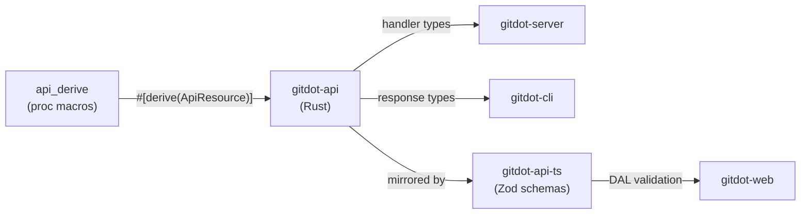
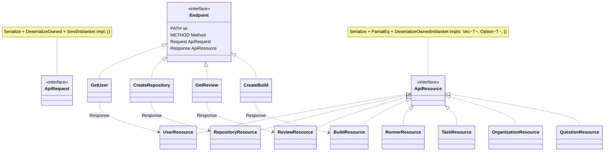

## gitdot-api

### Overview

`gitdot-api` defines the shared API contract between the Gitdot backend and its clients. It provides typed resource structs (response shapes) and endpoint definitions (request/response pairs with HTTP method and path metadata), forming a single source of truth that both the Axum server and TypeScript frontend mirror.

The crate is split into two layers: `resource/` contains plain data structs annotated with `#[derive(ApiResource)]`, and `endpoint/` contains zero-sized-type (ZST) structs implementing the `Endpoint` trait that associate a path, method, request type, and response type for each API call. A companion proc-macro crate (`gitdot-api/derive`) provides the `#[derive(ApiResource)]` and `#[derive(ApiRequest)]` derives.

### Architecture



### Class diagram



### Core Traits

Defined in [`src/resource.rs`](src/resource.rs) and [`src/endpoint.rs`](src/endpoint.rs).

- `ApiResource` — `Serialize + PartialEq + DeserializeOwned`. Marker for all response types. Blanket impls for `Vec<T>`, `Option<T>`, `()`.
- `ApiRequest` — `Serialize + DeserializeOwned + Send`. Marker for all request types. Blanket impl for `()`.
- `Endpoint` — Associates `PATH: &str`, `METHOD: Method`, `Request: ApiRequest`, `Response: ApiResource`.

Proc macros from [`derive/src/lib.rs`](derive/src/lib.rs):
- `#[derive(ApiResource)]` — implements `ApiResource` for any struct or enum
- `#[derive(ApiRequest)]` — implements `ApiRequest` for any struct or enum

---

### Resource Types

#### OAuth Resources

##### `DeviceCodeResource`

Returned when initiating a device authorization flow.

```json
{
  "device_code": "abc123",
  "user_code": "WDJB-MJHT",
  "verification_uri": "https://gitdot.dev/activate",
  "expires_in": 900,
  "interval": 5
}
```

##### `TokenResource`

Returned after a device code is authorized.

```json
{
  "access_token": "gdt_tok_...",
  "user_name": "alice",
  "user_email": "alice@example.com"
}
```

---

#### User Resources

##### `UserResource`

```json
{
  "id": "018e1b2c-0000-7000-8000-000000000001",
  "name": "alice",
  "email": "alice@example.com",
  "created_at": "2024-01-15T10:00:00Z"
}
```

##### `UserSettingsResource`

```json
{
  "repos": {
    "alice/myrepo": {
      "commit_filters": [
        {
          "name": "frontend only",
          "authors": [],
          "tags": [],
          "included_paths": ["src/web/"],
          "excluded_paths": [],
          "created_at": "2024-06-01T00:00:00Z",
          "updated_at": "2024-06-01T00:00:00Z"
        }
      ]
    }
  }
}
```

---

#### Organization Resources

##### `OrganizationResource`

```json
{
  "id": "018e1b2c-0000-7000-8000-000000000002",
  "name": "acme",
  "created_at": "2024-02-01T09:00:00Z"
}
```

##### `OrganizationMemberResource`

```json
{
  "id": "018e1b2c-0000-7000-8000-000000000003",
  "user_id": "018e1b2c-0000-7000-8000-000000000001",
  "organization_id": "018e1b2c-0000-7000-8000-000000000002",
  "role": "member",
  "created_at": "2024-03-10T12:00:00Z"
}
```

---

#### Repository Resources

##### `RepositoryResource`

```json
{
  "id": "018e1b2c-0000-7000-8000-000000000004",
  "name": "myrepo",
  "owner": "alice",
  "visibility": "public",
  "created_at": "2024-01-20T08:00:00Z"
}
```

##### `RepositoryPathsResource`

Top-level listing of a ref's tree entries.

```json
{
  "ref_name": "main",
  "commit_sha": "a1b2c3d4e5f6...",
  "entries": [
    {
      "path": "src/main.rs",
      "name": "main.rs",
      "path_type": "Blob",
      "sha": "deadbeef..."
    },
    {
      "path": "src",
      "name": "src",
      "path_type": "Tree",
      "sha": "cafebabe..."
    }
  ]
}
```

`path_type` is one of: `Blob` · `Tree` · `Commit` · `Unknown`

##### `RepositoryFileResource`

```json
{
  "path": "src/main.rs",
  "sha": "deadbeef...",
  "content": "fn main() {\n    println!(\"Hello\");\n}\n",
  "encoding": "utf-8"
}
```

##### `RepositoryFolderResource`

```json
{
  "path": "src",
  "entries": [
    { "path": "src/main.rs", "name": "main.rs", "path_type": "Blob", "sha": "deadbeef..." }
  ]
}
```

##### `RepositoryBlobResource`

Tagged union — either `{ "File": { ...RepositoryFileResource } }` or `{ "Folder": { ...RepositoryFolderResource } }`.

##### `RepositoryBlobsResource`

```json
{
  "ref_name": "main",
  "commit_sha": "a1b2c3d4e5f6...",
  "blobs": [
    { "File": { "path": "src/main.rs", "sha": "deadbeef...", "content": "...", "encoding": "utf-8" } }
  ]
}
```

##### `RepositoryCommitsResource`

```json
{
  "commits": [
    {
      "sha": "a1b2c3d4",
      "parent_sha": "00000000",
      "message": "Initial commit",
      "date": "2024-01-20T08:00:00Z",
      "author": { "id": "018e1b2c-...", "name": "alice", "email": "alice@example.com" },
      "review_number": null,
      "diff_position": null,
      "diffs": [{ "path": "src/main.rs", "lines_added": 5, "lines_removed": 0 }]
    }
  ]
}
```

##### `RepositoryCommitDiffResource`

```json
{
  "sha": "a1b2c3d4",
  "parent_sha": "00000000",
  "files": [
    {
      "path": "src/main.rs",
      "lines_added": 5,
      "lines_removed": 0,
      "hunks": [
        [
          {
            "lhs": null,
            "rhs": {
              "line_number": 1,
              "changes": [{ "start": 0, "end": 12, "content": "fn main() {", "highlight": "Keyword" }]
            }
          }
        ]
      ],
      "left_content": null,
      "right_content": "fn main() {\n    println!(\"Hello\");\n}\n"
    }
  ]
}
```

`SyntaxHighlight` values: `Delimiter` · `Normal` · `String` · `Type` · `Comment` · `Keyword` · `TreeSitterError`

##### `RepositoryResourcesResource`

Composite payload returned by `GetRepositoryResources`.

```json
{
  "last_commit": "a1b2c3d4",
  "last_updated": "2024-06-15T10:00:00Z",
  "paths": { "...RepositoryPathsResource": "..." },
  "commits": { "...RepositoryCommitsResource": "..." },
  "blobs": { "...RepositoryBlobsResource": "..." },
  "questions": { "questions": [] },
  "reviews": { "reviews": [] },
  "builds": { "builds": [] }
}
```

---

#### Review Resources

##### `ReviewResource`

```json
{
  "id": "018e1b2c-0000-7000-8000-000000000010",
  "number": 1,
  "author_id": "018e1b2c-0000-7000-8000-000000000001",
  "repository_id": "018e1b2c-0000-7000-8000-000000000004",
  "title": "Add login flow",
  "description": "Implements the OAuth device flow.",
  "target_branch": "main",
  "status": "open",
  "created_at": "2024-04-01T09:00:00Z",
  "updated_at": "2024-04-02T11:00:00Z",
  "author": { "id": "018e1b2c-...", "name": "alice" },
  "diffs": [],
  "reviewers": [],
  "comments": []
}
```

`status` values: `draft` · `open` · `merged` · `closed`

##### `DiffResource`

```json
{
  "id": "018e1b2c-0000-7000-8000-000000000020",
  "review_id": "018e1b2c-0000-7000-8000-000000000010",
  "position": 1,
  "title": "Auth changes",
  "description": "",
  "status": "open",
  "created_at": "2024-04-01T09:00:00Z",
  "updated_at": "2024-04-01T09:00:00Z",
  "revisions": []
}
```

##### `RevisionResource`

```json
{
  "id": "018e1b2c-0000-7000-8000-000000000030",
  "diff_id": "018e1b2c-0000-7000-8000-000000000020",
  "number": 1,
  "commit_hash": "a1b2c3d4",
  "parent_hash": "00000000",
  "created_at": "2024-04-01T09:00:00Z",
  "verdicts": []
}
```

##### `ReviewVerdictResource`

```json
{
  "id": "018e1b2c-0000-7000-8000-000000000040",
  "diff_id": "018e1b2c-0000-7000-8000-000000000020",
  "revision_id": "018e1b2c-0000-7000-8000-000000000030",
  "reviewer_id": "018e1b2c-0000-7000-8000-000000000001",
  "verdict": "approved",
  "created_at": "2024-04-02T10:00:00Z"
}
```

`verdict` values: `approved` · `rejected` · `pending`

##### `ReviewerResource`

```json
{
  "id": "018e1b2c-0000-7000-8000-000000000050",
  "review_id": "018e1b2c-0000-7000-8000-000000000010",
  "reviewer_id": "018e1b2c-0000-7000-8000-000000000002",
  "created_at": "2024-04-01T09:30:00Z",
  "user": { "id": "018e1b2c-...", "name": "bob" }
}
```

##### `ReviewCommentResource`

```json
{
  "id": "018e1b2c-0000-7000-8000-000000000060",
  "review_id": "018e1b2c-0000-7000-8000-000000000010",
  "diff_id": "018e1b2c-0000-7000-8000-000000000020",
  "revision_id": "018e1b2c-0000-7000-8000-000000000030",
  "author_id": "018e1b2c-0000-7000-8000-000000000002",
  "parent_id": null,
  "body": "LGTM",
  "file_path": "src/main.rs",
  "line_number_start": 10,
  "line_number_end": 12,
  "side": "right",
  "resolved": false,
  "created_at": "2024-04-02T10:05:00Z",
  "updated_at": "2024-04-02T10:05:00Z",
  "author": { "id": "018e1b2c-...", "name": "bob" }
}
```

---

#### Question Resources

##### `QuestionResource`

```json
{
  "id": "018e1b2c-0000-7000-8000-000000000070",
  "number": 1,
  "author_id": "018e1b2c-0000-7000-8000-000000000001",
  "repository_id": "018e1b2c-0000-7000-8000-000000000004",
  "title": "How does auth work?",
  "body": "Can someone explain the device flow?",
  "upvote": 3,
  "impression": 42,
  "created_at": "2024-05-01T08:00:00Z",
  "updated_at": "2024-05-01T08:00:00Z",
  "user_vote": 1,
  "author": { "id": "018e1b2c-...", "name": "alice" },
  "comments": [],
  "answers": []
}
```

##### `AnswerResource`

```json
{
  "id": "018e1b2c-0000-7000-8000-000000000080",
  "question_id": "018e1b2c-0000-7000-8000-000000000070",
  "author_id": "018e1b2c-0000-7000-8000-000000000002",
  "body": "It uses OAuth 2.0 device authorization grant.",
  "upvote": 5,
  "created_at": "2024-05-01T09:00:00Z",
  "updated_at": "2024-05-01T09:00:00Z",
  "user_vote": null,
  "author": { "id": "018e1b2c-...", "name": "bob" },
  "comments": []
}
```

##### `CommentResource`

```json
{
  "id": "018e1b2c-0000-7000-8000-000000000090",
  "parent_id": "018e1b2c-0000-7000-8000-000000000070",
  "author_id": "018e1b2c-0000-7000-8000-000000000001",
  "body": "Great question!",
  "upvote": 1,
  "created_at": "2024-05-01T08:30:00Z",
  "updated_at": "2024-05-01T08:30:00Z",
  "user_vote": null,
  "author": { "id": "018e1b2c-...", "name": "alice" }
}
```

##### `VoteResource`

```json
{
  "target_id": "018e1b2c-0000-7000-8000-000000000070",
  "score": 4,
  "user_vote": 1
}
```

---

#### Build Resources

##### `BuildResource`

```json
{
  "id": "018e1b2c-0000-7000-8000-000000000100",
  "number": 42,
  "repository_id": "018e1b2c-0000-7000-8000-000000000004",
  "ref_name": "main",
  "trigger": "push",
  "commit_sha": "a1b2c3d4",
  "status": "success",
  "total_tasks": 3,
  "completed_tasks": 3,
  "created_at": "2024-06-01T10:00:00Z",
  "updated_at": "2024-06-01T10:05:00Z"
}
```

`status` values: `pending` · `running` · `success` · `failed` · `cancelled`

---

#### Task Resources

##### `TaskResource`

```json
{
  "id": "018e1b2c-0000-7000-8000-000000000110",
  "repository_id": "018e1b2c-0000-7000-8000-000000000004",
  "build_id": "018e1b2c-0000-7000-8000-000000000100",
  "s2_uri": "s2://mystream/tasks/018e1b2c...",
  "name": "test",
  "command": "cargo test",
  "status": "success",
  "waits_for": [],
  "created_at": "2024-06-01T10:00:00Z",
  "updated_at": "2024-06-01T10:03:00Z"
}
```

##### `PollTaskResource`

Returned by a runner when polling for work.

```json
{
  "id": "018e1b2c-0000-7000-8000-000000000110",
  "token": "task_tok_...",
  "owner_name": "alice",
  "repository_name": "myrepo",
  "s2_uri": "s2://mystream/tasks/018e1b2c...",
  "name": "test",
  "command": "cargo test",
  "status": "pending"
}
```

##### `TaskTokenResource`

```json
{
  "token": "task_tok_shortlived..."
}
```

---

#### Runner Resources

##### `RunnerResource`

```json
{
  "id": "018e1b2c-0000-7000-8000-000000000120",
  "name": "my-runner",
  "owner_id": "018e1b2c-0000-7000-8000-000000000001",
  "owner_name": "alice",
  "owner_type": "user",
  "last_active": "2024-06-10T15:00:00Z",
  "created_at": "2024-06-01T00:00:00Z"
}
```

##### `RunnerTokenResource`

```json
{
  "token": "runner_tok_..."
}
```

---

#### Settings Resources

##### `CommitFilterResource`

```json
{
  "name": "frontend only",
  "authors": ["alice"],
  "tags": ["ui"],
  "included_paths": ["src/web/"],
  "excluded_paths": ["src/web/vendor/"],
  "created_at": "2024-06-01T00:00:00Z",
  "updated_at": "2024-06-01T00:00:00Z"
}
```

---

#### Migration Resources

##### `GitHubInstallationResource`

```json
{
  "id": "018e1b2c-0000-7000-8000-000000000130",
  "installation_id": 12345678,
  "owner_id": "018e1b2c-0000-7000-8000-000000000001",
  "installation_type": "User",
  "github_login": "alice",
  "created_at": "2024-03-01T08:00:00Z"
}
```

##### `GitHubRepositoryResource`

```json
{
  "id": 987654321,
  "name": "myrepo",
  "full_name": "alice/myrepo",
  "description": "My awesome repo",
  "private": false,
  "default_branch": "main"
}
```

##### `MigrationResource`

```json
{
  "id": "018e1b2c-0000-7000-8000-000000000140",
  "number": 1,
  "author_id": "018e1b2c-0000-7000-8000-000000000001",
  "origin_service": "github",
  "origin": "alice",
  "origin_type": "user",
  "destination": "alice",
  "destination_type": "user",
  "status": "complete",
  "created_at": "2024-03-15T10:00:00Z",
  "updated_at": "2024-03-15T10:45:00Z",
  "repositories": [
    {
      "id": "018e1b2c-0000-7000-8000-000000000150",
      "origin_full_name": "alice/myrepo",
      "destination_full_name": "alice/myrepo",
      "visibility": "public",
      "status": "complete",
      "error": null,
      "created_at": "2024-03-15T10:00:00Z",
      "updated_at": "2024-03-15T10:30:00Z"
    }
  ]
}
```

---

### Endpoints

Examples use `$BASE_URL` for the API base URL and `$TOKEN` for the Bearer token.

---

#### Authentication

##### `POST /oauth/device`

Initiate a device authorization flow.

```bash
curl -X POST $BASE_URL/oauth/device \
  -H "Content-Type: application/json" \
  -d '{"client_id": "gitdot-cli"}'
```

Response: `DeviceCodeResource`

---

##### `POST /oauth/authorize`

Authorize a device code after the user enters their user code.

```bash
curl -X POST $BASE_URL/oauth/authorize \
  -H "Content-Type: application/json" \
  -d '{"user_code": "WDJB-MJHT"}'
```

Response: empty

---

##### `POST /oauth/token`

Poll for an access token after device authorization.

```bash
curl -X POST $BASE_URL/oauth/token \
  -H "Content-Type: application/json" \
  -d '{"device_code": "abc123", "client_id": "gitdot-cli"}'
```

Response: `TokenResource`

---

#### Users

##### `GET /user`

Get the currently authenticated user.

```bash
curl $BASE_URL/user \
  -H "Authorization: Bearer $TOKEN"
```

Response: `UserResource`

---

##### `PATCH /user`

Update the current user's profile.

```bash
curl -X PATCH $BASE_URL/user \
  -H "Authorization: Bearer $TOKEN" \
  -H "Content-Type: application/json" \
  -d '{"name": "alice-new"}'
```

Response: `UserResource`

---

##### `GET /user/settings`

Get the current user's settings.

```bash
curl $BASE_URL/user/settings \
  -H "Authorization: Bearer $TOKEN"
```

Response: `UserSettingsResource`

---

##### `PATCH /user/settings`

Update the current user's settings.

```bash
curl -X PATCH $BASE_URL/user/settings \
  -H "Authorization: Bearer $TOKEN" \
  -H "Content-Type: application/json" \
  -d '{
    "repos": {
      "alice/myrepo": {
        "commit_filters": [
          {
            "name": "frontend only",
            "included_paths": ["src/web/"]
          }
        ]
      }
    }
  }'
```

Response: `UserSettingsResource`

---

##### `GET /user/{user_name}`

Get a user by username.

```bash
curl $BASE_URL/user/alice \
  -H "Authorization: Bearer $TOKEN"
```

Response: `UserResource`

---

##### `HEAD /user/{user_name}`

Check whether a username is taken. Returns `200` if the user exists, `404` otherwise.

```bash
curl -I $BASE_URL/user/alice \
  -H "Authorization: Bearer $TOKEN"
```

Response: empty

---

##### `GET /user/{user_name}/repositories`

List repositories owned by a user.

```bash
curl $BASE_URL/user/alice/repositories \
  -H "Authorization: Bearer $TOKEN"
```

Response: `RepositoryResource[]`

---

##### `GET /user/{user_name}/organizations`

List organizations a user belongs to.

```bash
curl $BASE_URL/user/alice/organizations \
  -H "Authorization: Bearer $TOKEN"
```

Response: `OrganizationResource[]`

---

##### `GET /user/{user_name}/reviews`

List reviews authored by or assigned to a user. Supports optional query params: `status`, `owner`, `repo`.

```bash
curl "$BASE_URL/user/alice/reviews?status=open&owner=alice&repo=myrepo" \
  -H "Authorization: Bearer $TOKEN"
```

Response: `ReviewResource[]`

---

#### Organizations

##### `POST /organization/{org_name}`

Create a new organization.

```bash
curl -X POST $BASE_URL/organization/acme \
  -H "Authorization: Bearer $TOKEN"
```

Response: `OrganizationResource`

---

##### `GET /organizations`

List all organizations.

```bash
curl $BASE_URL/organizations \
  -H "Authorization: Bearer $TOKEN"
```

Response: `OrganizationResource[]`

---

##### `POST /organization/{org_name}/members`

Add a member to an organization.

```bash
curl -X POST $BASE_URL/organization/acme/members \
  -H "Authorization: Bearer $TOKEN" \
  -H "Content-Type: application/json" \
  -d '{"user_name": "bob", "role": "member"}'
```

Response: `OrganizationMemberResource`

---

##### `GET /organization/{org_name}/members`

List members of an organization. Supports optional `role` query param.

```bash
curl "$BASE_URL/organization/acme/members?role=owner" \
  -H "Authorization: Bearer $TOKEN"
```

Response: `OrganizationMemberResource[]`

---

##### `GET /organization/{org_name}/repositories`

List repositories owned by an organization.

```bash
curl $BASE_URL/organization/acme/repositories \
  -H "Authorization: Bearer $TOKEN"
```

Response: `RepositoryResource[]`

---

#### Repositories

##### `POST /repository/{owner}/{repo}`

Create a new repository.

```bash
curl -X POST $BASE_URL/repository/alice/myrepo \
  -H "Authorization: Bearer $TOKEN" \
  -H "Content-Type: application/json" \
  -d '{"owner_type": "user", "visibility": "public"}'
```

Response: `RepositoryResource`

---

##### `DELETE /repository/{owner}/{repo}`

Delete a repository.

```bash
curl -X DELETE $BASE_URL/repository/alice/myrepo \
  -H "Authorization: Bearer $TOKEN"
```

Response: empty

---

##### `POST /repository/{owner}/{repo}/resources`

Fetch multiple repository resources in one request. Pass `last_commit` and `last_updated` to receive only what changed.

```bash
curl -X POST $BASE_URL/repository/alice/myrepo/resources \
  -H "Authorization: Bearer $TOKEN" \
  -H "Content-Type: application/json" \
  -d '{"last_commit": "a1b2c3d4", "last_updated": "2024-06-01T10:00:00Z"}'
```

Response: `RepositoryResourcesResource`

---

##### `GET /repository/{owner}/{repo}/paths`

List all file paths in the repository tree. Supports optional `ref_name` query param (default: `HEAD`).

```bash
curl "$BASE_URL/repository/alice/myrepo/paths?ref_name=main" \
  -H "Authorization: Bearer $TOKEN"
```

Response: `RepositoryPathsResource`

---

##### `GET /repository/{owner}/{repo}/blob`

Fetch a single file or directory. Requires `path` query param; `ref_name` is optional (default: `HEAD`).

```bash
curl "$BASE_URL/repository/alice/myrepo/blob?path=src/main.rs&ref_name=main" \
  -H "Authorization: Bearer $TOKEN"
```

Response: `RepositoryBlobResource`

---

##### `POST /repository/{owner}/{repo}/blobs`

Fetch multiple files or directories in one request.

```bash
curl -X POST $BASE_URL/repository/alice/myrepo/blobs \
  -H "Authorization: Bearer $TOKEN" \
  -H "Content-Type: application/json" \
  -d '{"ref_name": "main", "paths": ["src/main.rs", "Cargo.toml"]}'
```

Response: `RepositoryBlobsResource`

---

##### `GET /repository/{owner}/{repo}/commits`

List commits on a ref. Supports optional `ref_name`, `from`, and `to` query params.

```bash
curl "$BASE_URL/repository/alice/myrepo/commits?ref_name=main&from=2024-01-01T00:00:00Z" \
  -H "Authorization: Bearer $TOKEN"
```

Response: `RepositoryCommitsResource`

---

##### `GET /repository/{owner}/{repo}/commits/{sha}`

Get a single commit.

```bash
curl $BASE_URL/repository/alice/myrepo/commits/a1b2c3d4 \
  -H "Authorization: Bearer $TOKEN"
```

Response: `RepositoryCommitResource`

---

##### `GET /repository/{owner}/{repo}/commits/{sha}/diff`

Get the full diff for a commit.

```bash
curl $BASE_URL/repository/alice/myrepo/commits/a1b2c3d4/diff \
  -H "Authorization: Bearer $TOKEN"
```

Response: `RepositoryCommitDiffResource`

---

##### `GET /repository/{owner}/{repo}/file/commits`

List commits that touched a specific file, with pagination. Requires `path`; supports `ref_name`, `page`, `per_page`.

```bash
curl "$BASE_URL/repository/alice/myrepo/file/commits?path=src/main.rs&page=1&per_page=30" \
  -H "Authorization: Bearer $TOKEN"
```

Response: `RepositoryCommitsResource`

---

##### `GET /repository/{owner}/{repo}/settings`

Get repository settings.

```bash
curl $BASE_URL/repository/alice/myrepo/settings \
  -H "Authorization: Bearer $TOKEN"
```

Response: `RepositorySettingsResource`

---

##### `PATCH /repository/{owner}/{repo}/settings`

Update repository settings.

```bash
curl -X PATCH $BASE_URL/repository/alice/myrepo/settings \
  -H "Authorization: Bearer $TOKEN" \
  -H "Content-Type: application/json" \
  -d '{
    "commit_filters": [
      {"name": "no vendor", "excluded_paths": ["vendor/"]}
    ]
  }'
```

Response: `RepositorySettingsResource`

---

#### Reviews

##### `GET /repository/{owner}/{repo}/reviews`

List all reviews for a repository.

```bash
curl $BASE_URL/repository/alice/myrepo/reviews \
  -H "Authorization: Bearer $TOKEN"
```

Response: `ReviewResource[]`

---

##### `GET /repository/{owner}/{repo}/review/{number}`

Get a single review.

```bash
curl $BASE_URL/repository/alice/myrepo/review/1 \
  -H "Authorization: Bearer $TOKEN"
```

Response: `ReviewResource`

---

##### `PATCH /repository/{owner}/{repo}/review/{number}`

Update review metadata.

```bash
curl -X PATCH $BASE_URL/repository/alice/myrepo/review/1 \
  -H "Authorization: Bearer $TOKEN" \
  -H "Content-Type: application/json" \
  -d '{"title": "Updated title", "description": "Now with more details."}'
```

Response: `ReviewResource`

---

##### `POST /repository/{owner}/{repo}/review/{number}/publish`

Publish (open) a review, optionally setting metadata for the review and its diffs.

```bash
curl -X POST $BASE_URL/repository/alice/myrepo/review/1/publish \
  -H "Authorization: Bearer $TOKEN" \
  -H "Content-Type: application/json" \
  -d '{
    "title": "Add login flow",
    "description": "Implements device authorization.",
    "diffs": [
      {"position": 1, "title": "Auth changes", "description": ""}
    ]
  }'
```

Response: `ReviewResource`

---

##### `GET /repository/{owner}/{repo}/review/{number}/diff/{position}`

Get the file diffs for a specific diff within a review. Supports optional `revision` and `compare_to` query params.

```bash
curl "$BASE_URL/repository/alice/myrepo/review/1/diff/1?revision=2&compare_to=1" \
  -H "Authorization: Bearer $TOKEN"
```

Response: `{ "files": RepositoryDiffFileResource[] }`

---

##### `PATCH /repository/{owner}/{repo}/review/{number}/diff/{position}`

Update a diff's metadata.

```bash
curl -X PATCH $BASE_URL/repository/alice/myrepo/review/1/diff/1 \
  -H "Authorization: Bearer $TOKEN" \
  -H "Content-Type: application/json" \
  -d '{"title": "Refactored auth", "description": "Cleaner impl."}'
```

Response: `ReviewResource`

---

##### `POST /repository/{owner}/{repo}/review/{number}/diff/{position}/merge`

Merge a diff into the target branch.

```bash
curl -X POST $BASE_URL/repository/alice/myrepo/review/1/diff/1/merge \
  -H "Authorization: Bearer $TOKEN"
```

Response: `ReviewResource`

---

##### `POST /repository/{owner}/{repo}/review/{number}/diff/{position}/submit`

Submit a verdict and comments on a diff revision.

```bash
curl -X POST $BASE_URL/repository/alice/myrepo/review/1/diff/1/submit \
  -H "Authorization: Bearer $TOKEN" \
  -H "Content-Type: application/json" \
  -d '{
    "action": "approve",
    "comments": [
      {
        "body": "Looks great!",
        "file_path": "src/auth.rs",
        "line_number_start": 42,
        "line_number_end": 45,
        "side": "right"
      }
    ]
  }'
```

Response: `ReviewResource`

---

##### `POST /repository/{owner}/{repo}/review/{number}/reviewer`

Add a reviewer to a review.

```bash
curl -X POST $BASE_URL/repository/alice/myrepo/review/1/reviewer \
  -H "Authorization: Bearer $TOKEN" \
  -H "Content-Type: application/json" \
  -d '{"user_name": "bob"}'
```

Response: `ReviewerResource`

---

##### `DELETE /repository/{owner}/{repo}/review/{number}/reviewer/{reviewer_name}`

Remove a reviewer from a review.

```bash
curl -X DELETE $BASE_URL/repository/alice/myrepo/review/1/reviewer/bob \
  -H "Authorization: Bearer $TOKEN"
```

Response: empty

---

##### `PATCH /repository/{owner}/{repo}/review/{number}/comment/{comment_id}`

Edit a review comment.

```bash
curl -X PATCH "$BASE_URL/repository/alice/myrepo/review/1/comment/018e1b2c-0000-7000-8000-000000000060" \
  -H "Authorization: Bearer $TOKEN" \
  -H "Content-Type: application/json" \
  -d '{"body": "Updated: LGTM with minor nits."}'
```

Response: `ReviewCommentResource`

---

##### `POST /repository/{owner}/{repo}/review/{number}/comment/{comment_id}/resolve`

Toggle the resolved state of a review comment thread.

```bash
curl -X POST "$BASE_URL/repository/alice/myrepo/review/1/comment/018e1b2c-0000-7000-8000-000000000060/resolve" \
  -H "Authorization: Bearer $TOKEN" \
  -H "Content-Type: application/json" \
  -d '{"resolved": true}'
```

Response: `ReviewCommentResource`

---

#### Questions

##### `GET /repository/{owner}/{repo}/questions`

List questions in a repository.

```bash
curl $BASE_URL/repository/alice/myrepo/questions \
  -H "Authorization: Bearer $TOKEN"
```

Response: `QuestionResource[]`

---

##### `POST /repository/{owner}/{repo}/question`

Create a question.

```bash
curl -X POST $BASE_URL/repository/alice/myrepo/question \
  -H "Authorization: Bearer $TOKEN" \
  -H "Content-Type: application/json" \
  -d '{"title": "How does auth work?", "body": "Can someone explain the device flow?"}'
```

Response: `QuestionResource`

---

##### `GET /repository/{owner}/{repo}/question/{number}`

Get a question with its answers and comments.

```bash
curl $BASE_URL/repository/alice/myrepo/question/1 \
  -H "Authorization: Bearer $TOKEN"
```

Response: `QuestionResource`

---

##### `PATCH /repository/{owner}/{repo}/question/{number}`

Update a question.

```bash
curl -X PATCH $BASE_URL/repository/alice/myrepo/question/1 \
  -H "Authorization: Bearer $TOKEN" \
  -H "Content-Type: application/json" \
  -d '{"title": "How does OAuth device flow work?", "body": "Updated body with more context."}'
```

Response: `QuestionResource`

---

##### `POST /repository/{owner}/{repo}/question/{number}/vote`

Vote on a question. `value`: `1` (upvote), `-1` (downvote), `0` (remove vote).

```bash
curl -X POST $BASE_URL/repository/alice/myrepo/question/1/vote \
  -H "Authorization: Bearer $TOKEN" \
  -H "Content-Type: application/json" \
  -d '{"value": 1}'
```

Response: `VoteResource`

---

##### `POST /repository/{owner}/{repo}/question/{number}/comment`

Add a top-level comment to a question.

```bash
curl -X POST $BASE_URL/repository/alice/myrepo/question/1/comment \
  -H "Authorization: Bearer $TOKEN" \
  -H "Content-Type: application/json" \
  -d '{"body": "Great question!"}'
```

Response: `CommentResource`

---

##### `POST /repository/{owner}/{repo}/question/{number}/answer`

Post an answer to a question.

```bash
curl -X POST $BASE_URL/repository/alice/myrepo/question/1/answer \
  -H "Authorization: Bearer $TOKEN" \
  -H "Content-Type: application/json" \
  -d '{"body": "It uses OAuth 2.0 device authorization grant."}'
```

Response: `AnswerResource`

---

##### `PATCH /repository/{owner}/{repo}/question/{number}/answer/{answer_id}`

Edit an answer.

```bash
curl -X PATCH "$BASE_URL/repository/alice/myrepo/question/1/answer/018e1b2c-0000-7000-8000-000000000080" \
  -H "Authorization: Bearer $TOKEN" \
  -H "Content-Type: application/json" \
  -d '{"body": "Revised: it uses the RFC 8628 device authorization grant."}'
```

Response: `AnswerResource`

---

##### `POST /repository/{owner}/{repo}/question/{number}/answer/{answer_id}/vote`

Vote on an answer.

```bash
curl -X POST "$BASE_URL/repository/alice/myrepo/question/1/answer/018e1b2c-0000-7000-8000-000000000080/vote" \
  -H "Authorization: Bearer $TOKEN" \
  -H "Content-Type: application/json" \
  -d '{"value": 1}'
```

Response: `VoteResource`

---

##### `POST /repository/{owner}/{repo}/question/{number}/answer/{answer_id}/comment`

Add a comment to an answer.

```bash
curl -X POST "$BASE_URL/repository/alice/myrepo/question/1/answer/018e1b2c-0000-7000-8000-000000000080/comment" \
  -H "Authorization: Bearer $TOKEN" \
  -H "Content-Type: application/json" \
  -d '{"body": "Thanks, very helpful!"}'
```

Response: `CommentResource`

---

##### `PATCH /repository/{owner}/{repo}/question/{number}/comment/{comment_id}`

Edit a comment on a question or answer.

```bash
curl -X PATCH "$BASE_URL/repository/alice/myrepo/question/1/comment/018e1b2c-0000-7000-8000-000000000090" \
  -H "Authorization: Bearer $TOKEN" \
  -H "Content-Type: application/json" \
  -d '{"body": "Excellent question, actually."}'
```

Response: `CommentResource`

---

##### `POST /repository/{owner}/{repo}/question/{number}/comment/{comment_id}/vote`

Vote on a comment.

```bash
curl -X POST "$BASE_URL/repository/alice/myrepo/question/1/comment/018e1b2c-0000-7000-8000-000000000090/vote" \
  -H "Authorization: Bearer $TOKEN" \
  -H "Content-Type: application/json" \
  -d '{"value": 1}'
```

Response: `VoteResource`

---

#### Builds

##### `GET /repository/{owner}/{repo}/builds`

List builds for a repository. Supports optional `from` and `to` datetime query params.

```bash
curl "$BASE_URL/repository/alice/myrepo/builds?from=2024-06-01T00:00:00Z" \
  -H "Authorization: Bearer $TOKEN"
```

Response: `BuildResource[]`

---

##### `POST /repository/{owner}/{repo}/build`

Trigger a new build.

```bash
curl -X POST $BASE_URL/repository/alice/myrepo/build \
  -H "Authorization: Bearer $TOKEN" \
  -H "Content-Type: application/json" \
  -d '{"ref_name": "main", "commit_sha": "a1b2c3d4"}'
```

Response: `BuildResource`

---

##### `GET /repository/{owner}/{repo}/build/{number}`

Get a single build.

```bash
curl $BASE_URL/repository/alice/myrepo/build/42 \
  -H "Authorization: Bearer $TOKEN"
```

Response: `BuildResource`

---

##### `GET /repository/{owner}/{repo}/build/{number}/tasks`

List tasks belonging to a build.

```bash
curl $BASE_URL/repository/alice/myrepo/build/42/tasks \
  -H "Authorization: Bearer $TOKEN"
```

Response: `TaskResource[]`

---

#### Tasks

These endpoints are used by CI runners, not end users.

##### `GET /ci/task/poll`

Poll for the next available task. Returns `null` when no work is available.

```bash
curl $BASE_URL/ci/task/poll \
  -H "Authorization: Bearer $RUNNER_TOKEN"
```

Response: `PollTaskResource` (nullable)

---

##### `POST /ci/task/{id}/token`

Issue a short-lived token for a task before reporting status.

```bash
curl -X POST "$BASE_URL/ci/task/018e1b2c-0000-7000-8000-000000000110/token" \
  -H "Authorization: Bearer $RUNNER_TOKEN"
```

Response: `TaskTokenResource`

---

##### `PATCH /ci/task/{id}`

Report a task status update.

```bash
curl -X PATCH "$BASE_URL/ci/task/018e1b2c-0000-7000-8000-000000000110" \
  -H "Authorization: Bearer $TASK_TOKEN" \
  -H "Content-Type: application/json" \
  -d '{"status": "success"}'
```

`status` values: `running` · `success` · `failed`

Response: `TaskResource`

---

#### Runners

##### `GET /ci/runner/{owner}`

List runners for an owner.

```bash
curl $BASE_URL/ci/runner/alice \
  -H "Authorization: Bearer $TOKEN"
```

Response: `RunnerResource[]`

---

##### `POST /ci/runner/{owner}`

Register a new runner.

```bash
curl -X POST $BASE_URL/ci/runner/alice \
  -H "Authorization: Bearer $TOKEN" \
  -H "Content-Type: application/json" \
  -d '{"name": "my-runner", "owner_type": "user"}'
```

Response: `RunnerResource`

---

##### `GET /ci/runner/{owner}/{name}`

Get a runner by name.

```bash
curl $BASE_URL/ci/runner/alice/my-runner \
  -H "Authorization: Bearer $TOKEN"
```

Response: `RunnerResource`

---

##### `DELETE /ci/runner/{owner}/{name}`

Delete a runner.

```bash
curl -X DELETE $BASE_URL/ci/runner/alice/my-runner \
  -H "Authorization: Bearer $TOKEN"
```

Response: empty

---

##### `POST /ci/runner/{owner}/{name}/token`

Refresh the authentication token for a runner.

```bash
curl -X POST $BASE_URL/ci/runner/alice/my-runner/token \
  -H "Authorization: Bearer $TOKEN"
```

Response: `RunnerTokenResource`

---

##### `POST /ci/runner/{id}/verify`

Verify a runner's identity. Called by the runner on startup.

```bash
curl -X POST "$BASE_URL/ci/runner/018e1b2c-0000-7000-8000-000000000120/verify" \
  -H "Authorization: Bearer $RUNNER_TOKEN"
```

Response: empty

---

#### Migrations

##### `GET /migrations`

List all migrations initiated by the current user.

```bash
curl $BASE_URL/migrations \
  -H "Authorization: Bearer $TOKEN"
```

Response: `MigrationResource[]`

---

##### `GET /migration/{number}`

Get a single migration.

```bash
curl $BASE_URL/migration/1 \
  -H "Authorization: Bearer $TOKEN"
```

Response: `MigrationResource`

---

##### `GET /migration/github/installations`

List GitHub App installations connected by the current user.

```bash
curl $BASE_URL/migration/github/installations \
  -H "Authorization: Bearer $TOKEN"
```

Response: `GitHubInstallationResource[]`

---

##### `POST /migration/github/{installation_id}`

Register a GitHub App installation.

```bash
curl -X POST $BASE_URL/migration/github/12345678 \
  -H "Authorization: Bearer $TOKEN"
```

Response: `GitHubInstallationResource`

---

##### `GET /migration/github/{installation_id}/repositories`

List repositories accessible via a GitHub App installation.

```bash
curl $BASE_URL/migration/github/12345678/repositories \
  -H "Authorization: Bearer $TOKEN"
```

Response: `GitHubRepositoryResource[]`

---

##### `POST /migration/github/{installation_id}/migrate`

Start migrating repositories from GitHub.

```bash
curl -X POST $BASE_URL/migration/github/12345678/migrate \
  -H "Authorization: Bearer $TOKEN" \
  -H "Content-Type: application/json" \
  -d '{
    "origin": "alice",
    "origin_type": "user",
    "destination": "alice",
    "destination_type": "user",
    "repositories": ["myrepo", "otherrepo"]
  }'
```

Response: `MigrationResource`
