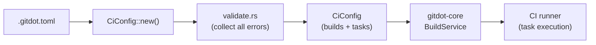

## gitdot-config

### Overview

`gitdot-config` is the shared configuration crate for the Gitdot platform. It parses and validates `.gitdot.toml` CI pipeline config files authored by users, and is consumed by `gitdot-core` when creating and executing CI builds.



### APIs

- **`CiConfig`** — top-level parsed config ([gitdot-config/src/ci.rs](gitdot-config/src/ci.rs))

  ```rust
  #[derive(Debug, Clone, Deserialize)]
  pub struct CiConfig {
      pub builds: Vec<BuildConfig>,
      pub tasks: Vec<TaskConfig>,
  }

  impl CiConfig {
      pub fn new(toml: &str) -> Result<Self, CiConfigError>
      pub fn get_build_config(&self, trigger: &BuildTrigger) -> Result<&BuildConfig, CiConfigError>
      pub fn get_task_configs(&self, build: &BuildConfig) -> Vec<&TaskConfig>
  }
  ```

  `new` parses the TOML and runs full validation before returning.

- **`BuildConfig`** — a single build definition

  ```rust
  #[derive(Debug, Clone, Deserialize)]
  pub struct BuildConfig {
      pub trigger: BuildTrigger,
      pub tasks: Vec<String>,  // task names to run for this build
  }
  ```

- **`TaskConfig`** — a single task definition

  ```rust
  #[derive(Debug, Clone, Deserialize)]
  pub struct TaskConfig {
      pub name: String,
      pub command: String,
      pub waits_for: Option<Vec<String>>,  // task names this task depends on
  }
  ```

- **`BuildTrigger`** — when a build fires

  ```rust
  #[derive(Debug, Clone, PartialEq, Serialize, Deserialize)]
  #[serde(rename_all = "snake_case")]
  pub enum BuildTrigger {
      PullRequest,
      PushToMain,
  }
  ```

- **`CiConfigError`** — parse and validation errors ([gitdot-config/src/error.rs](gitdot-config/src/error.rs))

  ```rust
  #[derive(Debug, thiserror::Error)]
  pub enum CiConfigError {
      #[error("failed to parse config: {0}")]
      Parse(#[from] toml::de::Error),
      #[error("config validation failed:\n{}", ...)]
      Validation(Vec<String>),       // all errors collected before returning
      #[error("no build config found for trigger '{0}'")]
      NoMatchingBuild(String),
      #[error("unknown build trigger '{0}'")]
      InvalidTrigger(String),
  }
  ```

  Example config:

  ```toml
  [[builds]]
  trigger = "pull_request"
  tasks = ["lint", "test"]

  [[tasks]]
  name = "lint"
  command = "cargo clippy"

  [[tasks]]
  name = "test"
  command = "cargo test"
  waits_for = ["lint"]
  ```
