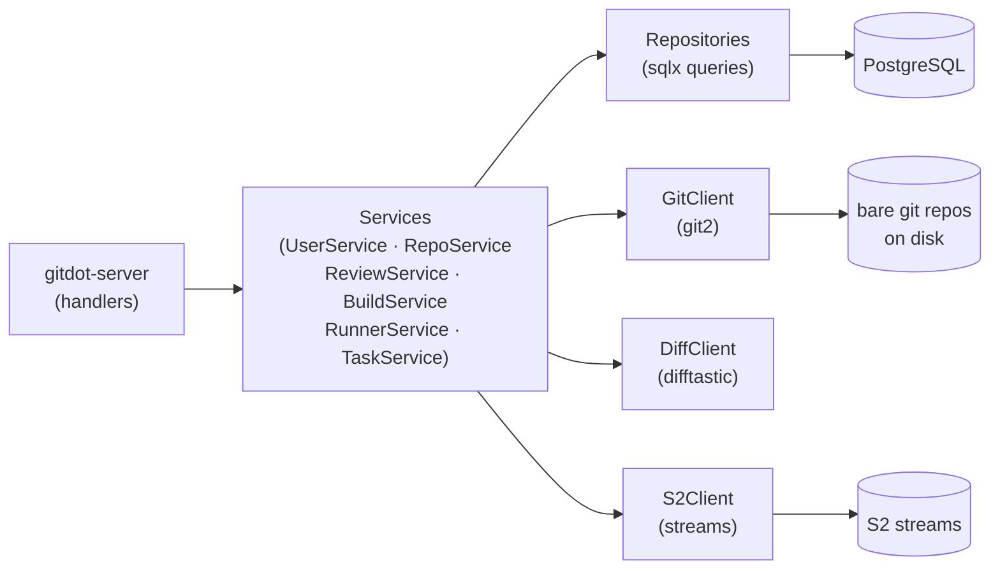

## gitdot-core

### Overview

`gitdot-core` is the business logic crate for the Gitdot platform. It defines all domain services, data-access repositories, external client integrations, DTOs, models, and error types. The Axum HTTP server (`gitdot-server`) depends entirely on this crate and delegates all logic to its services, keeping the handler layer thin.

The crate follows a strict layered architecture: handlers call services, services call repositories and clients, repositories execute SQL queries via `sqlx`, and clients wrap `git2`, `difftastic`, GitHub's API, and S2 streams. Every layer is expressed as a trait with a corresponding `Impl` struct, making each layer independently testable.



### APIs

#### Services (`gitdot-core/src/service/`)

All services are `async_trait` traits. Concrete impls are generic over repository/client traits and wired up with `*Impl` types.

---

#### `UserService` — [`src/service/user.rs`](gitdot-core/src/service/user.rs)

```rust
#[async_trait]
pub trait UserService: Send + Sync + 'static {
    async fn get_current_user(&self, request: GetCurrentUserRequest) -> Result<UserResponse, UserError>;
    async fn update_current_user(&self, request: UpdateCurrentUserRequest) -> Result<UserResponse, UserError>;
    async fn has_user(&self, request: HasUserRequest) -> Result<(), UserError>;
    async fn get_user(&self, request: GetUserRequest) -> Result<UserResponse, UserError>;
    async fn list_repositories(&self, request: ListUserRepositoriesRequest) -> Result<Vec<RepositoryResponse>, UserError>;
    async fn list_organizations(&self, request: ListUserOrganizationsRequest) -> Result<Vec<OrganizationResponse>, UserError>;
    async fn list_reviews(&self, request: ListUserReviewsRequest) -> Result<Vec<ReviewResponse>, UserError>;
    async fn get_current_user_settings(&self, request: GetCurrentUserSettingsRequest) -> Result<UserSettingsResponse, UserError>;
    async fn update_current_user_settings(&self, request: UpdateCurrentUserSettingsRequest) -> Result<UserSettingsResponse, UserError>;
}

pub struct UserServiceImpl<U, R, O, V>
where U: UserRepository, R: RepositoryRepository, O: OrganizationRepository, V: ReviewRepository
{
    pub fn new(user_repo: U, repo_repo: R, org_repo: O, review_repo: V) -> Self;
}
```

---

#### `RepositoryService` — [`src/service/repository.rs`](gitdot-core/src/service/repository.rs)

```rust
#[async_trait]
pub trait RepositoryService: Send + Sync + 'static {
    async fn create_repository(&self, request: CreateRepositoryRequest) -> Result<RepositoryResponse, RepositoryError>;
    async fn delete_repository(&self, request: DeleteRepositoryRequest) -> Result<(), RepositoryError>;
    async fn get_repository_by_id(&self, id: Uuid) -> Result<RepositoryResponse, RepositoryError>;
    async fn get_repository_blob(&self, request: GetRepositoryBlobRequest) -> Result<RepositoryBlobResponse, RepositoryError>;
    async fn get_repository_blobs(&self, request: GetRepositoryBlobsRequest) -> Result<RepositoryBlobsResponse, RepositoryError>;
    async fn get_repository_paths(&self, request: GetRepositoryPathsRequest) -> Result<RepositoryPathsResponse, RepositoryError>;
    async fn get_repository_file_commits(&self, request: GetRepositoryFileCommitsRequest) -> Result<RepositoryCommitsResponse, RepositoryError>;
    async fn resolve_ref_sha(&self, owner: &str, repo: &str, ref_name: &str) -> Result<String, RepositoryError>;
    async fn get_repository_settings(&self, request: GetRepositorySettingsRequest) -> Result<RepositorySettingsResponse, RepositoryError>;
    async fn update_repository_settings(&self, request: UpdateRepositorySettingsRequest) -> Result<RepositorySettingsResponse, RepositoryError>;
}

pub struct RepositoryServiceImpl<G, O, R, U>
where G: GitClient, O: OrganizationRepository, R: RepositoryRepository, U: UserRepository
{
    pub fn new(git_client: G, org_repo: O, repo_repo: R, user_repo: U) -> Self;
}
```

`create_repository` initializes a bare git repo on disk, installs hooks, then inserts the DB record. `get_repository_blob` serves a file or directory listing at a given ref/path.

---

#### `ReviewService` — [`src/service/review.rs`](gitdot-core/src/service/review.rs)

```rust
#[async_trait]
pub trait ReviewService: Send + Sync + 'static {
    async fn get_review(&self, request: GetReviewRequest) -> Result<ReviewResponse, ReviewError>;
    async fn list_reviews(&self, request: ListReviewsRequest) -> Result<ReviewsResponse, ReviewError>;
    async fn create_review(&self, request: ProcessReviewRequest) -> Result<ReviewResponse, ReviewError>;
    async fn process_review_update(&self, request: ProcessReviewRequest) -> Result<ReviewResponse, ReviewError>;
    async fn publish_review(&self, request: PublishReviewRequest) -> Result<ReviewResponse, ReviewError>;
    async fn update_review(&self, request: UpdateReviewRequest) -> Result<ReviewResponse, ReviewError>;
    async fn get_review_diff(&self, request: GetReviewDiffRequest) -> Result<ReviewDiffResponse, ReviewError>;
    async fn submit_review(&self, request: SubmitReviewRequest) -> Result<ReviewResponse, ReviewError>;
    async fn merge_diff(&self, request: MergeDiffRequest) -> Result<ReviewResponse, ReviewError>;
    async fn update_diff(&self, request: UpdateDiffRequest) -> Result<ReviewResponse, ReviewError>;
    async fn add_reviewer(&self, request: AddReviewerRequest) -> Result<ReviewerResponse, ReviewError>;
    async fn remove_reviewer(&self, request: RemoveReviewerRequest) -> Result<(), ReviewError>;
    async fn update_review_comment(&self, request: UpdateReviewCommentRequest) -> Result<ReviewCommentResponse, ReviewError>;
    async fn resolve_review_comment(&self, request: ResolveReviewCommentRequest) -> Result<ReviewCommentResponse, ReviewError>;
}

pub struct ReviewServiceImpl<V, R, U, O, G, D>
where V: ReviewRepository, R: RepositoryRepository, U: UserRepository,
      O: OrganizationRepository, G: GitClient, D: DiffClient
{
    pub fn new(review_repo: V, repo_repo: R, user_repo: U, org_repo: O, git_client: G, diff_client: D) -> Self;
}
```

`create_review` is triggered by a `refs/for/<branch>` push via the proc-receive hook. It creates diffs, revisions, and git refs (`refs/reviews/<N>/...`). `process_review_update` handles re-pushes and detects rebase-only vs. content changes via patch IDs.

---

#### `BuildService` — [`src/service/build.rs`](gitdot-core/src/service/build.rs)

```rust
#[async_trait]
pub trait BuildService: Send + Sync + 'static {
    async fn create_build(&self, request: CreateBuildRequest) -> Result<BuildResponse, BuildError>;
    async fn list_builds(&self, request: ListBuildsRequest) -> Result<BuildsResponse, BuildError>;
    async fn get_build(&self, owner: &str, repo: &str, number: i32) -> Result<BuildResponse, BuildError>;
    async fn list_build_tasks(&self, owner: &str, repo: &str, number: i32) -> Result<Vec<TaskResponse>, BuildError>;
}

pub struct BuildServiceImpl<G, S, B, T, R>
where G: GitClient, S: S2Client, B: BuildRepository, T: TaskRepository, R: RepositoryRepository
{
    pub fn new(git_client: G, s2_client: S, build_repo: B, task_repo: T, repo_repo: R) -> Self;
}
```

`create_build` reads the CI config from the repo, creates a build and its tasks in the DB, and publishes them to an S2 stream for runner pickup.

---

#### `RunnerService` — [`src/service/runner.rs`](gitdot-core/src/service/runner.rs)

```rust
#[async_trait]
pub trait RunnerService: Send + Sync + 'static {
    async fn create_runner(&self, request: CreateRunnerRequest) -> Result<CreateRunnerResponse, RunnerError>;
    async fn verify_runner(&self, request: VerifyRunnerRequest) -> Result<(), RunnerError>;
    async fn get_runner(&self, request: GetRunnerRequest) -> Result<GetRunnerResponse, RunnerError>;
    async fn delete_runner(&self, request: DeleteRunnerRequest) -> Result<(), RunnerError>;
    async fn refresh_runner_token(&self, request: CreateRunnerTokenRequest) -> Result<CreateRunnerTokenResponse, RunnerError>;
    async fn list_runners(&self, request: ListRunnersRequest) -> Result<ListRunnersResponse, RunnerError>;
}

pub struct RunnerServiceImpl<R, O, T>
where R: RunnerRepository, O: OrganizationRepository, T: TokenRepository
{
    pub fn new(runner_repo: R, org_repo: O, token_repo: T) -> Self;
}
```

`verify_runner` validates a hashed token without returning the runner record. `refresh_runner_token` rotates the token and returns the new one.

---

#### `TaskService` — [`src/service/task.rs`](gitdot-core/src/service/task.rs)

```rust
#[async_trait]
pub trait TaskService: Send + Sync + 'static {
    async fn get_task(&self, id: Uuid) -> Result<Option<TaskResponse>, TaskError>;
    async fn poll_task(&self, runner_id: Uuid) -> Result<Option<TaskResponse>, TaskError>;
    async fn update_task(&self, request: UpdateTaskRequest) -> Result<TaskResponse, TaskError>;
}

pub struct TaskServiceImpl<T, R, S>
where T: TaskRepository, R: RunnerRepository, S: RepositoryRepository
{
    pub fn new(task_repo: T, runner_repo: R, repository_repo: S) -> Self;
}
```

---

#### Clients (`gitdot-core/src/client/`)

```rust
// git2 wrapper — blocking calls run in tokio::task::spawn_blocking
#[async_trait]
pub trait GitClient: Send + Sync + Clone + 'static {
    async fn create_repo(&self, owner: &str, repo: &str) -> Result<(), GitError>;
    async fn delete_repo(&self, owner: &str, repo: &str) -> Result<(), GitError>;
    async fn mirror_repo(&self, owner: &str, repo: &str, url: &str) -> Result<(), GitError>;
    async fn get_repo_blob(&self, request: GetRepoBlobRequest) -> Result<RepositoryBlobResponse, GitError>;
    async fn get_repo_blobs(&self, request: GetRepoBlobsRequest) -> Result<RepositoryBlobsResponse, GitError>;
    async fn get_repo_paths(&self, request: GetRepoPathsRequest) -> Result<RepositoryPathsResponse, GitError>;
    async fn get_repo_commit(&self, request: GetRepoCommitRequest) -> Result<RepositoryCommitResponse, GitError>;
    async fn get_repo_file_commits(&self, request: GetRepoFileCommitsRequest) -> Result<RepositoryCommitsResponse, GitError>;
    async fn rev_list(&self, owner: &str, repo: &str, old_sha: &str, new_sha: &str) -> Result<Vec<RepositoryCommitResponse>, GitError>;
    async fn resolve_ref_sha(&self, owner: &str, repo: &str, ref_name: &str) -> Result<String, GitError>;
    async fn create_ref(&self, owner: &str, repo: &str, ref_name: &str, sha: &str) -> Result<(), GitError>;
    async fn update_ref(&self, owner: &str, repo: &str, ref_name: &str, sha: &str) -> Result<(), GitError>;
    async fn install_hook(&self, owner: &str, repo: &str, hook_name: &str) -> Result<(), GitError>;
    async fn cherry_pick_commit(&self, owner: &str, repo: &str, sha: &str, onto: &str) -> Result<String, GitError>;
}

// difftastic wrapper
#[async_trait]
pub trait DiffClient: Send + Sync + Clone + 'static {
    async fn diff_files(&self, left: DiffFile, right: DiffFile) -> Result<RepositoryDiffFileResponse, DiffError>;
}

// S2 stream provisioning
#[async_trait]
pub trait S2Client: Send + Sync + Clone + 'static {
    async fn create_stream(&self, owner: &str, repo: &str, task_id: Uuid) -> Result<String, S2ClientError>;
}
```

---

#### DTOs — Validated Types (`gitdot-core/src/dto/common.rs`)

```rust
// Auto-sanitize (trim, lowercase) + validate slug format (2–32 chars, [a-z0-9_-])
pub struct OwnerName(String);
pub struct RepositoryName(String);  // also strips ".git" suffix
pub struct RunnerName(String);

impl OwnerName {
    pub fn try_new(raw: impl Into<String>) -> Result<Self, OwnerNameError>;
}

// Usage in request constructors:
let owner = OwnerName::try_new("MyOrg")?;    // → "myorg"
let repo  = RepositoryName::try_new("Foo.git")?;  // → "foo"
```

---

#### Repositories (`gitdot-core/src/repository/`)

Each domain exposes a trait and a `PgPool`-backed impl. Methods return `Result<T, sqlx::Error>`.

```rust
#[async_trait]
pub trait UserRepository: Send + Sync + Clone + 'static {
    async fn get_by_id(&self, id: Uuid) -> Result<User, sqlx::Error>;
    async fn get(&self, name: &str) -> Result<User, sqlx::Error>;
    async fn get_by_emails(&self, emails: &[String]) -> Result<Vec<User>, sqlx::Error>;
    async fn is_name_taken(&self, name: &str) -> Result<bool, sqlx::Error>;
    async fn update(&self, id: Uuid, request: UpdateUserRequest) -> Result<User, sqlx::Error>;
    async fn get_settings(&self, id: Uuid) -> Result<UserSettings, sqlx::Error>;
    async fn update_settings(&self, id: Uuid, request: UpdateUserSettingsRequest) -> Result<UserSettings, sqlx::Error>;
}

#[async_trait]
pub trait RepositoryRepository: Send + Sync + Clone + 'static {
    async fn create(&self, request: CreateRepositoryDbRequest) -> Result<Repository, sqlx::Error>;
    async fn get(&self, owner: &str, name: &str) -> Result<Repository, sqlx::Error>;
    async fn get_by_id(&self, id: Uuid) -> Result<Repository, sqlx::Error>;
    async fn list_by_owner(&self, owner: &str) -> Result<Vec<Repository>, sqlx::Error>;
    async fn delete(&self, owner: &str, name: &str) -> Result<(), sqlx::Error>;
    async fn get_settings(&self, owner: &str, name: &str) -> Result<RepositorySettings, sqlx::Error>;
    async fn update_settings(&self, owner: &str, name: &str, request: UpdateRepositorySettingsDbRequest) -> Result<RepositorySettings, sqlx::Error>;
}

pub struct UserRepositoryImpl { pool: PgPool }
pub struct RepositoryRepositoryImpl { pool: PgPool }
// (all *RepositoryImpl types have the same shape)
```
