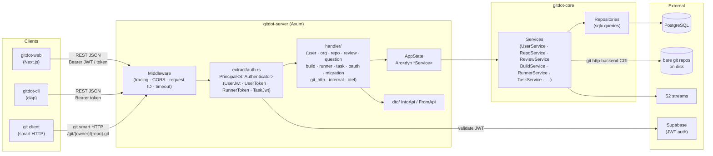

## gitdot-server

### Architecture



### Overview

`gitdot-server` is the Axum HTTP server that forms the API layer for Gitdot. It is intentionally thin: handlers extract request parameters, delegate all business logic to services from `gitdot-core`, and map results back to JSON responses using the `IntoApi` trait. The server composes all domain routers into a single `Router`, applies middleware (tracing, CORS, request IDs, timeouts), and exposes three route groups — the main API, Git smart HTTP, and internal hooks.

Authentication is handled via a sealed `Authenticator` trait with four concrete implementations: Supabase JWT (`UserJwt`), personal access token (`UserToken`), runner token (`RunnerToken`), and task JWT (`TaskJwt`). Extractors are generic over these schemes so handlers declare their auth requirement in the function signature. `AppState` is the central dependency container, holding `Arc<dyn ...>` handles to every service from `gitdot-core` and is thread-safely shared across all handlers via Axum's `State` extractor.

### APIs

- **[`GitdotServer`](gitdot-server/src/app.rs)**
  - `GitdotServer::new() -> anyhow::Result<Self>` — bootstraps tracing, loads `Settings`, connects to PostgreSQL, builds `AppState`, constructs the router, and binds the TCP listener.
  - `GitdotServer::start(self) -> anyhow::Result<()>` — calls `axum::serve` and blocks until shutdown.
  ```rust
  let server = GitdotServer::new().await?;
  server.start().await?;
  ```

- **[`AppState`](gitdot-server/src/app/app_state.rs)** — `#[derive(FromRef, Clone)]`; holds `Arc<dyn ...>` for every service.
  - `AppState::new(settings, pool, secret_client) -> anyhow::Result<Self>` — wires all repositories and services together.
  - Fields: `oauth_service`, `authentication_service`, `authorization_service`, `user_service`, `org_service`, `git_http_service`, `repo_service`, `question_service`, `review_service`, `commit_service`, `migration_service`, `build_service`, `runner_service`, `task_service`, `vercel_jwks`.

- **[`AppError`](gitdot-server/src/app/error.rs)** — `thiserror` enum mapping every `gitdot-core` error type to an HTTP status code via `IntoResponse`.
  - Variants: `Authorization`, `Token`, `User`, `Organization`, `Repository`, `Commit`, `Question`, `Review`, `Migration`, `GitHttp`, `Runner`, `Build`, `Task`, `Internal`.
  - All `From<XxxError>` conversions are derived; handlers return `Result<_, AppError>`.

- **[`AppResponse<T>`](gitdot-server/src/app/response.rs)** — typed JSON response wrapper.
  - `AppResponse::new(StatusCode, T) -> Self`
  - `impl IntoResponse` serialises `T` as JSON with the given status.
  ```rust
  Ok(AppResponse::new(StatusCode::OK, dto.into_api()))
  ```

- **[`Settings`](gitdot-server/src/app/settings.rs)** — read from environment at startup.
  - `Settings::new() -> anyhow::Result<Self>` — reads `PORT`, `GIT_PROJECT_ROOT`, `DATABASE_URL`, `GCP_PROJECT_ID`, `GITDOT_PUBLIC_KEY`, `SUPABASE_JWT_PUBLIC_KEY`, `OAUTH_DEVICE_VERIFICATION_URI`, `S2_SERVER_URL`, `VERCEL_OIDC_URL`.
  - `Settings::get_server_address() -> String`

- **[`Principal<S: Authenticator>`](gitdot-server/src/extract/auth.rs)** — Axum extractor carrying the authenticated principal UUID.
  - `impl FromRequestParts` — required auth; rejects with `AppError`.
  - `impl OptionalFromRequestParts` — optional auth; returns `Option<Principal<S>>`.
  - Authenticator implementations:
    - `User` — accepts either `Bearer` (JWT) or `Basic` (token) headers.
    - `UserJwt` — validates Supabase ES256 JWT.
    - `UserToken` — validates personal access token via `AuthenticationService`.
    - `RunnerToken` — validates runner token via `AuthenticationService`.
    - `TaskJwt` — validates EdDSA task JWT issued by gitdot.
  ```rust
  async fn get_user(
      Principal(user): Principal<User>,
      State(state): State<AppState>,
  ) -> Result<AppResponse<...>, AppError> { ... }
  ```

- **[`Service<V: Authenticator>`](gitdot-server/src/extract/service.rs)** — extractor for service-to-service auth (no principal returned).
  - `Vercel` — validates `x-vercel-oidc-token` using Vercel's JWKS endpoint.

- **[`IntoApi`](gitdot-server/src/dto.rs)** / **`FromApi`** — conversion traits between core DTOs and `gitdot-api` resource types.
  - `trait IntoApi { type ApiType; fn into_api(self) -> Self::ApiType; }`
  - `trait FromApi { type ApiType; fn from_api(api: Self::ApiType) -> Self; }`
  - Blanket impls for `Vec<T>` and `Option<T>`.
  - Domain impls in `dto/` (e.g., [`dto/repository.rs`](gitdot-server/src/dto/repository.rs), [`dto/review.rs`](gitdot-server/src/dto/review.rs)).

- **Handler routers** — each domain module exposes a `create_*_router() -> Router<AppState>` function registered in [`app.rs`](gitdot-server/src/app.rs):
  - [`create_user_router()`](gitdot-server/src/handler/user.rs) — `/user`, `/user/settings`, `/user/{username}`, `/user/{username}/repositories`, `/user/{username}/organizations`, `/user/{username}/reviews`
  - [`create_organization_router()`](gitdot-server/src/handler/organization.rs) — `/organization`, `/organization/{org}`, `/organization/{org}/members`, `/organization/{org}/repositories`
  - [`create_repository_router()`](gitdot-server/src/handler/repository.rs) — `/repository/{owner}/{repo}`, `…/blob`, `…/blobs`, `…/paths`, `…/commits`, `…/commits/{sha}`, `…/commits/{sha}/diff`, `…/settings`, `…/resources`
  - [`create_question_router()`](gitdot-server/src/handler/question.rs) — questions, answers, comments, votes
  - [`create_review_router()`](gitdot-server/src/handler/review.rs) — reviews, diffs, reviewers, publish/submit/merge
  - [`create_build_router()`](gitdot-server/src/handler/build.rs) — builds and build tasks
  - [`create_runner_router()`](gitdot-server/src/handler/runner.rs) — CI runners (under `/ci`)
  - [`create_task_router()`](gitdot-server/src/handler/task.rs) — CI tasks (under `/ci`)
  - [`create_oauth_router()`](gitdot-server/src/handler/oauth.rs) — device-flow OAuth
  - [`create_migration_router()`](gitdot-server/src/handler/migration.rs) — GitHub import
  - [`create_git_http_router()`](gitdot-server/src/handler/git_http.rs) — smart HTTP git protocol (`/git/{owner}/{repo}.git/…`)
  - [`create_internal_router()`](gitdot-server/src/handler/internal.rs) — internal post-receive and review webhooks
