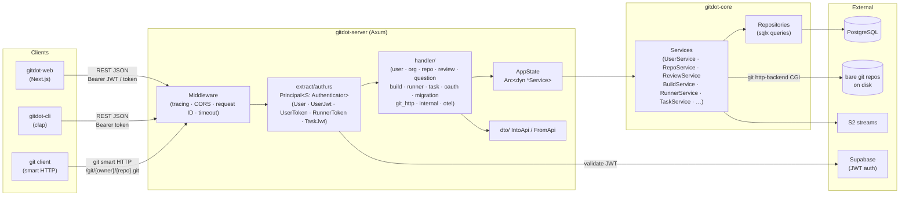
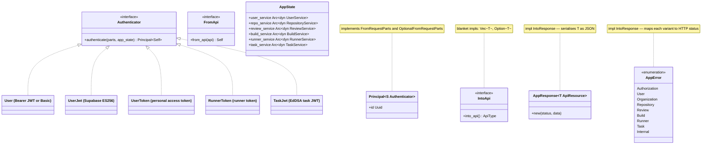

## gitdot-server

### Architecture





### Overview

`gitdot-server` is the Axum HTTP server that forms the API layer for Gitdot. It is intentionally thin: handlers extract request parameters, delegate all business logic to services from `gitdot-core`, and map results back to JSON responses using the `IntoApi` trait. The server composes all domain routers into a single `Router`, applies middleware (tracing, CORS, request IDs, timeouts), and exposes three route groups — the main API, Git smart HTTP, and internal hooks.

Authentication is handled via a sealed `Authenticator` trait with four concrete implementations: Supabase JWT (`UserJwt`), personal access token (`UserToken`), runner token (`RunnerToken`), and task JWT (`TaskJwt`). Extractors are generic over these schemes so handlers declare their auth requirement in the function signature.

### APIs

#### `GitdotServer` — [`src/app.rs`](gitdot-server/src/app.rs)

```rust
pub struct GitdotServer { /* ... */ }

impl GitdotServer {
    pub async fn new() -> anyhow::Result<Self>
    // Bootstraps tracing, loads Settings, connects to PostgreSQL,
    // builds AppState, constructs the router, binds the TCP listener.

    pub async fn start(self) -> anyhow::Result<()>
    // Calls axum::serve and blocks until shutdown.
}
```

```rust
let server = GitdotServer::new().await?;
server.start().await?;
```

---

#### `AppState` — [`src/app/app_state.rs`](gitdot-server/src/app/app_state.rs)

```rust
#[derive(FromRef, Clone)]
pub struct AppState {
    pub settings: Arc<Settings>,
    pub oauth_service: Arc<dyn OAuthService>,
    pub authentication_service: Arc<dyn AuthenticationService>,
    pub authorization_service: Arc<dyn AuthorizationService>,
    pub user_service: Arc<dyn UserService>,
    pub org_service: Arc<dyn OrganizationService>,
    pub git_http_service: Arc<dyn GitHttpService>,
    pub repo_service: Arc<dyn RepositoryService>,
    pub question_service: Arc<dyn QuestionService>,
    pub review_service: Arc<dyn ReviewService>,
    pub commit_service: Arc<dyn CommitService>,
    pub migration_service: Arc<dyn MigrationService>,
    pub build_service: Arc<dyn BuildService>,
    pub runner_service: Arc<dyn RunnerService>,
    pub task_service: Arc<dyn TaskService>,
    pub vercel_jwks: Arc<JwkSet>,
}

impl AppState {
    pub async fn new(settings: Arc<Settings>, pool: PgPool, secret_client: impl SecretClient) -> anyhow::Result<Self>
}
```

---

#### `AppError` — [`src/app/error.rs`](gitdot-server/src/app/error.rs)

```rust
#[derive(Debug, Error)]
pub enum AppError {
    #[error(transparent)] Authorization(#[from] AuthorizationError),
    #[error(transparent)] Token(#[from] TokenError),
    #[error(transparent)] User(#[from] UserError),
    #[error(transparent)] Organization(#[from] OrganizationError),
    #[error(transparent)] Repository(#[from] RepositoryError),
    #[error(transparent)] Commit(#[from] CommitError),
    #[error(transparent)] Question(#[from] QuestionError),
    #[error(transparent)] Review(#[from] ReviewError),
    #[error(transparent)] Migration(#[from] MigrationError),
    #[error(transparent)] GitHttp(#[from] GitHttpError),
    #[error(transparent)] Runner(#[from] RunnerError),
    #[error(transparent)] Build(#[from] BuildError),
    #[error(transparent)] Task(#[from] TaskError),
    #[error(transparent)] Internal(#[from] anyhow::Error),
}

impl IntoResponse for AppError { fn into_response(self) -> Response }
// Each variant maps to an appropriate HTTP status code.
```

---

#### `AppResponse<T>` — [`src/app/response.rs`](gitdot-server/src/app/response.rs)

```rust
pub struct AppResponse<T: ApiResource>(StatusCode, T);

impl<T: ApiResource> AppResponse<T> {
    pub fn new(status_code: StatusCode, data: T) -> Self
}

impl<T: ApiResource> IntoResponse for AppResponse<T> {
    fn into_response(self) -> Response
    // Serialises T as JSON with the given status code.
}
```

```rust
Ok(AppResponse::new(StatusCode::OK, dto.into_api()))
Ok(AppResponse::new(StatusCode::CREATED, dto.into_api()))
```

---

#### `Settings` — [`src/app/settings.rs`](gitdot-server/src/app/settings.rs)

```rust
pub struct Settings { /* fields private */ }

impl Settings {
    pub fn new() -> anyhow::Result<Self>
    // Reads env vars: PORT, GIT_PROJECT_ROOT, DATABASE_URL, GCP_PROJECT_ID,
    // GITDOT_PUBLIC_KEY, SUPABASE_JWT_PUBLIC_KEY, OAUTH_DEVICE_VERIFICATION_URI,
    // S2_SERVER_URL, VERCEL_OIDC_URL.

    pub fn get_server_address(&self) -> String
}
```

---

#### `Principal<S>` — [`src/extract/auth.rs`](gitdot-server/src/extract/auth.rs)

```rust
#[derive(Debug, Clone, PartialEq, Eq)]
pub struct Principal<S: Authenticator> {
    pub id: Uuid,
    _marker: PhantomData<S>,
}

#[async_trait]
pub trait Authenticator: Send + Sync + 'static {
    async fn authenticate(parts: &Parts, app_state: &AppState) -> Result<Principal<Self>, AuthorizationError>
    where Self: Sized;
}

// Authenticator implementations:
pub struct User;        // Bearer JWT or Basic token — accepts either scheme
pub struct UserJwt;     // Supabase ES256 JWT only
pub struct UserToken;   // personal access token via AuthenticationService
pub struct RunnerToken; // runner token via AuthenticationService
pub struct TaskJwt;     // EdDSA task JWT issued by gitdot
```

`Principal<S>` implements `FromRequestParts` (required auth) and `OptionalFromRequestParts` (optional). Handlers declare their auth requirement in the function signature:

```rust
async fn get_user(
    Principal(user_id): Principal<User>,
    State(state): State<AppState>,
    Path((owner,)): Path<(String,)>,
) -> Result<AppResponse<UserResource>, AppError> { ... }
```

---

#### `IntoApi` / `FromApi` — [`src/dto.rs`](gitdot-server/src/dto.rs)

```rust
pub trait IntoApi {
    type ApiType;
    fn into_api(self) -> Self::ApiType;
}

pub trait FromApi: Sized {
    type ApiType;
    fn from_api(api: Self::ApiType) -> Self;
}

// Blanket impls:
impl<T: IntoApi> IntoApi for Vec<T> { type ApiType = Vec<T::ApiType>; ... }
impl<T: IntoApi> IntoApi for Option<T> { type ApiType = Option<T::ApiType>; ... }
```

Domain impls live in `dto/` (e.g., [`dto/repository.rs`](gitdot-server/src/dto/repository.rs), [`dto/review.rs`](gitdot-server/src/dto/review.rs)).

---

#### Handler routers

Each domain module exposes a `create_*_router() -> Router<AppState>` registered in [`app.rs`](gitdot-server/src/app.rs):

```rust
create_user_router()         // /user, /user/settings, /user/{name}, /user/{name}/repositories, …
create_organization_router() // /organization, /organization/{org}/members, …
create_repository_router()   // /repository/{owner}/{repo}, …/blob, …/blobs, …/paths, …/commits, …
create_review_router()       // reviews, diffs, reviewers, publish/submit/merge
create_question_router()     // questions, answers, comments, votes
create_build_router()        // builds and build tasks (under /ci)
create_runner_router()       // CI runners (under /ci)
create_task_router()         // CI tasks (under /ci)
create_oauth_router()        // device-flow OAuth
create_migration_router()    // GitHub import
create_git_http_router()     // /git/{owner}/{repo}.git/… (smart HTTP git protocol)
create_internal_router()     // internal post-receive and review webhooks
```
