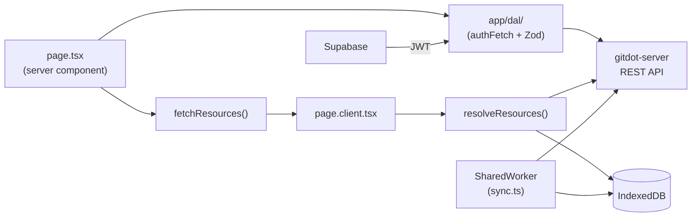
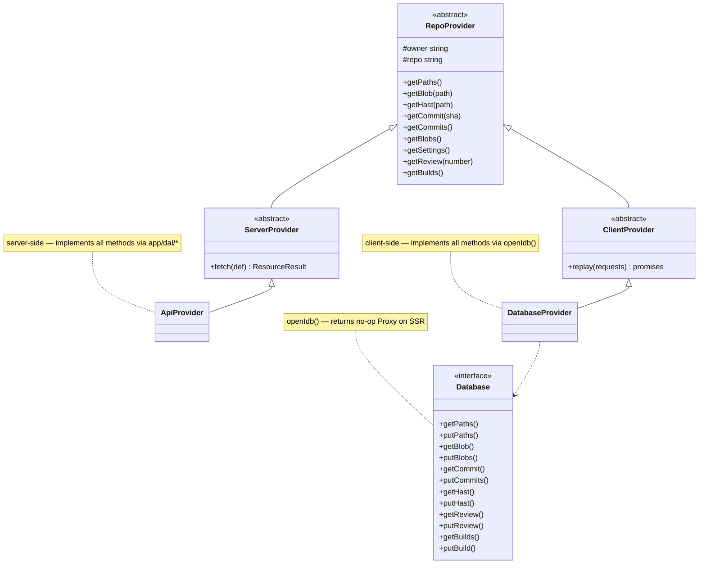

## gitdot-web

### Overview

`gitdot-web` is the Next.js 16 frontend for Gitdot, a GitHub alternative for open-source maintainers. It uses the App Router with React 19 server components, Supabase for authentication, and a custom backend API for all application data. Pages are organized into route groups for auth, landing, blog, and the authenticated main app under `app/(main)/[owner]/[repo]/...`.

Data fetching is built around a multi-provider pattern that races IndexedDB (for instant cached reads) against live API responses. A SharedWorker (`app/workers/sync.ts`) runs in the background to bulk-sync all repository resources — blobs, commits, paths, reviews, builds, and questions — into IDB, and pre-computes syntax-highlighted HAST trees for every file. This makes repeat navigations feel instant even on large repos.





### Pages & Layouts

The app uses Next.js App Router with route groups. Layouts nest from the root outward — each level adds providers, chrome, or data without re-mounting outer shells.

#### Layout tree

```
app/layout.tsx                          Root — fonts, MetricsProvider, TooltipProvider
│
├── app/(landing)/page.tsx              /  (public landing)
│
├── app/(auth)/                         Public auth pages — no layout wrapper
│   ├── login/page.tsx                  /login
│   ├── login/success/page.tsx          /login/success
│   ├── signup/page.tsx                 /signup
│   ├── signup/success/page.tsx         /signup/success
│   ├── oauth/device/page.tsx           /oauth/device  (CLI device flow)
│   └── onboarding/                     /onboarding, /onboarding/github
│
├── app/(blog)/layout.tsx               Blog — League Spartan font + blog-root class
│   ├── week/page.tsx                   /week  (index)
│   └── week/[number]/page.tsx          /week/:number
│
└── app/(main)/layout.tsx               Authenticated shell
    │   DatabaseProvider, WorkerProvider, UserProvider, ShortcutsProvider
    │   Full-screen flex column + MainFooter
    │
    ├── settings/layout.tsx             /settings — SettingsSidebar + scrollable content area
    │   ├── profile/page.tsx            /settings/profile
    │   ├── account/page.tsx            /settings/account
    │   ├── appearance/page.tsx         /settings/appearance
    │   ├── runners/page.tsx            /settings/runners
    │   ├── runners/new/page.tsx        /settings/runners/new
    │   ├── runners/[name]/page.tsx     /settings/runners/:name
    │   ├── migrations/page.tsx         /settings/migrations
    │   ├── migrations/new/page.tsx     /settings/migrations/new
    │   └── migrations/[number]/page.tsx  /settings/migrations/:number
    │
    └── [owner]/                        /:owner
        ├── page.tsx                    /:owner  (user/org profile)
        │
        ├── settings/layout.tsx         /:owner/settings — SettingsSidebar(owner) + content area
        │   ├── page.tsx                /:owner/settings
        │   ├── runners/page.tsx        /:owner/settings/runners
        │   ├── runners/new/page.tsx    /:owner/settings/runners/new
        │   └── runners/[name]/page.tsx /:owner/settings/runners/:name
        │
        └── [repo]/layout.tsx           /:owner/:repo — RepoResources context, RepoShortcuts,
            │   RepoDialogs; hides on mobile                 mobile fallback message
            │
            ├── (index)/layout.tsx      Repo tab bar — checks admin for settings tab visibility
            │   ├── page.tsx            /:owner/:repo  (repo home / README)
            │   ├── files/page.tsx      /:owner/:repo/files
            │   ├── commits/page.tsx    /:owner/:repo/commits
            │   ├── reviews/page.tsx    /:owner/:repo/reviews
            │   ├── builds/page.tsx     /:owner/:repo/builds
            │   ├── questions/page.tsx  /:owner/:repo/questions
            │   └── settings/page.tsx   /:owner/:repo/settings  (admin only)
            │
            ├── [...filePath]/          /:owner/:repo/*  (file browser)
            │   layout.tsx             Fetches paths resource; LayoutClient races IDB vs API
            │   page.tsx               Renders file or directory at path
            │
            ├── commits/[sha]/          /:owner/:repo/commits/:sha
            │   layout.tsx             Fetches commits list; LayoutClient races IDB vs API
            │   page.tsx               Commit detail + diff
            │
            ├── reviews/[number]/       /:owner/:repo/reviews/:number
            │   page.tsx               Review detail
            │
            ├── builds/[number]/        /:owner/:repo/builds/:number
            │   page.tsx               Build detail
            │
            └── questions/[number]/     /:owner/:repo/questions/:number
                layout.tsx             Fetches questions list; LayoutClient races IDB vs API
                page.tsx               Question detail
```

#### Layout responsibilities

| Layout | What it adds |
|---|---|
| `app/layout.tsx` | Global fonts (IBM Plex Sans, Inconsolata), `MetricsProvider`, `TooltipProvider` |
| `(main)/layout.tsx` | `DatabaseProvider` (IDB), `WorkerProvider` (SharedWorker), `UserProvider`, `ShortcutsProvider`, full-screen shell, `MainFooter` |
| `(main)/settings/layout.tsx` | `SettingsSidebar`, fetches current user to gate access |
| `(main)/[owner]/settings/layout.tsx` | `SettingsSidebar` scoped to owner |
| `(main)/[owner]/[repo]/layout.tsx` | `RepoResources` context (paths, commits, blobs, settings via IDB/API race), `RepoShortcuts`, `RepoDialogs`, mobile guard |
| `(main)/[owner]/[repo]/(index)/layout.tsx` | Repo tab bar; checks admin membership to show/hide Settings tab |
| `(main)/[owner]/[repo]/[...filePath]/layout.tsx` | Fetches `paths` resource for breadcrumb/sidebar; passes to `LayoutClient` for IDB race |
| `(main)/[owner]/[repo]/commits/[sha]/layout.tsx` | Fetches `commits` list; passes to `LayoutClient` for prev/next commit navigation |
| `(main)/[owner]/[repo]/questions/[number]/layout.tsx` | Fetches `questions` list; passes to `LayoutClient` for IDB race |
| `(blog)/layout.tsx` | League Spartan font, `blog-root` CSS class |

#### page.tsx / layout.tsx split pattern

Data-heavy routes follow the server/client split described in the [Provider section](#provider-appprovider----idb-vs-api-race-pattern). The server file (`page.tsx` or `layout.tsx`) calls `fetchResources` and passes `{ requests, promises }` to a `*Client` component, which calls `resolveResources` to race IDB against the API. This applies to layouts too — use the layout variant when the fetched data is needed by the chrome (nav, sidebar) rather than the page content.

---

### APIs

#### DAL (`app/dal/`) — server-only data access

All DAL functions import `"server-only"` and call `authFetch`/`authPost` with automatic Supabase JWT injection.

---

#### `app/dal/util.ts`

```typescript
export const GITDOT_SERVER_URL: string;

export async function authFetch(url: string, options?: RequestInit): Promise<Response>
export async function authHead(url: string, options?: RequestInit): Promise<Response>
export async function authPost(url: string, request: unknown, extraHeaders?: Record<string, string>): Promise<Response>
export async function authPatch(url: string, request: unknown): Promise<Response>
export async function authDelete(url: string, options?: RequestInit): Promise<Response>

export class ApiError extends Error {
  constructor(public readonly status: number, message: string)
}

export async function handleResponse<T>(response: Response, schema: ZodType<T>): Promise<T | null>
// Validates with Zod schema; returns null on 304/404; throws ApiError on other failures.

export async function handleEmptyResponse(response: Response): Promise<void>
```

---

#### `app/dal/repository.ts`

```typescript
export async function createRepository(
  owner: string, repo: string, request: CreateRepositoryRequest,
): Promise<RepositoryResource | null>

export async function getRepositoryBlob(
  owner: string, repo: string, query: GetRepositoryBlobRequest,
): Promise<RepositoryBlobResource | null>

export async function getRepositoryBlobs(
  owner: string, repo: string, request: GetRepositoryBlobsRequest,
): Promise<RepositoryBlobsResource | null>

export async function getRepositoryPaths(
  owner: string, repo: string, query?: GetRepositoryPathsRequest,
): Promise<RepositoryPathsResource | null>

export async function getRepositoryCommits(
  owner: string, repo: string, query?: GetRepositoryCommitsRequest,
): Promise<RepositoryCommitsResource | null>

export async function getRepositoryFileCommits(
  owner: string, repo: string, query: GetRepositoryFileCommitsRequest,
): Promise<RepositoryCommitsResource | null>

export async function getRepositoryCommit(
  owner: string, repo: string, sha: string,
): Promise<RepositoryCommitResource | null>

export async function getRepositoryCommitDiff(
  owner: string, repo: string, sha: string,
): Promise<RepositoryCommitDiffResource | null>

export async function getRepositorySettings(
  owner: string, repo: string,
): Promise<RepositorySettingsResource | null>

export async function updateRepositorySettings(
  owner: string, repo: string, request: UpdateRepositorySettingsRequest,
): Promise<RepositorySettingsResource | null>

export async function getRepositoryResources(
  owner: string, repo: string, request?: GetRepositoryResourcesRequest,
): Promise<RepositoryResourcesResource | null>

export async function deleteRepository(owner: string, repo: string): Promise<void>
```

---

#### `app/dal/review.ts`, `build.ts`, `user.ts`, `question.ts`

```typescript
// review.ts
export async function getReview(owner: string, repo: string, number: number): Promise<ReviewResource | null>
export async function listReviews(owner: string, repo: string): Promise<ReviewResource[] | null>
export async function createReview(owner: string, repo: string, request: CreateReviewRequest): Promise<ReviewResource | null>
export async function updateReview(owner: string, repo: string, number: number, request: UpdateReviewRequest): Promise<ReviewResource | null>

// build.ts
export async function getBuild(owner: string, repo: string, number: number): Promise<BuildResource | null>
export async function getBuilds(owner: string, repo: string): Promise<BuildResource[] | null>

// user.ts
export async function getUser(username: string): Promise<UserResource | null>
export async function updateUser(request: UpdateUserRequest): Promise<UserResource | null>

// question.ts
export async function listQuestions(owner: string, repo: string): Promise<QuestionResource[] | null>
export async function createQuestion(owner: string, repo: string, request: CreateQuestionRequest): Promise<QuestionResource | null>
export async function updateQuestion(owner: string, repo: string, id: string, request: UpdateQuestionRequest): Promise<QuestionResource | null>
```

---

#### Server Actions (`app/actions/`) — `"use server"` mutations

Return shape is always `{ success: true } | { error: string }` or `{ data: T } | { error: string }`.

```typescript
// actions/repository.ts
export async function getRepositoryHast(owner: string, repo: string, path: string): Promise<Root | null>
// Returns a pre-rendered Shiki HAST tree for syntax-highlighted display.

// actions/review.ts
export async function createReview(owner: string, repo: string, branch: string): Promise<ActionResult>
export async function submitReview(owner: string, repo: string, number: number, request: SubmitReviewRequest): Promise<ActionResult>
export async function addComment(owner: string, repo: string, number: number, request: AddCommentRequest): Promise<ActionResult>

// actions/build.ts
export async function triggerBuild(owner: string, repo: string, trigger: string): Promise<ActionResult>

// actions/user.ts
export async function updateProfile(request: UpdateProfileRequest): Promise<ActionResult>
export async function updateSettings(request: UpdateSettingsRequest): Promise<ActionResult>
```

---

#### Provider (`app/provider/`) — IDB vs. API race pattern

```typescript
// app/provider/types.ts

export abstract class RepoProvider {
  constructor(protected owner: string, protected repo: string)
  abstract getPaths(): Promise<RepositoryPathsResource | null>
  abstract getBlob(path: string): Promise<RepositoryBlobResource | null>
  abstract getHast(path: string): Promise<Root | null>
  abstract getCommit(sha: string): Promise<RepositoryCommitResource | null>
  abstract getCommits(): Promise<RepositoryCommitResource[] | null>
  abstract getBlobs(): Promise<RepositoryBlobsResource | null>
  abstract getSettings(): Promise<RepositorySettingsResource | null>
  abstract getQuestions(): Promise<QuestionResource[] | null>
  abstract getReview(number: number): Promise<ReviewResource | null>
  abstract getReviews(): Promise<ReviewResource[] | null>
  abstract getBuilds(): Promise<BuildResource[] | null>
  abstract getBuild(number: number): Promise<BuildResource | null>
}

// ServerProvider (server-side) — records which method+args were called for client replay
export abstract class ServerProvider extends RepoProvider {
  fetch<T extends ResourceDefinition>(def: T): ResourceResult<ShapeFromDefinition<T>>
}

// ClientProvider (client-side) — re-invokes recorded requests against IDB
export abstract class ClientProvider extends RepoProvider {
  replay(requests: Record<string, ResourceRequestType>): Record<string, Promise<unknown>>
}
```

```typescript
// app/provider/server.ts
export function fetchResources<T extends ResourceDefinition>(
  owner: string, repo: string, resources: T,
): ResourceResult<T>
// Entry point for server components. Returns { requests, promises }.

export class ApiProvider extends ServerProvider
// Implements all RepoProvider methods via DAL calls.
```

```typescript
// app/provider/client.ts
export function resolveResources<T extends ResourceDefinition>(
  owner: string, repo: string,
  requests: ResourceRequestsType<T>,
  serverPromises: ResourcePromisesType<T>,
): ResourcePromisesType<T>
// Races IDB (DatabaseProvider) vs. server promises; writes API results back to IDB.

export class DatabaseProvider extends ClientProvider
// Implements all RepoProvider methods via openIdb().
```

Usage in a route:

```typescript
// page.tsx (server component)
const { requests, promises } = fetchResources(owner, repo, {
  readme: (p) => p.getBlob("README.md"),
  commits: (p) => p.getCommits(),
});
return <PageClient owner={owner} repo={repo} requests={requests} promises={promises} />;

// page.client.tsx (client component)
const resolvedPromises = resolveResources(owner, repo, requests, promises);
const readme = use(resolvedPromises.readme);
```

---

#### IndexedDB (`app/db/idb.ts`)

```typescript
export interface Database {
  getPaths(owner: string, repo: string): Promise<RepositoryPathsResource | null>
  putPaths(owner: string, repo: string, paths: RepositoryPathsResource): Promise<void>

  getBlob(owner: string, repo: string, path: string): Promise<RepositoryBlobResource | null>
  getBlobs(owner: string, repo: string): Promise<RepositoryBlobsResource | undefined>
  putBlobs(owner: string, repo: string, blobs: RepositoryBlobsResource): Promise<void>

  getCommit(owner: string, repo: string, sha: string): Promise<RepositoryCommitResource | null>
  getCommits(owner: string, repo: string): Promise<RepositoryCommitResource[]>
  putCommit(owner: string, repo: string, commit: RepositoryCommitResource): Promise<void>
  putCommits(owner: string, repo: string, commits: RepositoryCommitResource[]): Promise<void>

  getHast(owner: string, repo: string, path: string): Promise<Root | null>
  getHasts(owner: string, repo: string): Promise<Map<string, Root> | null>
  putHast(owner: string, repo: string, path: string, hast: Root): Promise<void>

  getSettings(owner: string, repo: string): Promise<RepositorySettingsResource | null>
  putSettings(owner: string, repo: string, settings: RepositorySettingsResource): Promise<void>

  getMetadata(owner: string, repo: string): Promise<RepositoryMetadata | null>
  putMetadata(owner: string, repo: string, metadata: RepositoryMetadata): Promise<void>

  getQuestions(owner: string, repo: string): Promise<QuestionResource[] | null>
  putQuestions(owner: string, repo: string, questions: QuestionResource[]): Promise<void>

  getReview(owner: string, repo: string, number: number): Promise<ReviewResource | null>
  getReviews(owner: string, repo: string): Promise<ReviewResource[]>
  putReview(owner: string, repo: string, number: number, review: ReviewResource): Promise<void>

  getBuilds(owner: string, repo: string): Promise<BuildResource[] | null>
  getBuild(owner: string, repo: string, number: number): Promise<BuildResource | null>
  putBuilds(owner: string, repo: string, builds: BuildResource[]): Promise<void>
  putBuild(owner: string, repo: string, build: BuildResource): Promise<void>
}

export function openIdb(): Database
// Returns a Database handle. No-ops on server/SSR via Proxy.
```

---

#### SharedWorker (`app/workers/sync.ts`)

Background worker that fetches all repo resources from `/:owner/:repo/resources`, writes them to IDB, then pre-renders Shiki HAST for every file blob.

```typescript
// Connect from a client component:
const worker = new SharedWorker("/workers/sync.js");
worker.port.postMessage({ owner, repo });
worker.port.onmessage = ({ data }) => {
  // data: { resourcesReady: boolean, hastsReady: boolean }
};
```

---

#### Auth (`app/lib/supabase.ts`)

```typescript
export function createSupabaseClient(): SupabaseClient
// Server-side Supabase client with cookie-based session.

export async function updateSession(request: NextRequest): Promise<{ user: User | null, response: NextResponse }>
// Called in proxy.ts middleware to refresh session on every request.

export async function getSession(): Promise<Session | null>
// Returns current Supabase session with access token.

export async function getClaims(): Promise<UserMetadata | null>
// Returns JWT claims including username and orgs list.
```

---

#### Utilities (`app/util/`)

```typescript
export function cn(...classes: ClassValue[]): string
// Merges Tailwind classes via clsx + tailwind-merge.

export function timeAgo(date: Date | string): string
export function timeAgoFull(date: Date | string): string
export function formatDate(date: Date | string): string
export function formatDateTime(date: Date | string): string
export function formatTime(date: Date | string): string
export function subtractDays(date: Date, n: number): Date

export function pluralize(count: number, word: string): string

export function toQueryString(obj: Record<string, unknown>): string
// Converts object to URL query string; skips null/undefined values.

export function validateEmail(s: string): boolean
export function validatePassword(s: string): boolean
export function validateRepoSlug(s: string): boolean
export function validateUsername(s: string): boolean
```
