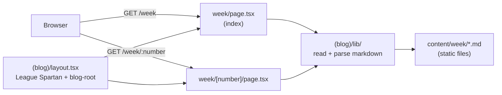

## app/(blog)

### Overview

`app/(blog)` is the public blog route group for Gitdot. It contains weekly development updates written as Markdown files, a blog index page at `/week`, and individual post pages at `/week/[number]`. The route group applies a dedicated layout (League Spartan font, `blog-root` CSS class) that is completely separate from the authenticated `(main)` shell.

Markdown files live in `content/week/` and are parsed server-side. The `lib/` directory contains utilities for reading and rendering those files.

### Architecture



### APIs

#### `layout.tsx`

```typescript
export default function BlogLayout({ children }: { children: React.ReactNode }): JSX.Element
// Applies League_Spartan font variable and adds the "blog-root" CSS class to the wrapper div.
// Scopes blog-specific typography styles away from the main app.
```

---

#### `week/page.tsx`

```typescript
export default async function WeekIndexPage(): Promise<JSX.Element>
// Lists all published weekly entries sorted by number descending.
// Each entry links to /week/:number.
```

---

#### `week/[number]/page.tsx`

```typescript
export default async function WeekPage({
  params,
}: {
  params: Promise<{ number: string }>
}): Promise<JSX.Element>
// Renders a single weekly blog post. Reads the corresponding markdown file,
// parses frontmatter (title, date, description), and renders body as HTML.

export async function generateStaticParams(): Promise<{ number: string }[]>
// Pre-generates static paths for all available week numbers at build time.
```

---

#### `lib/` — Blog utilities

```typescript
export interface WeekEntry {
  number: number
  title: string
  date: string
  description: string
  content: string   // Parsed HTML body.
}

export async function getWeekEntry(number: number): Promise<WeekEntry | null>
// Reads content/week/{number}.md, parses frontmatter and markdown body.
// Returns null if the file does not exist.

export async function listWeekEntries(): Promise<WeekEntry[]>
// Returns all entries in content/week/ sorted by number descending.
```
