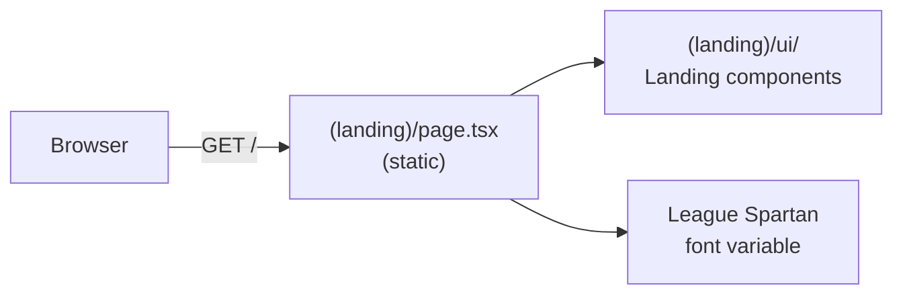

## app/(landing)

### Overview

`app/(landing)` is the public landing page route group, rendered at `/`. It is a statically generated marketing page introducing Gitdot to new visitors. The route group uses the League Spartan font and is completely separate from the authenticated `(main)` app shell.

Route-specific UI components live in `(landing)/ui/`.

### Architecture



### APIs

#### `page.tsx`

```typescript
export default function LandingPage(): JSX.Element
// Statically rendered home page at "/".
// Sections:
//   1. Hero — Gitdot logo and tagline.
//   2. What is gitdot? — Product description.
//   3. Who is gitdot for? — Target audience (open-source maintainers).
//   4. What problem does gitdot solve? — Value proposition.
// Applies League_Spartan font variable to the page wrapper.
```

---

#### `ui/` — Landing-specific components

```typescript
export function SubscribeButton(): JSX.Element
// Email subscribe / waitlist button. Rendered inside the hero section.
```
