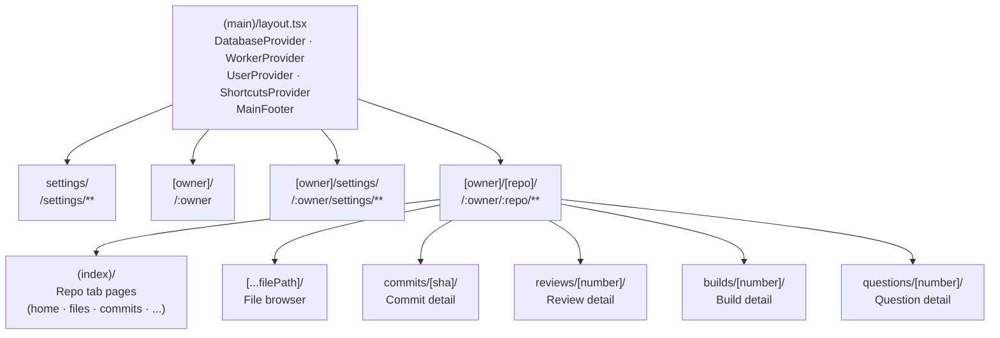

## app/(main)

### Overview

`app/(main)` is the authenticated application shell for Gitdot. Its root layout mounts four global providers (`DatabaseProvider`, `WorkerProvider`, `UserProvider`, `ShortcutsProvider`) that are available to every page inside this route group. The shell renders a full-screen flex column with a sticky `MainFooter` at the bottom.

Routes are organized into sub-groups:
- `/settings/**` — user-level settings (profile, runners, migrations)
- `/:owner` — user/org profile page
- `/:owner/settings/**` — owner-scoped runner settings
- `/:owner/:repo/**` — repository pages (file browser, commits, reviews, builds, questions)

### Architecture



### APIs

#### `layout.tsx`

```typescript
export default async function MainLayout({
  children,
}: {
  children: React.ReactNode
}): Promise<JSX.Element>
// Root layout for all authenticated pages.
// Wraps children in: DatabaseProvider → WorkerProvider → UserProvider → ShortcutsProvider.
// Renders MainFooter (toolbar + breadcrumbs + vitals) at the bottom of the viewport.
```

---

#### `ui/` — App shell components

See [`ui/README.md`](ui/README.md).

```typescript
export function AuthDialog({ open, setOpen }: { open: boolean; setOpen: (v: boolean) => void }): JSX.Element
// Email / GitHub login dialog. Shown by UserProvider when requireAuth() fails.

export function MainToolbar(): JSX.Element
// Top action bar: file search, create repo, user dropdown, shortcuts button.

export function MainFooter(): JSX.Element
// Sticky bottom bar: breadcrumbs, page vitals (FCP), MainToolbar.
```

---

#### `context/` — Global providers and hooks

See [`context/README.md`](context/README.md).

```typescript
export function UserProvider(...)       // User identity + auth-gating.
export function useUserContext()        // { user, refreshUser, requireAuth }

export function ShortcutsProvider(...) // Keyboard shortcut registry.
export function useShortcuts(...)      // Register shortcuts for a component.

export function DatabaseProvider(...)  // IDB initialization.
export function WorkerProvider(...)    // SharedWorker lifecycle.
export function useWorkerContext()     // { sync: SharedWorker | null }
```

---

#### `hooks/`

```typescript
export function useRightSidebar(): boolean
// Returns whether the right sidebar is currently open.
// Listens to the "toggleRightSidebar" window event.
```
