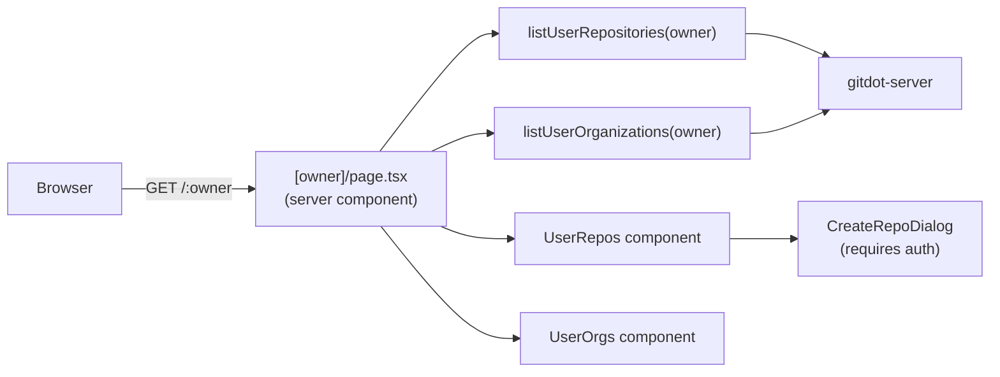

## app/(main)/[owner]

### Overview

`app/(main)/[owner]` renders the public profile page for a user or organization at `/:owner`. It fetches the owner's repositories and organizations in parallel and displays them in two sections. If the owner is not found, the page renders a 404-style error message.

Owner-scoped settings (runner management) live in `[owner]/settings/` as a nested route group.

### Architecture



### APIs

#### `page.tsx`

```typescript
export default async function OwnerPage({
  params,
}: {
  params: Promise<{ owner: string }>
}): Promise<JSX.Element>
// Server component. Fetches repositories and organizations in parallel.
// If the user is not found (getUser returns null), renders a "not found" message.
// Otherwise renders UserOrgs (if any) then UserRepos.
```

---

#### `ui/user-repos.tsx`

```typescript
export function UserRepos({
  owner,
  repos,
}: {
  owner: string
  repos: RepositoryResource[]
}): JSX.Element
// Lists all repositories for the owner.
// Header includes a CreateRepoButton (requires auth via requireAuth()).

export function CreateRepoButton(): JSX.Element
// Button that calls requireAuth() before opening CreateRepoDialog.

export function CreateRepoDialog({
  open,
  setOpen,
}: {
  open: boolean
  setOpen: (v: boolean) => void
}): JSX.Element
// Dialog form for creating a new repository. Fields: name, visibility.
// Calls createRepositoryAction on submit.
```

---

#### `ui/user-orgs.tsx`

```typescript
export function UserOrgs({
  orgs,
}: {
  orgs: OrganizationResource[]
}): JSX.Element
// Renders organization membership chips linking to /:orgName.
// Only shown when the owner belongs to at least one organization.
```

---

#### `settings/` — Owner-scoped runner settings

```typescript
// [owner]/settings/layout.tsx
export default async function OwnerSettingsLayout({ children, params }): Promise<JSX.Element>
// Renders SettingsSidebar scoped to the owner slug + content area.

// [owner]/settings/runners/page.tsx
// [owner]/settings/runners/new/page.tsx
// [owner]/settings/runners/[name]/page.tsx
// Same structure as /settings/runners/** but scoped to /:owner.
```
