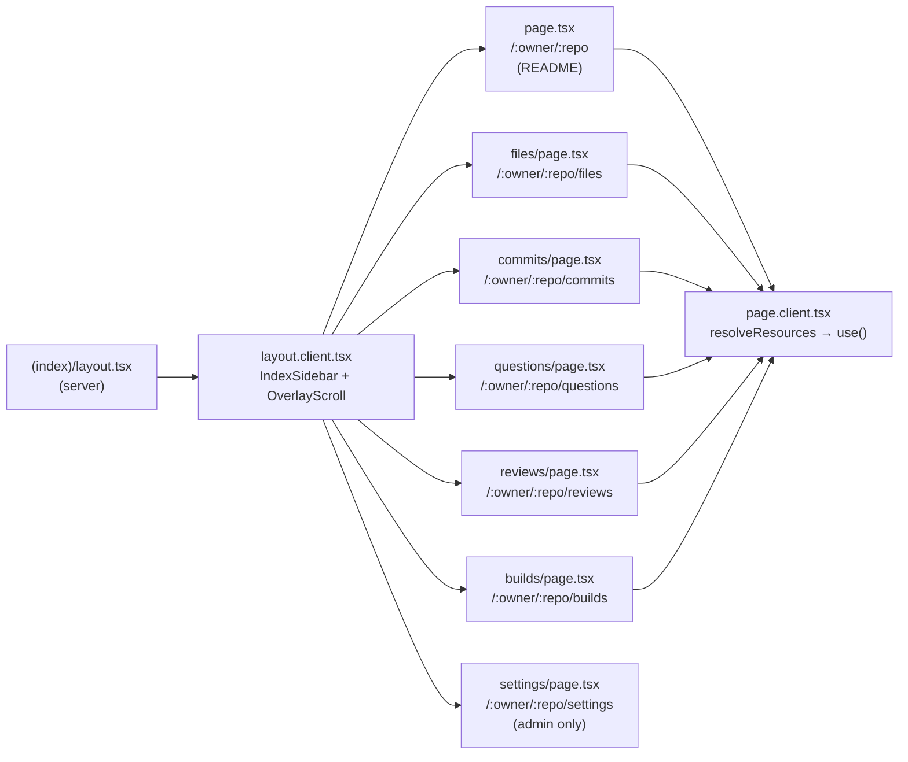

## app/(main)/[owner]/[repo]/(index)

### Overview

`app/(main)/[owner]/[repo]/(index)` contains the main tab pages for a repository: home (README), files, commits, questions, reviews, builds, and settings. A shared `(index)/layout.tsx` renders the tab navigation sidebar, checks admin membership to conditionally show the Settings tab, and wraps content in an `OverlayScroll` container.

Every content page follows the server/client split pattern: a `page.tsx` server component calls `fetchResources` and a `page.client.tsx` client component calls `resolveResources` to race IndexedDB against the API.

### Architecture



### APIs

#### `layout.tsx` / `layout.client.tsx`

```typescript
// layout.tsx (server)
export default async function IndexLayout({ children, params }): Promise<JSX.Element>
// Checks admin membership via getUserMetadata(); passes showSettings flag to LayoutClient.

// layout.client.tsx
export function LayoutClient({
  children,
  showSettings,
}: {
  children: React.ReactNode
  showSettings: boolean
}): JSX.Element
// Renders IndexSidebar + OverlayScroll content area.

export const NAV_ITEMS: Array<{ path: string; label: string; protected?: boolean }>
// [home, files, commits, questions, reviews, builds, settings (protected)]

export function IndexSidebar({ showSettings }: { showSettings: boolean }): JSX.Element
// Left nav sidebar. Highlights the active tab based on the current pathname.
// Hides the Settings item when showSettings is false.
```

---

#### Home — `page.tsx` / `page.client.tsx`

```typescript
// page.tsx
export type Resources = { readme: RepositoryBlobResource | null }
export default async function HomePage({ params }): Promise<JSX.Element>
// Fetches README.md blob. Passes { requests, promises } to PageClient.

// page.client.tsx
export function PageClient({ owner, repo, requests, promises }): JSX.Element
// Races IDB vs API for the README blob; renders MarkdownBody when resolved.
```

---

#### Files — `files/page.tsx` / `files/page.client.tsx`

```typescript
// page.tsx
export type Resources = { paths: RepositoryPathsResource | null }
export default async function FilesPage({ params }): Promise<JSX.Element>

// page.client.tsx
export function PageClient({ owner, repo, requests, promises }): JSX.Element
// Renders FolderViewer at the repo root using getFolderEntries().
```

---

#### Commits — `commits/page.tsx` / `commits/page.client.tsx`

```typescript
// page.tsx
export type Resources = {
  commits: RepositoryCommitResource[] | null
  settings: RepositorySettingsResource | null
}
export default async function CommitsPage({ params }): Promise<JSX.Element>

// page.client.tsx
export function PageClient({ owner, repo, requests, promises }): JSX.Element
// Client-side date-range filtering and commit-filter dropdown.
// Registers "filter commits" keyboard shortcut.
```

---

#### Questions — `questions/page.tsx` / `questions/page.client.tsx`

```typescript
export type QuestionsFilter = "popular" | "unanswered" | "all"
export type QuestionsSort = "newest" | "oldest" | "votes"

// page.client.tsx
export function PageClient({ owner, repo, requests, promises }): JSX.Element
// Client-side filtering + sorting via processQuestions().
// Filter: popular (≥1 answer) | unanswered (0 answers) | all.
```

---

#### Reviews — `reviews/page.tsx` / `reviews/page.client.tsx`

```typescript
export type ReviewsFilter = "all" | "open" | "merged"

// page.client.tsx
export function PageClient({ owner, repo, requests, promises }): JSX.Element
// Filters reviews by status via filterReviews(). Tab counts update live.
```

---

#### Builds — `builds/page.tsx` / `builds/page.client.tsx`

```typescript
export type BuildsFilter = "all" | "main" | "pull-request"

// page.client.tsx
export function PageClient({ owner, repo, requests, promises }): JSX.Element
// Joins builds with commits by SHA to show commit context per build.
// Filters by trigger type.
```

---

#### Settings — `settings/page.tsx`

```typescript
export default async function RepoSettingsPage({ params }): Promise<JSX.Element>
// Server component, admin-only (checked via getUserMetadata()).
// Fetches runners scoped to this repo's owner.
// Renders RepositorySettingsGeneral (name, visibility, danger zone)
// and RepositorySettingsRunners (runner assignment).
```
