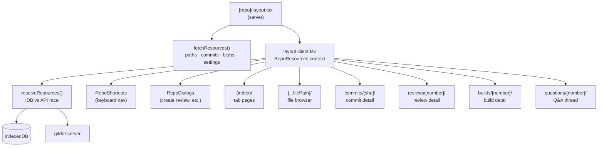

## app/(main)/[owner]/[repo]

### Overview

`app/(main)/[owner]/[repo]` is the root layout segment for all repository pages at `/:owner/:repo/**`. Its layout pre-fetches the four core repository resources (paths, commits, blobs, settings) and races IndexedDB against the API so all child pages start with data already resolved. It also mounts repo-scoped keyboard shortcuts and dialogs, and renders a mobile guard (repository pages are desktop-only).

Child route segments under this directory:

| Route | Purpose |
|---|---|
| `(index)/` | Tab pages: home, files, commits, questions, reviews, builds, settings |
| `[...filePath]/` | File and directory browser |
| `commits/[sha]/` | Commit detail + diff |
| `reviews/[number]/` | Code review detail |
| `builds/[number]/` | Build detail + task logs |
| `questions/[number]/` | Q&A thread detail |

### Architecture



### APIs

#### `layout.tsx`

```typescript
export type Resources = {
  paths: RepositoryPathsResource | null
  commits: RepositoryCommitResource[] | null
  blobs: RepositoryBlobsResource | null
  settings: RepositorySettingsResource | null
}

export default async function RepoLayout({
  children,
  params,
}: {
  children: React.ReactNode
  params: Promise<{ owner: string; repo: string }>
}): Promise<JSX.Element>
// Server component. Calls fetchResources() for paths/commits/blobs/settings.
// Renders a mobile guard ("desktop only") and passes resources to LayoutClient.
```

---

#### `resources/context.tsx`

```typescript
export interface RepoResourcesContextType {
  owner: string
  repo: string
  promises: ResourcePromisesType<Resources>
}

export function RepoResources({
  owner,
  repo,
  requests,
  promises,
  children,
}: RepoResourcesProps): JSX.Element
// Client component. Calls resolveResources() to race IDB vs server, then provides
// the resolved promises to all child components via context.

export function useRepoResources(): RepoResourcesContextType
// Returns { owner, repo, promises }. Must be used inside RepoResources.
```

---

#### `util/`

```typescript
export function getFolderEntries(
  paths: RepositoryPathsResource,
  prefix: string,
): FolderEntry[]
// Derives the immediate children of a directory from the flat paths list.
// Used by the file browser and directory listing components.

export type FolderEntry = {
  name: string
  path: string
  type: "blob" | "tree"
}
```

---

#### `ui/shortcuts.tsx`

```typescript
export function RepoShortcuts({ owner, repo }: { owner: string; repo: string }): null
// Registers repository-scoped keyboard shortcuts via useShortcuts().
// Examples: "g h" → navigate to repo home, "g f" → files, "g c" → commits.
```

---

#### `ui/dialog/repo-dialogs.tsx`

```typescript
export function RepoDialogs({ owner, repo }: { owner: string; repo: string }): JSX.Element
// Portal container for dialogs that can be triggered from anywhere inside the repo layout.
// Includes: CreateReviewDialog (triggered by "openCreateReview" window event).
```
