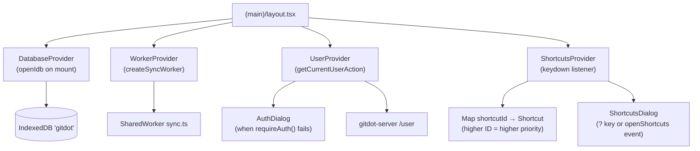

## app/(main)/context

### Overview

`app/(main)/context` contains the four global React Context providers that are mounted at the root of the authenticated app shell. Together they provide: user identity + auth-gating (`user.tsx`), a priority-sorted keyboard shortcut registry (`shortcuts.tsx`), IndexedDB initialization (`database.tsx`), and the background SharedWorker lifecycle (`worker.tsx`).

All four providers are composed in `app/(main)/layout.tsx`.

### Architecture



### APIs

#### `user.tsx`

```typescript
export interface UserContextType {
  user: UserResource | null
  refreshUser(): Promise<void>
  // Re-fetches user from server via getCurrentUserAction() and updates state.
  requireAuth(): boolean
  // Returns true if authenticated. If not, shows AuthDialog and returns false.
}

export function UserProvider({ children }: { children: React.ReactNode }): JSX.Element
// Calls getCurrentUserAction() on mount. Renders AuthDialog portal for unauthenticated gates.

export function useUserContext(): UserContextType
// Must be used inside UserProvider. Throws with a helpful message if used outside.
```

---

#### `shortcuts.tsx`

```typescript
export interface Shortcut {
  name: string
  description: string
  keys: string[]       // e.g. ["Mod+K"] or ["g", "h"] (chord sequences)
  execute(): void
}

export function ShortcutsProvider({ children }: { children: React.ReactNode }): JSX.Element
// Maintains a priority-sorted registry of shortcuts.
// On keydown: resolves the matching shortcut with the highest registration priority.
// Skips execution when:
//   - An input/textarea/contenteditable is focused (isInputFocused()).
//   - A Radix modal/dialog is open (isRadixModalOpen()).
// Opens the shortcuts reference dialog on "?" keydown or "openShortcuts" window event.

export function useShortcuts(shortcuts: Shortcut[]): void
// Registers shortcuts on mount; unregisters them on unmount.
// Higher-priority registrations (later in time) shadow earlier ones with the same key.

export function eventKey(event: KeyboardEvent): string
// Normalises a keyboard event to a canonical string: "Mod+K", "Ctrl+Alt+Escape", "g", etc.
// "Mod" maps to Cmd on macOS and Ctrl elsewhere.

export function displayKey(key: string): React.ReactNode
// Formats a canonical key string for display in the shortcuts dialog.
// "Escape" → "Esc", "Shift" → ⇧ symbol, "Mod" → ⌘ on macOS.
```

---

#### `database.tsx`

```typescript
export function DatabaseProvider({ children }: { children: React.ReactNode }): JSX.Element
// Calls openIdb() on mount to initialize the IndexedDB schema before any child reads.
// Renders children immediately (no loading gate — IDB open is best-effort).
```

---

#### `worker.tsx`

```typescript
export interface WorkerContextType {
  sync: SharedWorker | null   // null before the component mounts (SSR).
}

export function WorkerProvider({ children }: { children: React.ReactNode }): JSX.Element
// Creates the background sync SharedWorker on mount; terminates its port on unmount.

export function useWorkerContext(): WorkerContextType
// Returns { sync }. Throws if used outside WorkerProvider.
```
