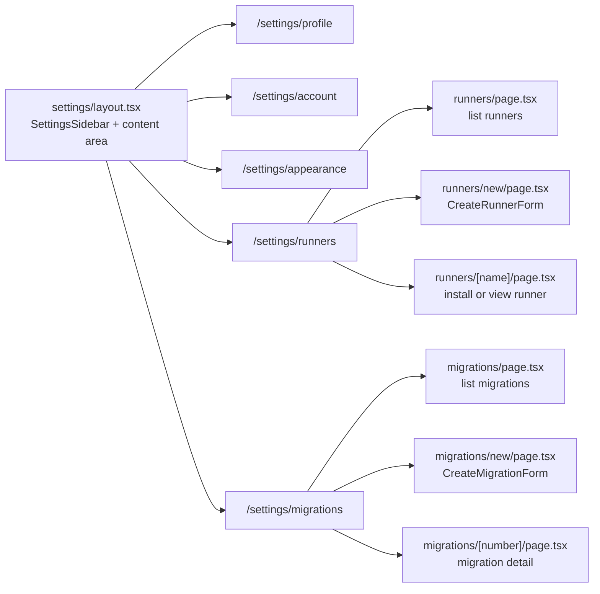

## app/(main)/settings

### Overview

`app/(main)/settings` contains the user-level settings area, accessible at `/settings`. The layout renders a two-column shell: a `SettingsSidebar` on the left and a scrollable content area on the right. It requires authentication — unauthenticated visitors are redirected.

Sub-routes cover profile editing, account management, appearance preferences, CI runner management, and GitHub repository migrations.

### Architecture



### APIs

#### `layout.tsx`

```typescript
export default async function SettingsLayout({
  children,
}: {
  children: React.ReactNode
}): Promise<JSX.Element>
// Server component. Calls getCurrentUser() — redirects to /login if unauthenticated.
// Renders SettingsSidebar on the left and children in a scrollable content area.
// Desktop only; mobile shows a "To come" placeholder.
```

---

#### `ui/settings-sidebar.tsx`

```typescript
export function SettingsSidebar({ owner }: { owner?: string }): JSX.Element
// Client-side navigation sidebar.
// Without owner: shows user settings nav (/settings/profile, /account, /appearance,
//   /runners, /migrations).
// With owner: shows owner-scoped nav (/:owner/settings/runners).
// Highlights the active item based on the current pathname.
```

---

#### Runners (`settings/runners/`)

```typescript
// runners/page.tsx
export default async function RunnersPage(): Promise<JSX.Element>
// Fetches all runners for the current user and renders the Runners list component.

// runners/ui/runners.tsx
export function Runners({ runners }: { runners: RunnerResource[] }): JSX.Element
// Displays a list of runners. Each row shows: name, status badge, link to detail page.

export function RunnerStatus({ runner }: { runner: RunnerResource }): JSX.Element
// "Pending installation" | "Active" | "Active {timeAgo}".
// Uses a 90-second heuristic: active if last_active is within 90s.

// runners/new/page.tsx
export default async function NewRunnerPage(): Promise<JSX.Element>
// Renders CreateRunnerForm (main column) and CreateRunnerInstructions (sidebar).

// runners/ui/create-runner-form.tsx
export function CreateRunnerForm({ owner, ownerType }: CreateRunnerFormProps): JSX.Element
// Client form. Fields: name (text, required), owner (read-only), owner_type (read-only).
// Calls createRunnerAction via useActionState. Shows error message on failure.

// runners/[name]/page.tsx
export default async function RunnerDetailPage({ params }): Promise<JSX.Element>
// Fetches the named runner. If never activated (no last_active), renders InstallRunnerForm.
// If active, renders RunnerMain + RunnerDetails panels.
```

---

#### Migrations (`settings/migrations/`)

```typescript
// migrations/page.tsx
export default async function MigrationsPage(): Promise<JSX.Element>
// Fetches all migrations and renders the Migrations list component.

// migrations/ui/migrations.tsx
export function Migrations({ migrations }: { migrations: MigrationResource[] }): JSX.Element
// List of migrations. Each row shows: number, origin, repo count, status badge, creation date.

export function MigrationStatus({ status }: { status: string }): JSX.Element
// Status badge: "Pending" (gray) | "Running" (yellow) | "Completed" (green) | "Failed" (red).

// migrations/new/page.tsx
export default async function NewMigrationPage(): Promise<JSX.Element>
// Fetches GitHub App installations and their repos.
// Renders CreateMigrationForm (main) + CreateMigrationInstructions (sidebar).

// migrations/[number]/page.tsx
export default async function MigrationDetailPage({ params }): Promise<JSX.Element>
// Fetches migration by number. Shows metadata (origin, destination, status, dates)
// and a per-repository status list. Failed repos show their error on hover.

export function RepositoryStatus({ repo }: { repo: MigrationRepoResource }): JSX.Element
// Same color coding as MigrationStatus. Adds error Tooltip on failure.
```
