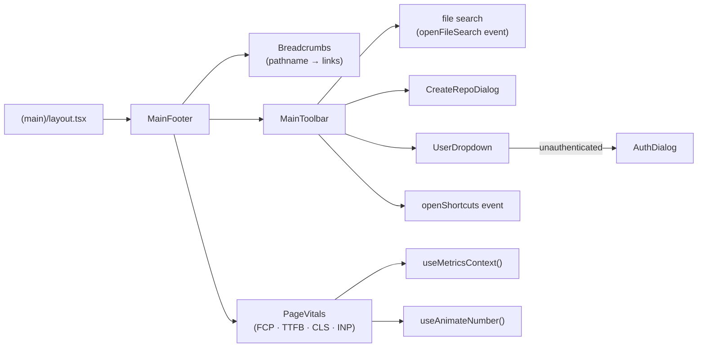

## app/(main)/ui

### Overview

`app/(main)/ui` contains the top-level shell components for the authenticated application: the toolbar, footer, and login/signup dialog. These are rendered by `app/(main)/layout.tsx` and wrap every authenticated page.

`MainFooter` sits at the bottom of the viewport and combines breadcrumb navigation, Core Web Vitals metrics, and the `MainToolbar`. `MainToolbar` houses the file-search picker, create-repo button, and the user dropdown.

### Architecture



### APIs

#### `auth-dialog.tsx`

```typescript
export function AuthDialog({
  open,
  setOpen,
}: {
  open: boolean
  setOpen: (open: boolean) => void
}): JSX.Element
// Modal login/signup dialog.
// Tabs: Email OTP (calls login()) and GitHub OAuth (calls loginWithGithub()).
// Shows a "check your email" success state after OTP submission.
```

---

#### `main-toolbar.tsx`

```typescript
export function MainToolbar(): JSX.Element
// Horizontal action bar rendered inside MainFooter.
// Buttons:
//   File search  — dispatches "openFileSearch" window event.
//   Create repo  — opens CreateRepoDialog (requires auth via requireAuth()).
//   User menu    — UserDropdown with profile/sign-out or log-in/sign-up items.
//   Shortcuts    — dispatches "openShortcuts" window event.

export function ToolbarButton({
  icon,
  iconClassName,
  label,
  onClick,
}: ToolbarButtonProps): JSX.Element
// Reusable icon button for the toolbar. Shows a Tooltip with the label on hover.

export function DropdownToolbarButton({
  icon,
  label,
  children,
}: DropdownToolbarButtonProps): JSX.Element
// Toolbar button that opens a DropdownMenu. children are the menu items.

export function UserDropdown(): JSX.Element
// Renders the current user's avatar/username as a toolbar button.
// Dropdown shows authenticated items (Profile, Sign out) or unauthenticated items (Log in, Sign up).
```

---

#### `main-footer.tsx`

```typescript
export function MainFooter(): JSX.Element
// Sticky bottom bar. Contains:
//   Breadcrumbs — clickable path segments derived from the current pathname.
//   PageVitals  — animated FCP display with dropdown showing TTFB/CLS/INP.
//   MainToolbar — action buttons.

export function Breadcrumbs(): JSX.Element
// Parses window.location.pathname into clickable Link segments.
// Special handling for file paths (/:owner/:repo/*filePath).

export function PageVitals(): JSX.Element
// Shows the current page FCP with useAnimateNumber() animation.
// Dropdown expands to show all four Core Web Vitals from useMetricsContext().
```
