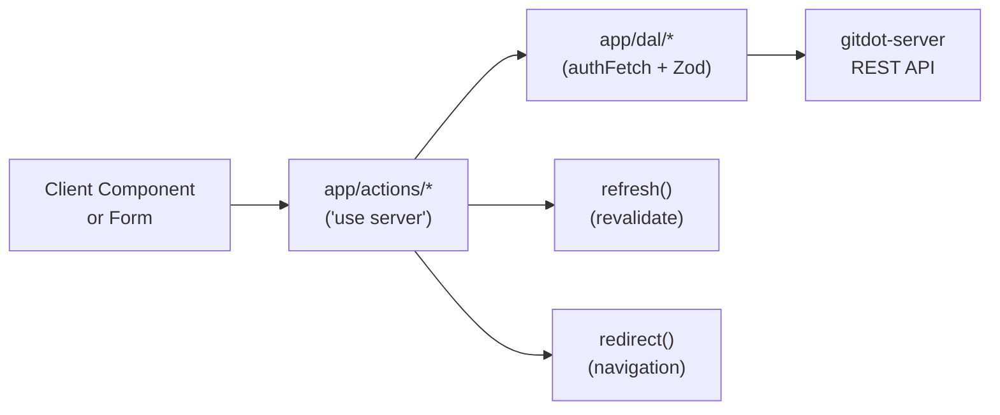

## app/actions

### Overview

`app/actions` contains all Next.js server actions — mutations that run on the server under the `"use server"` directive. Actions call DAL functions, then call `refresh()` to revalidate the current request. Most actions are called from client components via `useActionState` or direct invocation.

Return shapes are always `{ success: true } | { error: string }` or `{ data: T } | { error: string }`.

### Architecture



### APIs

#### `user.ts`

```typescript
export async function getCurrentUserAction(): Promise<UserResource | null>
// Returns the currently authenticated user via getCurrentUser().

export async function login(prev: AuthActionResult, formData: FormData): Promise<AuthActionResult>
// Sends email OTP via Supabase signInWithOtp. 300ms artificial delay to prevent spam.

export async function signup(prev: AuthActionResult, formData: FormData): Promise<AuthActionResult>
// Registers new user via Supabase signUp (creates if not exists). 300ms delay.

export async function loginWithGithub(): Promise<never>
// Initiates GitHub OAuth flow via Supabase signInWithOAuth. Redirects immediately.

export async function updateUserAction(prev: AuthActionResult, formData: FormData): Promise<AuthActionResult>
// Updates username after validation. Calls validateUsername() then updateCurrentUser().

export async function validateUsername(username: string): Promise<{ valid: boolean; error?: string }>
// Checks: length 2–32, only alphanumeric/hyphen/underscore, no leading/trailing hyphen,
// not already taken (via hasUser()).

export async function signout(): Promise<never>
// Signs out the current Supabase session and redirects to /.

type AuthActionResult = { success: true } | { error: string }
```

---

#### `repository.ts`

```typescript
export async function createRepositoryAction(formData: FormData): Promise<ActionResult>
// Creates a repository with owner, name, and visibility from form data.

export async function deleteRepositoryAction(owner: string, repo: string): Promise<never>
// Deletes the repository and redirects to /{owner}.

export async function createCommitFilterAction(owner: string, repo: string, filter: string): Promise<ActionResult>
// Appends a commit filter regex to the repository's settings.

export async function migrateGitHubRepositoriesAction(
  owner: string, installation: string, repos: string[],
): Promise<ActionResult>
// Triggers a GitHub repository migration for the specified installation and repo list.

export async function getRepositoryHast(owner: string, repo: string, path: string): Promise<Root | null>
// Fetches the file blob and renders it to a Shiki HAST tree for syntax-highlighted display.
// Returns null if blob not found or language unsupported.
```

---

#### `review.ts`

```typescript
export async function addReviewerAction(owner: string, repo: string, number: number, formData: FormData): Promise<ActionResult>
export async function removeReviewerAction(owner: string, repo: string, number: number, reviewerName: string): Promise<ActionResult>
export async function updateDiffAction(owner: string, repo: string, number: number, position: number, request: UpdateDiffRequest): Promise<ActionResult>
export async function updateReviewAction(owner: string, repo: string, number: number, request: UpdateReviewRequest): Promise<ActionResult>
export async function publishReviewAction(owner: string, repo: string, number: number, request: PublishReviewRequest): Promise<ActionResult>
export async function submitReviewAction(owner: string, repo: string, number: number, position: number, request: SubmitReviewRequest): Promise<ActionResult>
export async function mergeDiffAction(owner: string, repo: string, number: number, position: number): Promise<ActionResult>
export async function resolveReviewCommentAction(owner: string, repo: string, number: number, commentId: string, resolved: boolean): Promise<ActionResult>
```

---

#### `build.ts`

```typescript
export async function createBuildAction(owner: string, repo: string, formData: FormData): Promise<ActionResult>
// Creates a build. Form fields: trigger ("pull_request" | "push_to_main"), sha (commit SHA).
```

---

#### `diff.ts`

```typescript
export async function renderCommitDiffAction(owner: string, repo: string, sha: string): Promise<DiffEntry[] | null>
// Fetches commit diff from the backend and renders it into split/single-view DiffEntry objects.

export async function renderReviewDiffAction(
  owner: string, repo: string, number: number, position: number,
  revision?: number, compareTo?: number,
): Promise<DiffEntry[] | null>
// Fetches review diff at a specific position/revision and renders it.

type DiffEntry = {
  path: string
  type: "split" | "single" | "no-change"
  // ... rendered diff rows
}
```

---

#### `question.ts`

```typescript
export async function createQuestionAction(owner: string, repo: string, formData: FormData): Promise<ActionResult>
export async function updateQuestionAction(owner: string, repo: string, number: number, formData: FormData): Promise<ActionResult>
export async function createAnswerAction(owner: string, repo: string, number: number, formData: FormData): Promise<ActionResult>
export async function updateAnswerAction(owner: string, repo: string, number: number, answerId: string, formData: FormData): Promise<ActionResult>
export async function createCommentAction(owner: string, repo: string, number: number, parentType: string, parentId: string, formData: FormData): Promise<ActionResult>
export async function updateCommentAction(owner: string, repo: string, number: number, commentId: string, formData: FormData): Promise<ActionResult>
export async function voteAction(owner: string, repo: string, number: number, targetId: string, targetType: string, formData: FormData): Promise<ActionResult>
```

---

#### `runner.ts`

```typescript
export async function createRunnerAction(prev: ActionResult, formData: FormData): Promise<ActionResult>
// Creates a runner with name, owner, owner_type from form data.

export async function refreshRunnerTokenAction(runnerName: string, ownerName: string): Promise<ActionResult<RunnerTokenResource>>
// Rotates and returns the runner's authentication token.

export async function authorizeDeviceAction(userCode: string): Promise<ActionResult>
// Exchanges a CLI device user_code for authorization (/oauth/device/authorize).

export async function deleteRunnerAction(ownerName: string, runnerName: string, ownerType?: string): Promise<ActionResult>
```

---

#### `otel.ts`

```typescript
export async function createSpanAction(url: string, startTime: number, endTime: number): Promise<void>
// Creates an OpenTelemetry span for a navigation event. No-op unless OTEL_ENABLED=1.
```
