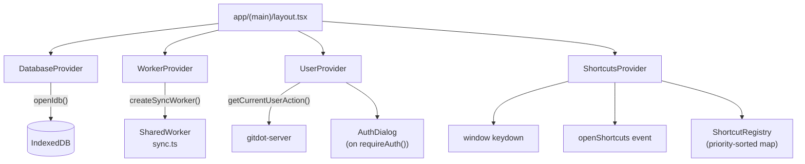

## app/context

### Overview

`app/context` provides the global React Context providers that are mounted once at the root of `app/(main)/layout.tsx`. Each file in this directory corresponds to a single concern:

- **`user.tsx`** — authenticated user identity and auth-gating
- **`shortcuts.tsx`** — keyboard shortcut registry, priority resolution, and the shortcuts dialog
- **`database.tsx`** — IndexedDB initialization
- **`worker.tsx`** — SharedWorker (sync) lifecycle

### Architecture



### APIs

#### `user.tsx`

```typescript
export interface UserContextType {
  user: UserResource | null
  refreshUser(): Promise<void>  // Re-fetches current user from the server.
  requireAuth(): boolean        // Returns false and shows AuthDialog if not logged in.
}

export function UserProvider({ children }: { children: React.ReactNode }): JSX.Element
// Fetches the current user on mount via getCurrentUserAction().
// Renders AuthDialog when requireAuth() is called and user is null.

export function useUserContext(): UserContextType
// Must be used inside UserProvider. Throws if used outside.
```

---

#### `shortcuts.tsx`

```typescript
export interface Shortcut {
  name: string
  description: string
  keys: string[]          // e.g. ["Mod+K"], ["g", "h"]
  execute(): void
}

export function ShortcutsProvider({ children }: { children: React.ReactNode }): JSX.Element
// Root provider. Maintains a priority-sorted shortcut registry.
// Listens to:
//   - window "keydown" — dispatches matching shortcut (highest-priority registration wins).
//   - window "openShortcuts" — opens the shortcuts reference dialog.
// Skips dispatch when an input/textarea/contenteditable is focused or a Radix modal is open.

export function useShortcuts(shortcuts: Shortcut[]): void
// Register an array of shortcuts for the lifetime of the calling component.
// Shortcuts are unregistered automatically on unmount.

// Utility helpers (internal, but exported):
export function eventKey(event: KeyboardEvent): string
// Normalizes a KeyboardEvent to a canonical string, e.g. "Mod+K", "Ctrl+Alt+Escape".

export function displayKey(key: string): React.ReactNode
// Formats a key string for display. Replaces "Escape" → "Esc", renders "Shift" as ⇧ symbol.
```

---

#### `database.tsx`

```typescript
export function DatabaseProvider({ children }: { children: React.ReactNode }): JSX.Element
// Minimal provider. Calls openIdb() on mount to ensure the IDB database is initialized
// before any child component tries to read from it.
```

---

#### `worker.tsx`

```typescript
export interface WorkerContextType {
  sync: SharedWorker | null
}

export function WorkerProvider({ children }: { children: React.ReactNode }): JSX.Element
// Creates the sync SharedWorker via createSyncWorker() on mount.
// Starts the worker port and terminates it on unmount.

export function useWorkerContext(): WorkerContextType
// Returns { sync } — the shared worker instance, or null before mount.
// Must be used inside WorkerProvider. Throws if used outside.
```
