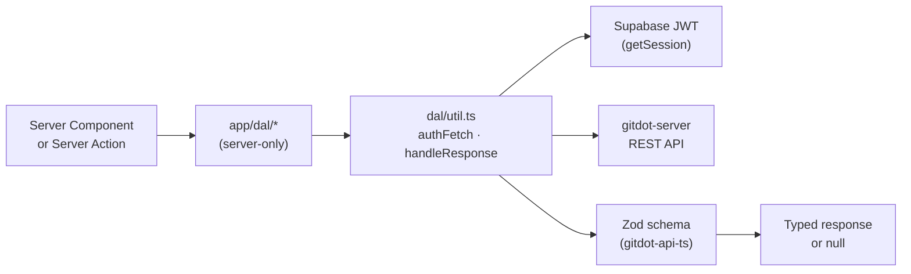

## app/dal

### Overview

`app/dal` is the server-only data access layer for the Gitdot frontend. Every module imports `"server-only"` to prevent accidental client-side use. All HTTP calls go through `authFetch`/`authPost`/`authPatch`/`authDelete` in `util.ts`, which automatically attach the Supabase JWT and (on Vercel) an OIDC token.

Responses are validated at runtime against Zod schemas from the `gitdot-api` package via `handleResponse`. Non-200 responses throw `ApiError`; 304/404 returns `null`.

### Architecture



### APIs

#### `util.ts`

```typescript
export const GITDOT_SERVER_URL: string
// Backend URL from GITDOT_SERVER_URL env var; defaults to "http://localhost:8080".

export async function authFetch(url: string, options?: RequestInit): Promise<Response>
export async function authHead(url: string, options?: RequestInit): Promise<Response>
export async function authPost(url: string, body: unknown, extraHeaders?: Record<string, string>): Promise<Response>
export async function authPatch(url: string, body: unknown): Promise<Response>
export async function authDelete(url: string, options?: RequestInit): Promise<Response>
// All wrappers inject Authorization: Bearer <supabase_jwt>.
// authPost/authPatch set Content-Type: application/json.

export class ApiError extends Error {
  constructor(public readonly status: number, message: string)
}

export async function handleResponse<T>(response: Response, schema: ZodType<T>): Promise<T | null>
// Validates response body with schema. Returns null on 304 or 404. Throws ApiError otherwise.

export async function handleEmptyResponse(response: Response): Promise<void>
// For endpoints that return no body (e.g. DELETE). Throws ApiError on failure.
```

---

#### `repository.ts`

```typescript
export async function createRepository(owner: string, repo: string, request: CreateRepositoryRequest): Promise<RepositoryResource | null>
export async function getRepositoryBlob(owner: string, repo: string, query: GetRepositoryBlobRequest): Promise<RepositoryBlobResource | null>
export async function getRepositoryBlobs(owner: string, repo: string, request: GetRepositoryBlobsRequest): Promise<RepositoryBlobsResource | null>
export async function getRepositoryPaths(owner: string, repo: string, query?: GetRepositoryPathsRequest): Promise<RepositoryPathsResource | null>
export async function getRepositoryCommits(owner: string, repo: string, query?: GetRepositoryCommitsRequest): Promise<RepositoryCommitsResource | null>
export async function getRepositoryFileCommits(owner: string, repo: string, query: GetRepositoryFileCommitsRequest): Promise<RepositoryCommitsResource | null>
export async function getRepositoryCommit(owner: string, repo: string, sha: string): Promise<RepositoryCommitResource | null>
export async function getRepositoryCommitDiff(owner: string, repo: string, sha: string): Promise<RepositoryCommitDiffResource | null>
export async function getRepositorySettings(owner: string, repo: string): Promise<RepositorySettingsResource | null>
export async function updateRepositorySettings(owner: string, repo: string, request: UpdateRepositorySettingsRequest): Promise<RepositorySettingsResource | null>
export async function getRepositoryResources(owner: string, repo: string, request?: GetRepositoryResourcesRequest): Promise<RepositoryResourcesResource | null>
export async function deleteRepository(owner: string, repo: string): Promise<void>
```

Cookie-based incremental fetches: `getRepositoryBlob`, `getRepositoryPaths`, and `getRepositoryCommits` read the `gd_sha_{owner}_{repo}` cookie and forward it as `X-Gitdot-Client-Sha` + `X-Gitdot-Client-Timestamp` headers so the backend can return only what changed since that SHA.

---

#### `user.ts`

```typescript
export async function getCurrentUser(required?: boolean): Promise<UserResource | null>
// GET /user. If required=true and not authenticated, redirects to /login.

export async function updateCurrentUser(request: UpdateUserRequest): Promise<UserResource | null>
// PATCH /user

export async function hasUser(username: string): Promise<boolean>
// HEAD /user/{username} — returns true if the user exists.

export async function getUser(username: string): Promise<UserResource | null>
// GET /user/{username}

export async function listUserRepositories(username: string): Promise<RepositoryResource[] | null>
// GET /user/{username}/repositories

export async function listUserOrganizations(username: string): Promise<OrganizationResource[] | null>
// GET /user/{username}/organizations
```

---

#### `review.ts`

```typescript
export async function listReviews(owner: string, repo: string): Promise<ReviewResource[] | null>
export async function getReview(owner: string, repo: string, number: number): Promise<ReviewResource | null>
export async function getReviewDiff(owner: string, repo: string, number: number, position: number, query?: GetReviewDiffRequest): Promise<ReviewDiffResource | null>
export async function addReviewer(owner: string, repo: string, number: number, request: AddReviewerRequest): Promise<ReviewerResource | null>
export async function removeReviewer(owner: string, repo: string, number: number, reviewerName: string): Promise<void>
export async function updateDiff(owner: string, repo: string, number: number, position: number, request: UpdateDiffRequest): Promise<ReviewResource | null>
export async function updateReview(owner: string, repo: string, number: number, request: UpdateReviewRequest): Promise<ReviewResource | null>
export async function publishReview(owner: string, repo: string, number: number, request: PublishReviewRequest): Promise<ReviewResource | null>
export async function submitReview(owner: string, repo: string, number: number, position: number, request: SubmitReviewRequest): Promise<ReviewResource | null>
export async function mergeDiff(owner: string, repo: string, number: number, position: number): Promise<ReviewResource | null>
export async function resolveReviewComment(owner: string, repo: string, number: number, commentId: string, resolved: boolean): Promise<ReviewCommentResource | null>
```

---

#### `build.ts`

```typescript
export async function createBuild(owner: string, repo: string, request: CreateBuildRequest): Promise<BuildResource | null>
export async function listBuilds(owner: string, repo: string): Promise<BuildResource[] | null>
export async function getBuild(owner: string, repo: string, number: number): Promise<BuildResource | null>
export async function listBuildTasks(owner: string, repo: string, number: number): Promise<TaskResource[] | null>
```

---

#### `question.ts`

```typescript
export async function listQuestions(owner: string, repo: string): Promise<QuestionResource[] | null>
export async function createQuestion(owner: string, repo: string, request: CreateQuestionRequest): Promise<QuestionResource | null>
export async function updateQuestion(owner: string, repo: string, number: number, request: UpdateQuestionRequest): Promise<QuestionResource | null>
export async function createAnswer(owner: string, repo: string, number: number, request: CreateAnswerRequest): Promise<AnswerResource | null>
export async function updateAnswer(owner: string, repo: string, number: number, answerId: string, request: UpdateAnswerRequest): Promise<AnswerResource | null>
export async function createComment(owner: string, repo: string, number: number, parentType: string, parentId: string, request: CreateCommentRequest): Promise<CommentResource | null>
export async function updateComment(owner: string, repo: string, number: number, commentId: string, request: UpdateCommentRequest): Promise<CommentResource | null>
export async function vote(owner: string, repo: string, number: number, targetId: string, targetType: string, request: VoteRequest): Promise<void>
```

---

#### `runner.ts`

```typescript
export async function createRunner(request: CreateRunnerRequest): Promise<CreateRunnerResponse | null>
export async function listRunners(owner: string): Promise<RunnerResource[] | null>
export async function getRunner(owner: string, name: string): Promise<RunnerResource | null>
export async function refreshRunnerToken(runnerName: string, ownerName: string): Promise<RunnerTokenResource | null>
export async function deleteRunner(ownerName: string, runnerName: string, ownerType?: string): Promise<void>
```

---

#### `task.ts`

```typescript
export async function getTask(taskId: string): Promise<TaskResource | null>
```

---

#### `oauth.ts`

```typescript
export async function authorizeDevice(userCode: string): Promise<AuthorizeDeviceResponse | null>
// POST /oauth/device/authorize — exchanges a CLI device code for authorization.
```

---

#### `migration.ts`

```typescript
export async function listMigrations(): Promise<MigrationResource[] | null>
export async function getMigration(number: number): Promise<MigrationResource | null>
export async function createMigration(request: CreateMigrationRequest): Promise<MigrationResource | null>
```
