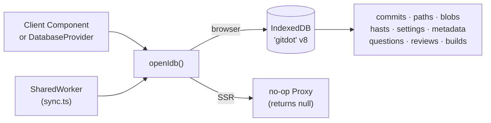

## app/db

### Overview

`app/db` provides the client-side IndexedDB persistence layer for Gitdot. It stores all repository resources (paths, blobs, commits, HAST trees, settings, questions, reviews, builds) so that repeat navigations are instant without waiting for the network.

`openIdb()` is the single entry point. On the server/SSR it returns a no-op `Proxy` so server components can call IDB methods safely without crashing. On the client it opens (or upgrades) the `"gitdot"` database at version 8.

### Architecture



### APIs

#### `types.ts`

```typescript
export interface RepositoryMetadata {
  last_commit: string    // SHA of the most recently synced commit.
  last_updated: string   // ISO datetime of the last sync.
}

export interface Database {
  // Paths — full file tree for a repo.
  getPaths(owner: string, repo: string): Promise<RepositoryPathsResource | null>
  putPaths(owner: string, repo: string, paths: RepositoryPathsResource): Promise<void>

  // Blobs — individual file contents.
  getBlob(owner: string, repo: string, path: string): Promise<RepositoryBlobResource | null>
  getBlobs(owner: string, repo: string): Promise<RepositoryBlobsResource | undefined>
  putBlobs(owner: string, repo: string, blobs: RepositoryBlobsResource): Promise<void>

  // Commits — list and individual commit records.
  getCommit(owner: string, repo: string, sha: string): Promise<RepositoryCommitResource | null>
  getCommits(owner: string, repo: string): Promise<RepositoryCommitResource[]>
  putCommit(owner: string, repo: string, commit: RepositoryCommitResource): Promise<void>
  putCommits(owner: string, repo: string, commits: RepositoryCommitResource[]): Promise<void>

  // HAST trees — pre-rendered Shiki syntax-highlight output per file.
  getHast(owner: string, repo: string, path: string): Promise<Root | null>
  getHasts(owner: string, repo: string): Promise<Map<string, Root> | null>
  putHast(owner: string, repo: string, path: string, hast: Root): Promise<void>

  // Settings — repository configuration.
  getSettings(owner: string, repo: string): Promise<RepositorySettingsResource | null>
  putSettings(owner: string, repo: string, settings: RepositorySettingsResource): Promise<void>

  // Metadata — sync bookkeeping (last SHA, last updated).
  getMetadata(owner: string, repo: string): Promise<RepositoryMetadata | null>
  putMetadata(owner: string, repo: string, metadata: RepositoryMetadata): Promise<void>

  // Questions — repo Q&A threads.
  getQuestions(owner: string, repo: string): Promise<QuestionResource[] | null>
  putQuestions(owner: string, repo: string, questions: QuestionResource[]): Promise<void>

  // Reviews — code review records.
  getReview(owner: string, repo: string, number: number): Promise<ReviewResource | null>
  getReviews(owner: string, repo: string): Promise<ReviewResource[]>
  putReview(owner: string, repo: string, number: number, review: ReviewResource): Promise<void>

  // Builds — CI build records.
  getBuilds(owner: string, repo: string): Promise<BuildResource[] | null>
  getBuild(owner: string, repo: string, number: number): Promise<BuildResource | null>
  putBuilds(owner: string, repo: string, builds: BuildResource[]): Promise<void>
  putBuild(owner: string, repo: string, build: BuildResource): Promise<void>
}
```

---

#### `idb.ts`

```typescript
export function openIdb(): Database
// Opens the "gitdot" IndexedDB database (version 8).
// Returns a no-op Proxy on the server (all reads return null, writes are no-ops).
//
// Object store key schemes:
//   commits    — "{owner}/{repo}/{sha}"
//   paths      — "{owner}/{repo}"
//   blobs      — "{owner}/{repo}/{path}"
//   hasts      — "{owner}/{repo}/{path}"
//   settings   — "{owner}/{repo}"
//   metadata   — "{owner}/{repo}"
//   questions  — "{owner}/{repo}"
//   reviews    — "{owner}/{repo}/{number}"
//   builds     — "{owner}/{repo}"
```
