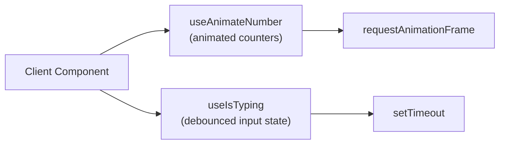

## app/hooks

### Overview

`app/hooks` contains reusable React hooks for the Gitdot frontend. These are generic utilities unrelated to any specific route or domain feature. Route-specific hooks live in `app/(routegroup)/hooks/` subfolders instead.

### Architecture



### APIs

#### `use-animate-number.tsx`

```typescript
export function useAnimateNumber(value: number, duration?: number): number
// Smoothly animates from the previous value to the new value over `duration` ms (default 600ms).
// Uses requestAnimationFrame with a cubic ease-out curve.
// Returns the current interpolated value on each frame.
// Useful for animating metric counters (e.g. FCP, TTFB readings in PageVitals).
```

---

#### `use-is-typing.tsx`

```typescript
export function useIsTyping(value: unknown, delay?: number): boolean
// Returns true for `delay` ms (default 500ms) after `value` changes, then resets to false.
// Useful for suppressing search/filter triggers while the user is still typing.
// Resets the timer on every new change, so it reflects the most recent keystroke.
```
