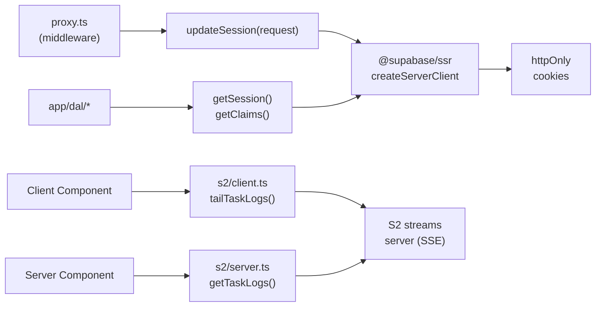

## app/lib

### Overview

`app/lib` contains third-party library integrations and shared low-level utilities that do not belong in the DAL or action layers.

- **`supabase.ts`** (server-only) — creates and manages the per-request Supabase client, refreshes session cookies in middleware, and exposes typed helpers for reading the current user's JWT claims.
- **`s2/`** — thin wrappers around the S2 durable-streams server for reading CI task logs, with separate client and server entry points.

### Architecture



### APIs

#### `supabase.ts` (server-only)

```typescript
export interface UserMetadata {
  username: string
  orgs: string[]   // Organization slugs the user belongs to.
}

export function createSupabaseClient(): SupabaseClient
// Creates a per-request Supabase client backed by Next.js cookies().
// Must be called inside a Server Component, Server Action, or Route Handler.

export async function updateSession(request: NextRequest): Promise<{
  user: JwtPayload | undefined
  response: NextResponse
}>
// Called in proxy.ts middleware on every request.
// Refreshes the Supabase session cookie; returns the (potentially updated) response.

export async function getUserMetadata(): Promise<UserMetadata | null>
// Returns { username, orgs } from the current JWT's custom claims.
// Returns null if not authenticated.

export async function getClaims(): Promise<JwtPayload | null>
// Returns the raw decoded JWT payload for the current session.

export async function getSession(): Promise<Session | null>
// Returns the full Supabase Session object including access_token.
// Used by authFetch() to attach the Bearer token.
```

---

#### `s2/shared.ts`

```typescript
export const S2_SERVER_URL: string
// S2 streaming server URL. Reads S2_SERVER_URL env var; defaults to "http://localhost:8081".

export type S2Record = {
  seq_num: number
  timestamp: string
  body: string
  headers: Record<string, string>
}
```

---

#### `s2/client.ts` (client-only)

```typescript
export function tailTaskLogs(
  token: string,
  owner: string,
  repo: string,
  taskId: string,
  onBatch: (records: S2Record[]) => void,
  options?: { signal?: AbortSignal },
): AbortController
// Opens an SSE connection to the S2 server and streams task log records in real time.
// Calls onBatch with each batch of records as they arrive.
// Event types handled: "batch" (parsed JSON array), "ping" (keepalive), "error" (closes).
// Returns an AbortController; call .abort() to close the stream.
```

---

#### `s2/server.ts` (server-only)

```typescript
export async function getTaskLogs(
  token: string,
  owner: string,
  repo: string,
  taskId: string,
  options?: {
    tailOffset?: number  // Start from N records before the end (default 100).
    count?: number       // Max records to return (default 100).
    clamp?: boolean      // Clamp to available records (default true).
  },
): Promise<S2Record[]>
// Fetches a page of task log records from the S2 server.
// Used for initial server-side render of task log output.
```
