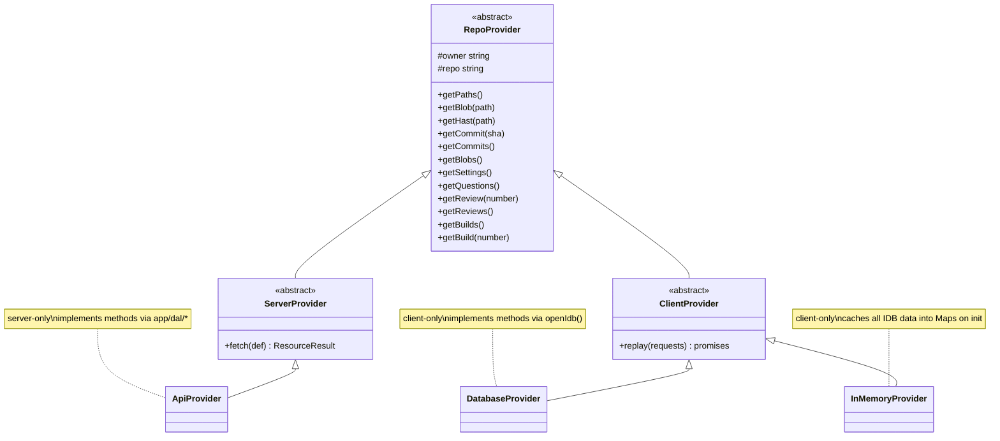

## app/provider

### Overview

`app/provider` implements the multi-fetch pattern that races IndexedDB against the live backend API. The server-side entry point (`server.ts`) creates an `ApiProvider` that captures which provider methods were called and returns server-rendered promises. The client-side entry point (`client.ts`) creates a `DatabaseProvider` that re-runs those same calls against IDB, then races the two promise sets — whichever resolves first wins the render, and the API result is written back to IDB for the next visit.

All resource types share the same abstract base class `RepoProvider`, which defines the full set of fetching methods. `ServerProvider` extends it to capture method calls; `ClientProvider` extends it to replay them.

### Architecture



### APIs

#### `types.ts`

```typescript
// Describes a mapping of resource names to provider method invocations.
export type ResourceDefinition = Record<string, (provider: RepoProvider) => Promise<unknown>>

// Serializable record of a single provider method call (for cross-boundary replay).
export type ResourceRequestType = { method: string; args: unknown[] }

// Mapped types over a ResourceDefinition — parallel structures for requests and promises.
export type ResourceRequestsType<S extends ResourceDefinition> = { [K in keyof S]: ResourceRequestType }
export type ResourcePromisesType<S extends ResourceDefinition> = { [K in keyof S]: ReturnType<S[K]> }

// Return type of fetchResources() and ServerProvider.fetch().
export type ResourceResult<S extends ResourceDefinition> = {
  requests: ResourceRequestsType<S>
  promises: ResourcePromisesType<S>
}

export abstract class RepoProvider {
  constructor(protected owner: string, protected repo: string)
  abstract getPaths(): Promise<RepositoryPathsResource | null>
  abstract getBlob(path: string): Promise<RepositoryBlobResource | null>
  abstract getHast(path: string): Promise<Root | null>
  abstract getCommit(sha: string): Promise<RepositoryCommitResource | null>
  abstract getCommits(): Promise<RepositoryCommitResource[] | null>
  abstract getBlobs(): Promise<RepositoryBlobsResource | null>
  abstract getSettings(): Promise<RepositorySettingsResource | null>
  abstract getQuestions(): Promise<QuestionResource[] | null>
  abstract getReview(number: number): Promise<ReviewResource | null>
  abstract getReviews(): Promise<ReviewResource[] | null>
  abstract getBuilds(): Promise<BuildResource[] | null>
  abstract getBuild(number: number): Promise<BuildResource | null>
}

// Server-side base class: intercepts calls to record method name + args for later replay.
export abstract class ServerProvider extends RepoProvider {
  fetch<T extends ResourceDefinition>(def: T): ResourceResult<T>
}

// Client-side base class: re-invokes recorded requests against the concrete subclass.
export abstract class ClientProvider extends RepoProvider {
  replay(requests: Record<string, ResourceRequestType>): Record<string, Promise<unknown>>
}
```

---

#### `server.ts` (server-only)

```typescript
export function fetchResources<T extends ResourceDefinition>(
  owner: string,
  repo: string,
  resources: T,
): ResourceResult<T>
// Entry point for server components. Instantiates ApiProvider and calls provider.fetch(resources).
// Returns { requests, promises } — pass both to the corresponding client component.

export class ApiProvider extends ServerProvider
// Implements every RepoProvider method by calling the corresponding app/dal/* function.
// All methods are server-only (call authFetch internally).
```

Usage:

```typescript
// page.tsx (server component)
const { requests, promises } = fetchResources(owner, repo, {
  readme: (p) => p.getBlob("README.md"),
  commits: (p) => p.getCommits(),
})
return <PageClient owner={owner} repo={repo} requests={requests} promises={promises} />
```

---

#### `client.ts` (client-only)

```typescript
export function resolveResources<T extends ResourceDefinition>(
  owner: string,
  repo: string,
  requests: ResourceRequestsType<T>,
  serverPromises: ResourcePromisesType<T>,
): ResourcePromisesType<T>
// Races DatabaseProvider (IDB) against the incoming server promises.
// Whichever resolves first (non-null) wins. API results are written back to IDB.

export class DatabaseProvider extends ClientProvider
// Implements every RepoProvider method via openIdb() from app/db.
// Also provides write(method, value) to persist API responses back to IDB.
```

Usage:

```typescript
// page.client.tsx (client component)
const resolvedPromises = resolveResources(owner, repo, requests, promises)
const readme = use(resolvedPromises.readme)
```

---

#### `memory.ts` (client-only)

```typescript
export class InMemoryProvider extends ClientProvider
// Loads all IDB data into in-memory Maps on initialize().
// Used for pre-warming resource access without repeated IDB reads.

  async initialize(): Promise<void>
  // Bulk-reads all IDB stores into memory.
```
