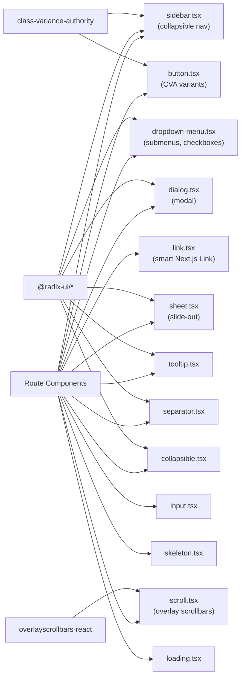

## app/ui

### Overview

`app/ui` is the shared component library for the Gitdot frontend. All components wrap [Radix UI](https://www.radix-ui.com/) primitives with Tailwind CSS styling. Components with multiple visual variants use [CVA](https://cva.style/) (`class-variance-authority`). This directory is **global** — route-specific components live in `app/(routegroup)/ui/` subfolders instead.

The custom `Link` wrapper is enforced project-wide by Biome: all imports of `next/link` should be replaced with `@/ui/link` to prevent hydration mismatches on dynamic routes.

### Architecture



### APIs

#### `link.tsx`

```typescript
export default function Link(props: LinkProps): JSX.Element
// Smart Next.js Link wrapper. Falls back to <a> when href contains dynamic segments
// (e.g. "[owner]"). Deduplicates navigation and records metrics via startNavigation().
```

---

#### `button.tsx`

```typescript
export const buttonVariants: CVA
// variant: "default" | "destructive" | "outline" | "secondary" | "ghost" | "link"
// size: "default" | "sm" | "lg" | "icon"

export const Button: React.ForwardRefExoticComponent<ButtonProps>
// Renders a <button> with CVA variant classes. Accepts all HTMLButtonElement props.
```

---

#### `input.tsx`

```typescript
export const Input: React.ForwardRefExoticComponent<InputProps>
// Styled <input> with consistent focus ring, placeholder, file picker, and selection states.
```

---

#### `tooltip.tsx`

```typescript
export { TooltipProvider }   // Wrap the app root; controls global delay.
export { Tooltip }           // Radix Tooltip.Root
export { TooltipTrigger }    // Radix Tooltip.Trigger
export { TooltipContent }    // Styled tooltip bubble (sideOffset=4 default).
```

---

#### `dialog.tsx`

```typescript
export { Dialog }             // Radix Dialog.Root
export { DialogTrigger }      // Radix Dialog.Trigger
export { DialogPortal }       // Radix Dialog.Portal
export { DialogClose }        // Radix Dialog.Close
export { DialogOverlay }      // Semi-transparent backdrop with fade animation.
export { DialogContent }      // Centered panel with slide + fade animation.
export { DialogTitle }        // Radix Dialog.Title (accessible heading).
export { DialogDescription }  // Radix Dialog.Description (accessible description).
```

---

#### `sheet.tsx`

```typescript
export { Sheet }              // Radix Dialog.Root (reused for sheets)
export { SheetTrigger }
export { SheetClose }
export { SheetPortal }
export { SheetOverlay }
export { SheetContent }       // Props: side: "top" | "right" | "bottom" | "left"
export { SheetHeader }        // Flex column, gap-2
export { SheetFooter }        // Flex row, justify-end
export { SheetTitle }
export { SheetDescription }
```

---

#### `sidebar.tsx`

```typescript
export { Sidebar }               // Root sidebar container; toggles on "toggleLeftSidebar" event.
export { SidebarInset }          // Main content area next to sidebar.
export { SidebarInput }          // Styled input inside sidebar.
export { SidebarHeader }         // Top sticky section of sidebar.
export { SidebarFooter }         // Bottom sticky section of sidebar.
export { SidebarSeparator }      // Horizontal rule inside sidebar.
export { SidebarContent }        // Scrollable middle section.
export { SidebarGroup }          // Logical group of menu items.
export { SidebarGroupLabel }     // Small label for a group.
export { SidebarGroupAction }    // Icon button appended to group label row.
export { SidebarGroupContent }   // Wrapper around SidebarMenu inside a group.
export { SidebarMenu }           // <ul> container for menu items.
export { SidebarMenuItem }       // <li> container for a single item.
export { SidebarMenuButton }     // Styled button/link with optional tooltip; CVA variants.
export { sidebarMenuButtonVariants }
export { SidebarMenuAction }     // Icon button inside a menu item.
export { SidebarMenuBadge }      // Numeric badge on a menu item.
export { SidebarMenuSkeleton }   // Pulsing placeholder for a menu item.
export { SidebarMenuSub }        // Nested <ul> for sub-items.
export { SidebarMenuSubItem }    // <li> for a sub-item.
export { SidebarMenuSubButton }  // Styled link/button for a sub-item.
```

---

#### `separator.tsx`

```typescript
export { Separator }
// Props: orientation: "horizontal" | "vertical" (default horizontal), decorative?: boolean
```

---

#### `collapsible.tsx`

```typescript
export { Collapsible }         // Radix Collapsible.Root
export { CollapsibleTrigger }  // Radix Collapsible.Trigger
export { CollapsibleContent }  // Radix Collapsible.Content
```

---

#### `dropdown-menu.tsx`

```typescript
export { DropdownMenu }               // Radix DropdownMenu.Root
export { DropdownMenuTrigger }
export { DropdownMenuContent }        // Styled popover with slide + fade animation.
export { DropdownMenuGroup }
export { DropdownMenuItem }           // Props: inset?, destructive?
export { DropdownMenuCheckboxItem }
export { DropdownMenuRadioGroup }
export { DropdownMenuRadioItem }
export { DropdownMenuLabel }          // Props: inset?
export { DropdownMenuSeparator }
export { DropdownMenuShortcut }       // Right-aligned keyboard hint.
export { DropdownMenuSub }
export { DropdownMenuSubTrigger }     // Props: inset?
export { DropdownMenuSubContent }
export { DropdownMenuPortal }
```

---

#### `skeleton.tsx`

```typescript
export function Skeleton({ className, ...props }: React.HTMLAttributes<HTMLDivElement>): JSX.Element
// Pulsing rounded rectangle for loading placeholders.
```

---

#### `scroll.tsx`

```typescript
export function OverlayScroll({ children, className }: OverlayScrollProps): JSX.Element
// Overlay scrollbars using "os-theme-gitdot" theme via overlayscrollbars-react.
// Hides native scrollbars; renders custom overlay tracks instead.
```

---

#### `loading.tsx`

```typescript
export function Loading(): JSX.Element
// Renders a simple "loading..." text node. Used as Suspense fallback.
```
