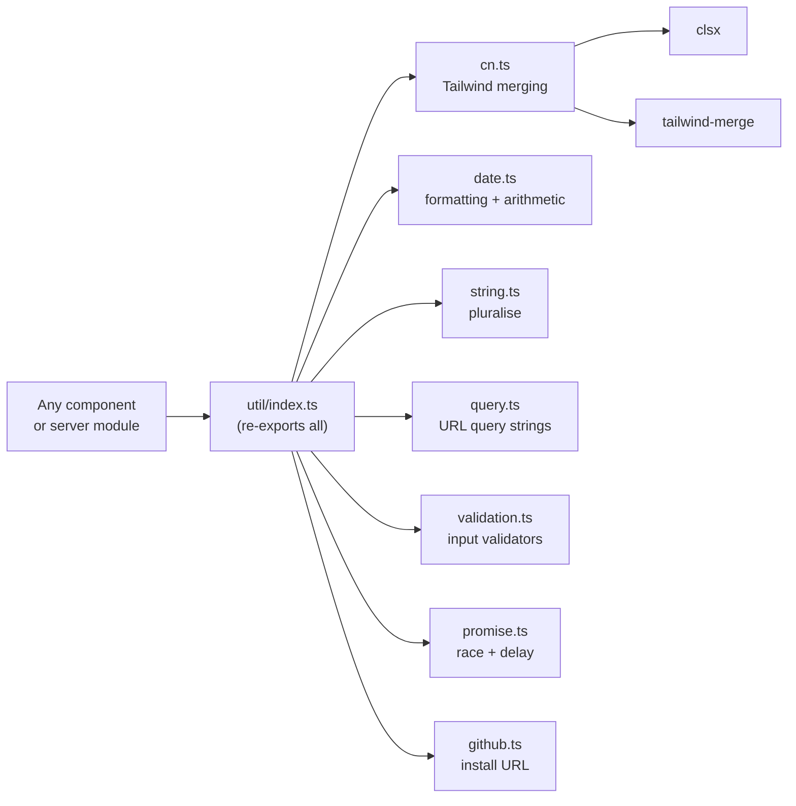

## app/util

### Overview

`app/util` is the shared utility library for the Gitdot frontend. Each module handles a distinct concern (class merging, date formatting, URL building, validation, etc.) and is re-exported from `index.ts` for convenient barrel imports.

### Architecture



### APIs

#### `cn.ts`

```typescript
export function cn(...inputs: ClassValue[]): string
// Merges Tailwind classes. Deduplicates conflicting utilities via tailwind-merge,
// supports conditional classes via clsx.
// Example: cn("px-2 py-1", condition && "bg-red-500", { "font-bold": isBold })
```

---

#### `date.ts`

```typescript
export function addDays(date: Date, days: number): Date
export function subtractDays(date: Date, days: number): Date
export function dateOnly(value: Date | string): Date
// Strips the time component, returning midnight UTC.

export function timeAgo(date: Date | string): string
// Short relative time: "just now", "2h ago", "Jan 12".

export function timeAgoFull(date: Date | string): string
// Verbose relative time: "2 hours, 30 minutes ago", "5 days ago".

export function formatDateKey(dateKey: string): string
// Human header label: "Today", "Yesterday", or "Jan 12".

export function formatDate(date: Date | string): string
// "Jan 12, 2025"

export function formatTime(date: Date | string): string
// "2:30 PM"

export function formatDateTime(date: Date | string): string
// "Jan 14, 2026 2:30:45 PM"

export function formatDuration(ms: number): string
// "1m 30s", "45s", "2h 5m"
```

---

#### `string.ts`

```typescript
export function pluralize(count: number, word: string): string
// Returns "1 item" or "2 items". Appends "s" for count !== 1.
```

---

#### `query.ts`

```typescript
export function toQueryString(params: Record<string, string | number | boolean | undefined | null>): string
// Converts an object to a URL query string. Skips null and undefined values.
// Example: toQueryString({ page: 1, filter: "open" }) → "?page=1&filter=open"
```

---

#### `validation.ts`

```typescript
export function validateEmail(email: string): boolean
// RFC-ish email check with domain validation. Requires TLD ≥ 2 chars.

export function validatePassword(password: string): boolean
// Minimum 8 characters.

export function validateRepoSlug(slug: string): boolean
// Alphanumeric, hyphens, and underscores only. Must start/end with alphanumeric.

export function validateUsername(username: string): boolean
// Same rules as validateRepoSlug; length 2–32.
```

---

#### `promise.ts`

```typescript
export function delay<T>(ms: number, value?: T): Promise<T | undefined>
// Resolves after ms milliseconds with an optional value.

export function racePromises<T>(...promises: Promise<T | null>[]): Promise<T | null>
// Returns the first non-null resolved value from the given promises.
// If all resolve to null, returns null.
```

---

#### `github.ts`

```typescript
export function githubAppInstallUrl(state: string): string
// Returns the GitHub App installation URL with the given OAuth state parameter.
// Used to initiate GitHub repository migration auth flow.
```
