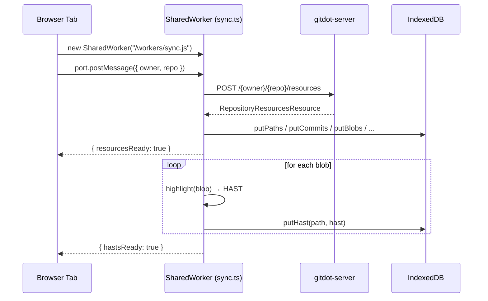

## app/workers

### Overview

`app/workers` contains the background `SharedWorker` that bulk-syncs all repository resources into IndexedDB and pre-renders syntax-highlighted HAST trees for every file. Because it's a `SharedWorker`, a single instance is shared across all browser tabs open on the same origin, avoiding duplicate fetches.

On startup the worker initializes a Shiki highlighter with 40+ languages. When a client tab connects and sends `{ owner, repo }`, the worker fetches the bulk resources endpoint, writes everything to IDB, then iterates all blobs and converts each to a Shiki HAST tree. Clients receive progress events so the page can update when resources or highlights become available.

### Architecture



### APIs

#### `index.ts`

```typescript
export function createSyncWorker(): SharedWorker
// Instantiates a new SharedWorker pointing to the compiled sync.ts bundle.
// Called once inside WorkerProvider on mount.
```

---

#### `sync.ts` (SharedWorker)

Messages sent **to** the worker (via `port.postMessage`):

```typescript
type SyncRequest = { owner: string; repo: string }
```

Messages received **from** the worker (via `port.onmessage`):

```typescript
type MessageResponse = {
  resourcesReady: boolean  // true once paths/commits/blobs/settings are in IDB.
  hastsReady: boolean      // true once all file blobs have been highlighted.
}
```

Internal flow:
1. `onconnect` — accepts each new port, queues messages until highlighter is ready.
2. `process(owner, repo)` — calls `getRepositoryResources()`, writes all resource types to IDB via `openIdb()`, then renders each blob to a HAST tree via the Shiki highlighter.
3. Broadcasts `{ resourcesReady: true }` after IDB writes, then `{ hastsReady: true }` after all highlights.

---

#### `util.ts`

```typescript
export async function createHighlighter(): Promise<Highlighter>
// Creates a Shiki highlighter bundled with:
//   Languages: TypeScript, JavaScript, TSX, JSX, Rust, Python, Go, Java, C, C++,
//              C#, Ruby, PHP, Swift, Kotlin, Shell, SQL, HTML, CSS, JSON, YAML,
//              TOML, Markdown, Dockerfile, Make, and more (~40 total).
//   Themes: "vitesse-light" (default), "gitdot-light" (custom).

export function inferLanguage(filePath: string): string
// Maps a file path to a Shiki language ID by extension.
// Special-cases: Dockerfile → "dockerfile", Makefile → "makefile",
//                .env* → "dotenv", unknown → "text".
```
