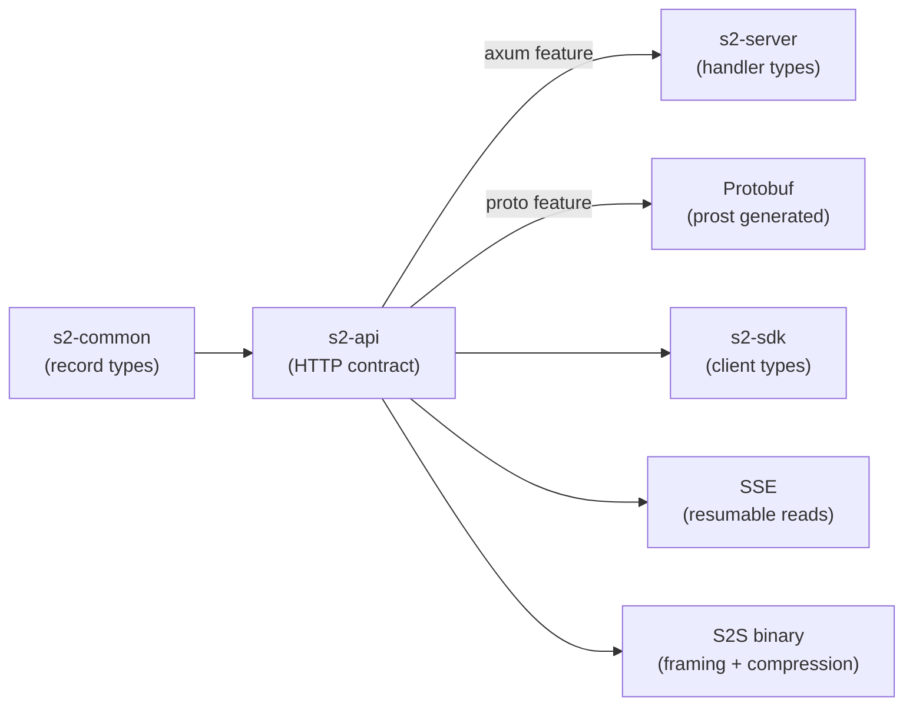
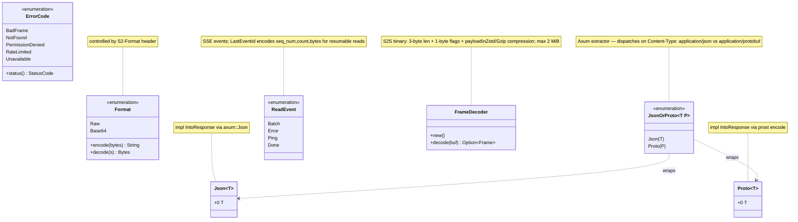

## s2-api

### Overview

`s2-api` defines the shared API contract for S2, a durable streams service — request/response types, error codes, format negotiation, and wire protocols. It is the contract layer consumed by both `s2-server` (to type handlers) and `s2-sdk` (to serialize requests and deserialize responses). Axum extractors and `IntoResponse` impls are behind the `axum` feature flag; protobuf support requires the `proto` feature.





### APIs

- **`ErrorCode`** — machine-readable error codes ([s2-api/src/v1/error.rs](s2-api/src/v1/error.rs))

  ```rust
  pub enum ErrorCode {
      BadFrame, BadHeader, BadJson, BadPath, BadProto, BadQuery,
      BasinDeletionPending, BasinNotFound,
      ClientHangup, HotServer, Invalid, Other,
      PermissionDenied, QuotaExhausted, RateLimited, RequestTimeout,
      ResourceAlreadyExists, Storage,
      StreamDeletionPending, StreamNotFound,
      TransactionConflict, Unavailable, UpstreamTimeout,
  }

  impl ErrorCode {
      pub fn status(self) -> http::StatusCode
  }
  ```

- **Basin types** ([s2-api/src/v1/basin.rs](s2-api/src/v1/basin.rs))

  ```rust
  pub struct BasinInfo {
      pub name: BasinName,
      pub scope: Option<BasinScope>,
      pub state: BasinState,
  }

  pub enum BasinState { Active, Creating, Deleting }
  pub enum BasinScope { AwsUsEast1 }

  pub struct ListBasinsRequest {
      pub prefix: Option<BasinNamePrefix>,
      pub start_after: Option<BasinNameStartAfter>,
      pub limit: Option<usize>,
  }

  pub struct CreateBasinRequest {
      pub basin: BasinName,
      pub config: Option<BasinConfig>,
      pub scope: Option<BasinScope>,
  }
  ```

- **Config types** ([s2-api/src/v1/config.rs](s2-api/src/v1/config.rs))

  ```rust
  pub enum StorageClass { Standard, Express }

  pub enum RetentionPolicy {
      Age(u64),           // seconds
      Infinite(InfiniteRetention),
  }

  pub enum TimestampingMode { ClientPrefer, ClientRequire, Arrival }
  ```

- **Stream types** ([s2-api/src/v1/stream/mod.rs](s2-api/src/v1/stream/mod.rs))

  ```rust
  pub struct StreamInfo {
      pub name: StreamName,
      pub created_at: OffsetDateTime,
      pub deleted_at: Option<OffsetDateTime>,
  }

  pub struct StreamPosition { pub seq_num: SeqNum, pub timestamp: Timestamp }

  pub struct AppendRecord {
      pub timestamp: Option<Timestamp>,
      pub headers: Vec<Header>,
      pub body: Option<String>,
  }

  pub struct AppendInput {
      pub records: Vec<AppendRecord>,
      pub match_seq_num: Option<SeqNum>,
      pub fencing_token: Option<FencingToken>,
  }

  pub struct AppendAck {
      pub start: StreamPosition,
      pub end: StreamPosition,
  }

  pub struct SequencedRecord {
      pub seq_num: SeqNum,
      pub timestamp: Timestamp,
      pub headers: Vec<Header>,
      pub body: Option<String>,
  }

  pub struct ReadBatch {
      pub records: Vec<SequencedRecord>,
      pub next_seq_num: Option<StreamPosition>,
  }

  pub struct ReadStart {
      pub seq_num: Option<SeqNum>,
      pub timestamp: Option<Timestamp>,
      pub tail_offset: Option<u64>,
  }

  pub struct ReadEnd {
      pub count: Option<usize>,
      pub bytes: Option<usize>,
      pub until: Option<Timestamp>,
  }

  pub struct TailResponse { pub tail: StreamPosition }
  ```

- **SSE types** ([s2-api/src/v1/stream/sse.rs](s2-api/src/v1/stream/sse.rs))

  ```rust
  pub enum ReadEvent {
      Batch { event: Batch, data: ReadBatch, id: LastEventId },
      Error { event: Error, data: ErrorInfo },
      Ping  { event: Ping,  data: PingEventData },
      Done  { data: DoneEventData },
  }

  pub struct LastEventId {
      pub seq_num: u64,
      pub count: usize,
      pub bytes: usize,
  }
  // Serialized as "seq_num,count,bytes" in the Last-Event-Id header for resumable reads.
  ```

- **Format negotiation** ([s2-api/src/data.rs](s2-api/src/data.rs), [s2-api/src/mime.rs](s2-api/src/mime.rs))

  ```rust
  pub enum Format { Raw, Base64 }  // controlled by S2-Format header

  impl Format {
      pub fn encode(self, bytes: &[u8]) -> String
      pub fn decode(self, s: String) -> Result<Bytes, ValidationError>
  }

  pub struct Json<T>(pub T);   // JSON content-type wrapper; IntoResponse via axum::Json
  pub struct Proto<T>(pub T);  // Protobuf content-type wrapper; IntoResponse via prost encode

  pub enum JsonOrProto<T, P> { Json(T), Proto(P) }
  // Axum extractor that dispatches on Content-Type: application/json vs application/protobuf
  ```

- **S2S binary streaming protocol** ([s2-api/src/v1/stream/s2s.rs](s2-api/src/v1/stream/s2s.rs))

  Framing: 3-byte length + 1-byte flags + payload. Max frame size 2 MiB. Terminal frame carries HTTP status + JSON error body. Compression: Zstd preferred, Gzip fallback; auto-skipped below 1 KiB.

  ```rust
  pub struct FrameDecoder { /* ... */ }

  impl FrameDecoder {
      pub fn new() -> Self
      pub fn decode(&mut self, buf: &mut impl Buf) -> Result<Option<Frame>, FrameError>
  }
  ```
