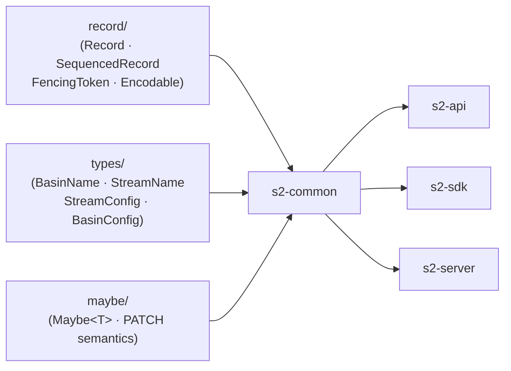
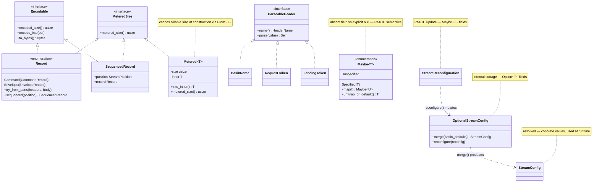

## s2-common

### Overview

`s2-common` is the shared library crate for the S2 durable streams system, providing the core record model, binary encoding, naming types, and configuration primitives used across `s2-api`, `s2-sdk`, and `s2-server`. It defines the canonical on-wire format for records, the type-safe naming conventions for basins and streams, and the three-tier configuration system that supports both full resolution and PATCH-style partial updates.

The crate is intentionally dependency-light and feature-gated: the `axum` feature enables Axum extractor implementations for HTTP header types, `clap` enables CLI parsing support, and `rkyv` enables binary serialization.





### APIs

#### `record` — core record types ([s2-common/src/record/mod.rs](s2-common/src/record/mod.rs))

```rust
pub type SeqNum = u64;
pub type Timestamp = u64;

#[derive(Debug, Clone, PartialEq, Eq, Copy)]
pub struct StreamPosition {
    pub seq_num: SeqNum,
    pub timestamp: Timestamp,
}

impl StreamPosition {
    pub const MIN: Self;  // zero position
}

#[derive(Debug, Clone, PartialEq)]
pub struct Header {
    pub name: Bytes,
    pub value: Bytes,
}

pub enum Record {
    Command(CommandRecord),
    Envelope(EnvelopeRecord),
}

impl Record {
    pub fn try_from_parts(headers: Vec<Header>, body: Bytes) -> Result<Self, PublicRecordError>
    // Empty header name signals a command record.

    pub fn into_parts(self) -> (Vec<Header>, Bytes)
    pub fn sequenced(self, position: StreamPosition) -> SequencedRecord
}

pub struct SequencedRecord {
    pub position: StreamPosition,
    pub record: Record,
}
```

```rust
let record = Record::try_from_parts(headers, body)?;
let sequenced = record.sequenced(StreamPosition { seq_num: 1, timestamp: 1000 });
```

---

#### `Encodable` trait ([s2-common/src/record/mod.rs](s2-common/src/record/mod.rs))

```rust
pub trait Encodable {
    fn encoded_size(&self) -> usize;
    fn encode_into(&self, buf: &mut impl BufMut);
    fn to_bytes(&self) -> Bytes { /* default: allocates and calls encode_into */ }
}
```

---

#### `FencingToken` ([s2-common/src/record/fencing.rs](s2-common/src/record/fencing.rs))

```rust
pub const MAX_FENCING_TOKEN_LENGTH: usize = 36;

pub struct FencingToken(/* ... */);

impl FencingToken {
    pub fn try_from_bytes(bytes: impl Into<Bytes>) -> Result<Self, FencingTokenTooLongError>
    pub fn as_bytes(&self) -> &[u8]
}
```

---

#### `metering` — billable size tracking ([s2-common/src/record/metering.rs](s2-common/src/record/metering.rs))

```rust
pub trait MeteredSize {
    fn metered_size(&self) -> usize;
}

// Impls: Record, SequencedRecord, &T where T: MeteredSize, &[T], Vec<T>

pub struct Metered<T> {
    size: usize,
    inner: T,
}

impl<T: MeteredSize> From<T> for Metered<T>  // computes and caches metered size

impl<T> Metered<T> {
    pub fn into_inner(self) -> T
    pub const fn as_ref(&self) -> Metered<&T>
    pub fn metered_size(&self) -> usize
}

impl<T> Metered<Vec<T>> {
    pub fn push(&mut self, item: Metered<T>)  // appends and accumulates size
}

impl<T> Deref for Metered<T> { type Target = T; }
```

```rust
let metered: Metered<Record> = record.into();
println!("billable bytes: {}", metered.metered_size());
```

---

#### `batcher` — record batching ([s2-common/src/record/batcher.rs](s2-common/src/record/batcher.rs))

```rust
pub struct RecordBatch {
    pub records: Metered<Vec<SequencedRecord>>,
    pub is_terminal: bool,
    // is_terminal = true signals the read limit was exhausted.
}

pub struct RecordBatcher<I, E>
where
    I: Iterator<Item = Result<(StreamPosition, Bytes), E>>,
    E: Into<InternalRecordError>,
{ /* ... */ }

impl<I, E> RecordBatcher<I, E> {
    pub fn new(record_iterator: I, read_limit: ReadLimit, until: ReadUntil) -> Self
    // Caps batches at 1000 records or 1 MiB per batch.
}

impl<I, E> Iterator for RecordBatcher<I, E> {
    type Item = Result<RecordBatch, InternalRecordError>;
}
```

```rust
let batcher = RecordBatcher::new(iter, ReadLimit::Count(500), ReadUntil::Unbounded);
for batch in batcher {
    let batch = batch?;
    // batch.is_terminal signals whether the read limit was exhausted
}
```

---

#### `maybe` — PATCH semantics ([s2-common/src/maybe.rs](s2-common/src/maybe.rs))

```rust
#[derive(Debug, Clone, Default, PartialEq, Eq)]
pub enum Maybe<T> {
    #[default]
    Unspecified,        // field absent from JSON — no change
    Specified(T),       // field explicitly set (including null → Specified(None))
}

impl<T> Maybe<T> {
    pub fn is_unspecified(&self) -> bool
    pub fn map<U, F: FnOnce(T) -> U>(self, f: F) -> Maybe<U>
    pub fn unwrap_or_default(self) -> T where T: Default
}

impl<T> Maybe<Option<T>> {
    pub fn map_opt<U, F: FnOnce(T) -> U>(self, f: F) -> Maybe<Option<U>>
    pub fn try_map_opt<U, E, F: FnOnce(T) -> Result<U, E>>(self, f: F) -> Result<Maybe<Option<U>>, E>
    pub fn opt_or_default_mut(&mut self) -> &mut T where T: Default
}
```

```rust
#[derive(Deserialize)]
struct Patch {
    #[serde(default)]
    pub retention: Maybe<Option<RetentionPolicy>>,
}
// "{}"                        → Unspecified (no change)
// {"retention": null}         → Specified(None) (clear retention)
// {"retention": {"age": 86400}} → Specified(Some(...))
```

---

#### `read_extent` — read throttling ([s2-common/src/read_extent.rs](s2-common/src/read_extent.rs))

```rust
#[derive(Debug, Default, PartialEq, Eq, Hash, Clone, Copy)]
pub enum ReadLimit {
    #[default]
    Unbounded,
    Count(usize),
    Bytes(usize),
    CountOrBytes(CountOrBytes),  // whichever limit is hit first
}

impl ReadLimit {
    pub fn from_count_and_bytes(count: Option<usize>, bytes: Option<usize>) -> Self
    pub fn allow(&self, additional_count: usize, additional_bytes: usize) -> bool
    pub fn deny(&self, additional_count: usize, additional_bytes: usize) -> bool
    pub fn count(&self) -> Option<usize>
    pub fn bytes(&self) -> Option<usize>
}

#[derive(Debug, Default, PartialEq, Eq, Hash, Clone, Copy)]
pub enum ReadUntil {
    #[default]
    Unbounded,
    Timestamp(u64),
}

impl ReadUntil {
    pub fn allow(&self, timestamp: u64) -> bool
    pub fn deny(&self, timestamp: u64) -> bool
}
```

---

#### `types::config` — three-tier config ([s2-common/src/types/config.rs](s2-common/src/types/config.rs))

```rust
// Resolved — all fields concrete; used at runtime
pub struct StreamConfig { /* ... */ }

// Internal storage with Option<T> fields; mutated via reconfigure()
pub struct OptionalStreamConfig { /* ... */ }
impl OptionalStreamConfig {
    pub fn merge(self, basin_defaults: &BasinConfig) -> StreamConfig
    pub fn reconfigure(&mut self, reconfig: StreamReconfiguration)
}

// PATCH update with Maybe<Option<T>> fields
pub struct StreamReconfiguration { /* ... */ }

pub enum StorageClass { Standard, Express }
pub enum RetentionPolicy { Age(Duration), Infinite() }
pub enum TimestampingMode { ClientPrefer, ClientRequire, Arrival }

pub struct BasinConfig {
    pub default_stream_config: OptionalStreamConfig,
    pub create_stream_on_append: bool,
    pub create_stream_on_read: bool,
}

impl BasinConfig {
    pub fn reconfigure(self, reconfiguration: BasinReconfiguration) -> Self
}

pub struct BasinReconfiguration { /* Maybe<T> fields for PATCH semantics */ }
```

---

#### `types::basin` + `types::stream` — naming types

```rust
// Basin names: 8–48 bytes, lowercase + digits + `-_.`
pub struct BasinName(/* ... */);
pub struct BasinNamePrefix(/* ... */);
pub struct BasinInfo { pub name: BasinName, pub scope: Option<BasinScope>, pub state: BasinState }
pub enum BasinState { Active, Creating, Deleting }
pub enum BasinScope { AwsUsEast1 }

// Stream names: 1–512 bytes
pub struct StreamName(/* ... */);
pub struct StreamNamePrefix(/* ... */);
```

---

#### `types::resources` — pagination and request types

```rust
pub struct Page<T> {
    pub values: Vec<T>,
    pub has_more: bool,
}

impl<T> Page<T> {
    pub fn new(values: Vec<T>, has_more: bool) -> Self
    pub fn new_empty() -> Self
}

pub struct ListLimit(NonZeroUsize);  // capped at 1000
impl ListLimit { pub const MAX: Self; }

pub struct RequestToken(/* string ≤36 bytes */);  // idempotency token

pub enum CreateMode {
    CreateOnly(Option<RequestToken>),
    CreateOrReconfigure,
}
```

---

#### `http` — header parsing ([s2-common/src/http.rs](s2-common/src/http.rs))

```rust
pub trait ParseableHeader: Sized {
    fn name() -> &'static HeaderName;
    fn parse(value: &HeaderValue) -> Result<Self, ValidationError>;
}
// Implemented by: BasinName, RequestToken, FencingToken

// axum feature:
pub struct Header<T: ParseableHeader>(pub T);       // required header extractor
pub struct HeaderOpt<T: ParseableHeader>(pub Option<T>);  // optional header extractor

pub fn parse_header<T: ParseableHeader>(headers: &HeaderMap) -> Result<T, HeaderRejection>
```

---

#### `bash` — BLAKE3 hashing ([s2-common/src/bash.rs](s2-common/src/bash.rs))

```rust
pub struct Bash([u8; 32]);

impl Bash {
    pub fn delimited(components: &[&[u8]], delimiter: u8) -> Self
    pub fn length_prefixed(components: &[&[u8]]) -> Self
    // Avoids separator-ambiguity attacks by length-prefixing each component.

    pub fn as_bytes(&self) -> &[u8; 32]
    // Serde uses hex representation.
}
```
