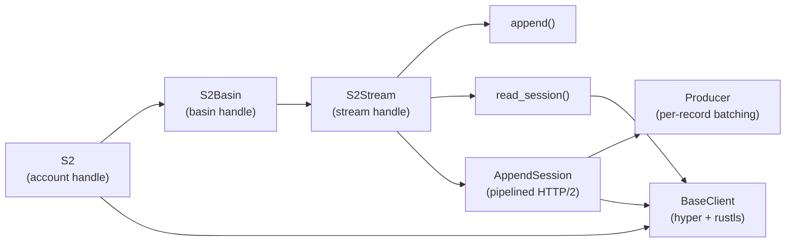
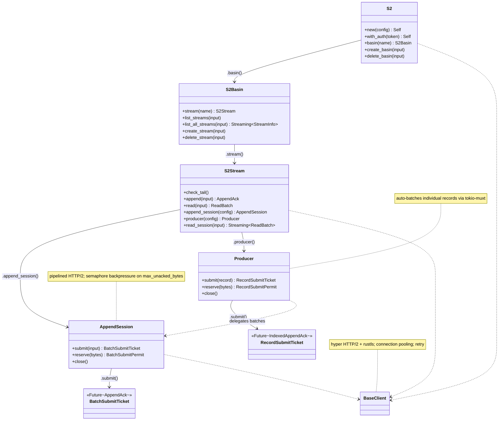

## s2-sdk

### Overview

`s2-sdk` is an async Rust SDK for [S2](https://s2.dev/), a durable streams platform. It provides ergonomic bindings for managing basins and streams — creating, deleting, listing, and performing high-throughput record I/O — built on top of hyper HTTP/2 with rustls for transport and prost for protobuf serialization.

The SDK exposes three top-level handle types — `S2`, `S2Basin`, and `S2Stream` — that reflect the S2 resource hierarchy. Append workloads are served at multiple abstraction levels: a single `append` call for simple use cases, an `AppendSession` for pipelined HTTP/2 batches with backpressure, and a `Producer` that further abstracts individual record submission with automatic batching and per-record acknowledgement tickets.

### Architecture



### Class diagram



### APIs

#### `S2` — account-level handle ([s2-sdk/src/ops.rs](s2-sdk/src/ops.rs))

```rust
pub struct S2 { /* ... */ }

impl S2 {
    pub fn new(config: S2Config) -> Result<Self, S2Error>
    pub fn from_url(url: &str) -> Result<Self, S2Error>
    pub fn with_auth(token: impl AsRef<str>) -> Self   // clone handle with Bearer token injected

    pub fn basin(&self, name: BasinName) -> S2Basin

    pub async fn create_basin(&self, input: CreateBasinInput) -> Result<BasinInfo, S2Error>
    pub async fn delete_basin(&self, input: DeleteBasinInput) -> Result<(), S2Error>
}
```

```rust
let s2 = S2::new(S2Config::new().with_endpoints(S2Endpoints::from_env()?))?;
let s2 = s2.with_auth("my-token");
let basin = s2.basin("my-basin".parse()?);
```

---

#### `S2Basin` — basin-level handle ([s2-sdk/src/ops.rs](s2-sdk/src/ops.rs))

```rust
pub struct S2Basin { /* ... */ }

impl S2Basin {
    pub fn stream(&self, name: StreamName) -> S2Stream

    pub async fn list_streams(&self, input: ListStreamsInput) -> Result<Page<StreamInfo>, S2Error>
    pub fn list_all_streams(&self, input: ListAllStreamsInput) -> Streaming<StreamInfo>
    // Auto-paginating cursor-based stream via start_after paging.

    pub async fn create_stream(&self, input: CreateStreamInput) -> Result<StreamInfo, S2Error>
    pub async fn delete_stream(&self, input: DeleteStreamInput) -> Result<(), S2Error>
}
```

```rust
let mut streams = basin.list_all_streams(ListAllStreamsInput::new());
while let Some(info) = streams.next().await {
    println!("{}", info?.name);
}
```

---

#### `S2Stream` — stream-level handle ([s2-sdk/src/ops.rs](s2-sdk/src/ops.rs))

```rust
pub struct S2Stream { /* ... */ }

impl S2Stream {
    pub async fn check_tail(&self) -> Result<StreamPosition, S2Error>

    pub async fn append(&self, input: AppendInput) -> Result<AppendAck, S2Error>
    pub async fn read(&self, input: ReadInput) -> Result<ReadBatch, S2Error>

    pub fn append_session(&self, config: AppendSessionConfig) -> AppendSession
    pub fn producer(&self, config: ProducerConfig) -> Producer
    pub async fn read_session(&self, input: ReadInput) -> Result<Streaming<ReadBatch>, S2Error>
}
```

---

#### `S2Config` — client configuration ([s2-sdk/src/types.rs](s2-sdk/src/types.rs))

```rust
pub struct S2Config { /* ... */ }

impl S2Config {
    pub fn new() -> Self
    // Defaults: AWS endpoints, 3s connection timeout, 5s request timeout.

    pub fn with_endpoints(self, endpoints: S2Endpoints) -> Self
    pub fn with_connection_timeout(self, timeout: Duration) -> Self
    pub fn with_request_timeout(self, timeout: Duration) -> Self
    pub fn with_retry(self, retry: RetryConfig) -> Self
    pub fn with_compression(self, compression: Compression) -> Self  // None | Gzip | Zstd
    pub fn with_insecure_skip_cert_verification(self, skip: bool) -> Self  // dev/test only
}
```

---

#### `S2Endpoints` — endpoint configuration ([s2-sdk/src/types.rs](s2-sdk/src/types.rs))

```rust
pub struct S2Endpoints { /* ... */ }

impl S2Endpoints {
    pub fn from_env() -> Result<Self, ValidationError>
    // Reads S2_ACCOUNT_ENDPOINT + S2_BASIN_ENDPOINT env vars.

    pub fn from_url(url: &str) -> Result<Self, ValidationError>
    // Single URL used for both account and basin endpoints.

    pub fn new(account: AccountEndpoint, basin: BasinEndpoint) -> Result<Self, ValidationError>
}
```

---

#### `RetryConfig` — retry policy ([s2-sdk/src/types.rs](s2-sdk/src/types.rs))

```rust
pub struct RetryConfig { /* ... */ }

impl RetryConfig {
    pub fn new() -> Self
    // Defaults: max_attempts = 3, min_base_delay = 100ms, max_base_delay = 1s.

    pub fn with_max_attempts(self, n: NonZeroU32) -> Self
    pub fn with_min_base_delay(self, d: Duration) -> Self
    pub fn with_max_base_delay(self, d: Duration) -> Self
    pub fn with_append_retry_policy(self, policy: AppendRetryPolicy) -> Self
    // AppendRetryPolicy::All | AppendRetryPolicy::NoSideEffects
}
```

---

#### `AppendSession` — pipelined append ([s2-sdk/src/session/append.rs](s2-sdk/src/session/append.rs))

```rust
pub struct AppendSession { /* ... */ }

impl AppendSession {
    pub async fn submit(&self, input: AppendInput) -> Result<BatchSubmitTicket, S2Error>
    // Backpressure-aware: blocks when unacked bytes/batches exceed config limits.

    pub async fn reserve(&self, bytes: u32) -> Result<BatchSubmitPermit, S2Error>
    // Explicit permit for use in select! loops; cancel-safe.

    pub async fn close(self) -> Result<(), S2Error>
    // Flush all pending appends and close the session.
}

pub struct AppendSessionConfig { /* ... */ }

impl AppendSessionConfig {
    pub fn new() -> Self
    pub fn with_max_unacked_bytes(self, bytes: u32) -> Self    // default 5 MiB, min 1 MiB
    pub fn with_max_unacked_batches(self, n: NonZeroU32) -> Self  // default unlimited
}

// BatchSubmitTicket is a future resolving to AppendAck once the batch is confirmed.
pub struct BatchSubmitTicket(/* ... */);
impl Future for BatchSubmitTicket { type Output = Result<AppendAck, S2Error>; }
```

```rust
let session = stream.append_session(AppendSessionConfig::new());
let ticket = session.submit(AppendInput::new(records)).await?;
session.close().await?;
let ack = ticket.await?;
```

---

#### `Producer` — record-level producer ([s2-sdk/src/producer.rs](s2-sdk/src/producer.rs))

```rust
pub struct Producer { /* ... */ }

impl Producer {
    pub async fn submit(&self, record: AppendRecord) -> Result<RecordSubmitTicket, S2Error>
    // Batches individual records via tokio-muxt; returns per-record ticket.

    pub async fn reserve(&self, bytes: u32) -> Result<RecordSubmitPermit, S2Error>
    // Cancel-safe permit for select! loops.

    pub async fn close(self) -> Result<(), S2Error>
}

pub struct ProducerConfig { /* ... */ }

impl ProducerConfig {
    pub fn new() -> Self
    pub fn with_max_unacked_bytes(self, bytes: u32) -> Self   // default 5 MiB
    pub fn with_batching(self, config: BatchingConfig) -> Self
    pub fn with_fencing_token(self, token: FencingToken) -> Self
    pub fn with_match_seq_num(self, seq_num: u64) -> Self     // auto-incremented per batch
}

// RecordSubmitTicket resolves to IndexedAppendAck with per-record seq_num.
pub struct RecordSubmitTicket(/* ... */);
impl Future for RecordSubmitTicket { type Output = Result<IndexedAppendAck, S2Error>; }
```

```rust
let producer = stream.producer(ProducerConfig::new());
let ticket = producer.submit(AppendRecord::new(b"hello")?).await?;
producer.close().await?;
let ack = ticket.await?;
println!("assigned seq_num: {}", ack.seq_num);
```

---

#### `BatchingConfig` — record batching policy ([s2-sdk/src/batching.rs](s2-sdk/src/batching.rs))

```rust
pub struct BatchingConfig { /* ... */ }

impl BatchingConfig {
    pub fn new() -> Self
    pub fn with_linger(self, d: Duration) -> Self           // default 5ms
    pub fn with_max_batch_bytes(self, bytes: usize) -> Self  // default 1 MiB, min 8 B
    pub fn with_max_batch_records(self, n: usize) -> Self    // default 1000, min 1
}
```
