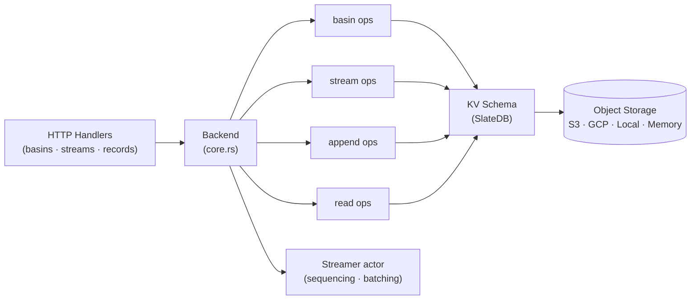
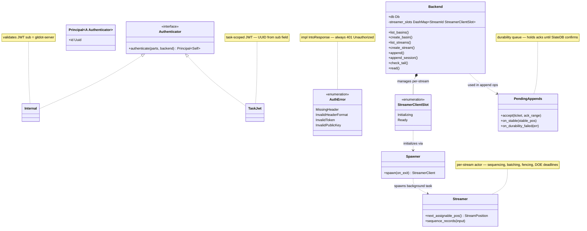

## s2-server

### Overview

`s2-server` is a lightweight HTTP server implementing the [S2](https://s2.dev) durable streams API, backed by object storage via SlateDB. It manages **basins** (logical containers) and **streams** (append-only logs) with a pluggable storage backend layer supporting S3, GCP, local filesystem, or in-memory storage.

The server follows a clean layered architecture: HTTP handlers delegate to backend service methods, which execute reads and writes against a KV schema built on top of SlateDB. Append operations flow through per-stream **streamer** actors that handle sequencing, batching, and durability tracking, while background tasks manage stream trimming, delete-on-empty enforcement, and basin deletion cleanup.

### Architecture



### Class diagram



### APIs

#### `LiteArgs` + `run` — entry point ([s2-server/src/server.rs](s2-server/src/server.rs))

```rust
pub struct LiteArgs {
    pub local_root: Option<PathBuf>,   // local filesystem backend root
    pub port: Option<u16>,             // default: 443 (TLS) or 80
    pub tls: TlsConfig,                // self-signed | cert+key | none
    pub no_cors: bool,
    pub init_file: Option<PathBuf>,
}

pub enum StoreType { S3Bucket(String), GcpBucket(String), LocalFileSystem(PathBuf), InMemory }

impl StoreType {
    pub fn default_flush_interval(&self) -> Duration
}

pub async fn run(args: LiteArgs) -> eyre::Result<()>
// Detects storage backend, initializes SlateDB, applies init spec, starts Axum.
```

---

#### `auth` — JWT authentication ([s2-server/src/auth.rs](s2-server/src/auth.rs))

```rust
#[derive(Debug, Clone)]
pub struct Principal<A: Authenticator> {
    pub id: Uuid,
    _marker: PhantomData<A>,
}

#[async_trait]
pub trait Authenticator: Send + Sync + 'static {
    async fn authenticate(parts: &Parts, backend: &Backend) -> Result<Principal<Self>, AuthError>
    where Self: Sized;
}

// Authenticator implementations:
pub struct Internal;   // gitdot server-to-server; validates JWT with sub = "gitdot-server"
pub struct TaskJwt;    // task-scoped JWT; parses UUID from sub field

#[derive(Debug, thiserror::Error)]
pub enum AuthError {
    #[error("missing authorization header")]           MissingHeader,
    #[error("invalid authorization header format")]    InvalidHeaderFormat,
    #[error("invalid token: {0}")]                     InvalidToken(String),
    #[error("invalid public key: {0}")]                InvalidPublicKey(String),
}

impl IntoResponse for AuthError  // always 401 Unauthorized
```

---

#### `init` — declarative JSON initialization ([s2-server/src/init.rs](s2-server/src/init.rs))

```rust
pub struct ResourcesSpec {
    pub basins: Vec<BasinSpec>,
}

pub struct BasinSpec {
    pub name: String,
    pub config: Option<BasinConfigSpec>,
    pub streams: Vec<StreamSpec>,
}

pub struct StreamSpec {
    pub name: String,
    pub config: Option<StreamConfigSpec>,
}

pub fn load(path: &Path) -> eyre::Result<ResourcesSpec>
pub fn validate(spec: &ResourcesSpec) -> eyre::Result<()>
pub async fn apply(backend: &Backend, spec: ResourcesSpec) -> eyre::Result<()>
```

```json
{
  "basins": [{
    "name": "my-basin",
    "config": { "create_stream_on_append": true },
    "streams": [{ "name": "events" }]
  }]
}
```

---

#### `Backend` — main service struct ([s2-server/src/backend/core.rs](s2-server/src/backend/core.rs))

```rust
#[derive(Clone)]
pub struct Backend {
    pub(super) db: slatedb::Db,
    pub gitdot_public_key: String,
    streamer_slots: Arc<DashMap<StreamId, StreamerClientSlot>>,
    append_inflight_max: ByteSize,
    bgtask_trigger_tx: broadcast::Sender<BgtaskTrigger>,
}

impl Backend {
    pub fn new(db: slatedb::Db, append_inflight_max: ByteSize, gitdot_public_key: String) -> Self

    pub(super) async fn streamer_client(
        &self, basin: BasinName, stream: StreamName,
    ) -> Result<StreamerClient, StreamerError>
    // Gets or initializes the streamer actor for this stream.

    pub(super) fn streamer_client_if_active(
        &self, basin: &BasinName, stream: &StreamName,
    ) -> Option<StreamerClient>
    // Non-blocking check; returns None if no streamer is running.

    pub(super) fn bgtask_trigger(&self, trigger: BgtaskTrigger)
    pub(super) fn bgtask_trigger_subscribe(&self) -> broadcast::Receiver<BgtaskTrigger>
}

pub enum StreamerClientSlot {
    Initializing { init_id: Uuid, future: SharedFuture },
    Ready { client: StreamerClient },
}
```

---

#### Basin operations ([s2-server/src/backend/basins.rs](s2-server/src/backend/basins.rs))

```rust
impl Backend {
    pub async fn list_basins(
        &self, request: ListBasinsRequest,
    ) -> Result<Page<BasinInfo>, ListBasinsError>

    pub async fn create_basin(
        &self,
        basin: BasinName,
        config: impl Into<BasinReconfiguration>,
        mode: CreateMode,
    ) -> Result<CreatedOrReconfigured<BasinInfo>, CreateBasinError>

    pub async fn get_basin_config(
        &self, basin: &BasinName,
    ) -> Result<BasinConfig, GetBasinConfigError>

    pub async fn reconfigure_basin(
        &self,
        basin: &BasinName,
        reconfig: BasinReconfiguration,
    ) -> Result<BasinConfig, ReconfigureBasinError>

    pub async fn delete_basin(
        &self, basin: &BasinName,
    ) -> Result<(), DeleteBasinError>
}
```

---

#### Stream operations ([s2-server/src/backend/streams.rs](s2-server/src/backend/streams.rs))

```rust
impl Backend {
    pub async fn list_streams(
        &self, basin: &BasinName, request: ListStreamsRequest,
    ) -> Result<Page<StreamInfo>, ListStreamsError>

    pub async fn create_stream(
        &self,
        basin: &BasinName,
        stream: StreamName,
        config: impl Into<StreamReconfiguration>,
        mode: CreateMode,
    ) -> Result<CreatedOrReconfigured<StreamInfo>, CreateStreamError>

    pub async fn get_stream_config(
        &self, basin: &BasinName, stream: &StreamName,
    ) -> Result<OptionalStreamConfig, GetStreamConfigError>

    pub async fn reconfigure_stream(
        &self,
        basin: &BasinName,
        stream: &StreamName,
        reconfig: StreamReconfiguration,
    ) -> Result<OptionalStreamConfig, ReconfigureStreamError>

    pub async fn delete_stream(
        &self, basin: &BasinName, stream: &StreamName,
    ) -> Result<(), DeleteStreamError>
    // Terminal trim then mark deleted.
}
```

---

#### Append operations ([s2-server/src/backend/append.rs](s2-server/src/backend/append.rs))

```rust
impl Backend {
    pub async fn append(
        &self,
        basin: BasinName,
        stream: StreamName,
        input: AppendInput,
    ) -> Result<AppendAck, AppendError>

    pub async fn append_session(
        self,
        basin: BasinName,
        stream: StreamName,
        inputs: impl Stream<Item = AppendInput>,
    ) -> Result<impl Stream<Item = Result<AppendAck, AppendError>>, AppendError>
}

pub struct PendingAppends { /* durability queue */ }

impl PendingAppends {
    pub fn accept(&mut self, ticket: Ticket, ack_range: Range<StreamPosition>)
    pub fn on_stable(&mut self, stable_pos: StreamPosition)  // complete appends when durable
    pub fn on_durability_failed(self, err: slatedb::Error)   // fail all pending
}

pub struct Ticket { /* permission slot to enqueue an append */ }

impl Ticket {
    pub fn accept(self, ack_range: Range<StreamPosition>) -> BlockedReplySender
    pub fn reject(self, err: AppendError, stable_pos: StreamPosition) -> Option<BlockedReplySender>
}
```

---

#### Read operations ([s2-server/src/backend/read.rs](s2-server/src/backend/read.rs))

```rust
impl Backend {
    pub async fn check_tail(
        &self, basin: BasinName, stream: StreamName,
    ) -> Result<StreamPosition, CheckTailError>

    pub async fn read(
        &self,
        basin: BasinName,
        stream: StreamName,
        start: ReadStart,
        end: ReadEnd,
    ) -> Result<impl Stream<Item = Result<ReadSessionOutput, ReadError>> + 'static, ReadError>

    async fn resolve_timestamp(
        &self, stream_id: StreamId, timestamp: u64,
    ) -> Result<Option<StreamPosition>, StorageError>
}
```

---

#### Streamer actor ([s2-server/src/backend/streamer.rs](s2-server/src/backend/streamer.rs))

```rust
pub struct Spawner { /* configures and launches a streamer background task */ }

impl Spawner {
    pub fn spawn(self, on_exit: impl FnOnce(StreamerId)) -> StreamerClient
}

pub struct Streamer { /* runtime instance: sequencing, batching, fencing, DOE deadlines */ }

impl Streamer {
    pub fn next_assignable_pos(&self) -> StreamPosition
    pub fn sequence_records(&self, input: AppendInput) -> Result<Vec<Metered<SequencedRecord>>, AppendErrorInternal>
}

pub const DORMANT_TIMEOUT: Duration;        // 60s
pub const DOE_DEADLINE_REFRESH_PERIOD: Duration;  // 600s
```

---

#### HTTP handlers

```rust
// basins.rs — fn router() -> axum::Router<Backend>
async fn list_basins(auth: Principal<Internal>, State(backend): State<Backend>, ListArgs) -> Result<Json<ListBasinsResponse>, ServiceError>
async fn create_basin(auth: Principal<Internal>, State(backend): State<Backend>, CreateArgs) -> Result<(StatusCode, Json<BasinInfo>), ServiceError>  // 201 Created
async fn delete_basin(auth: Principal<Internal>, State(backend): State<Backend>, DeleteArgs) -> Result<StatusCode, ServiceError>  // 202 Accepted
async fn get_basin_config(auth: Principal<Internal>, ...) -> Result<Json<BasinConfig>, ServiceError>
async fn reconfigure_basin(auth: Principal<Internal>, ...) -> Result<Json<BasinConfig>, ServiceError>

// streams.rs — fn router() -> axum::Router<Backend>
async fn list_streams(auth: Principal<Internal>, ...) -> Result<Json<ListStreamsResponse>, ServiceError>
async fn create_stream(auth: Principal<Internal>, ...) -> Result<(StatusCode, Json<StreamInfo>), ServiceError>
async fn delete_stream(auth: Principal<Internal>, ...) -> Result<StatusCode, ServiceError>
async fn get_stream_config(auth: Principal<Internal>, ...) -> Result<Json<StreamConfig>, ServiceError>
async fn reconfigure_stream(auth: Principal<Internal>, ...) -> Result<Json<StreamConfig>, ServiceError>

// records.rs — fn router() -> axum::Router<Backend>
async fn check_tail(auth: Principal<TaskJwt>, State(backend): State<Backend>, CheckTailArgs) -> Result<Json<TailResponse>, ServiceError>
async fn read(auth: Principal<TaskJwt>, State(backend): State<Backend>, ReadArgs) -> Result<Response, ServiceError>
// Supports SSE streaming (Accept: text/event-stream) and unary modes.
async fn append(auth: Principal<TaskJwt>, State(backend): State<Backend>, AppendArgs) -> Result<Response, ServiceError>
```

HTTP routes:

```
GET  /health  (also /ping)
GET  /v1/basins                              list_basins
POST /v1/basins                              create_basin
GET  /v1/basins/{basin}                      get_basin_config
PUT  /v1/basins/{basin}                      reconfigure_basin
DELETE /v1/basins/{basin}                    delete_basin
GET  /v1/{basin}/streams                     list_streams
POST /v1/{basin}/streams                     create_stream
GET  /v1/{basin}/streams/{stream}            get_stream_config
PUT  /v1/{basin}/streams/{stream}            reconfigure_stream
DELETE /v1/{basin}/streams/{stream}          delete_stream
GET  /v1/{basin}/streams/{stream}/records/tail    check_tail
GET  /v1/{basin}/streams/{stream}/records         read
POST /v1/{basin}/streams/{stream}/records         append
```
